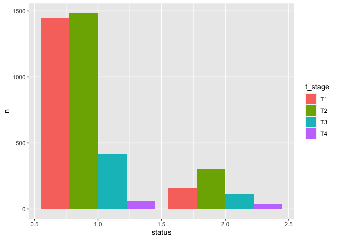

EDA_Claire
================
2023-12-04

``` r
library(ggplot2)
library(corrplot)
```

    ## corrplot 0.92 loaded

``` r
library(dplyr)
```

    ## 
    ## Attaching package: 'dplyr'

    ## The following objects are masked from 'package:stats':
    ## 
    ##     filter, lag

    ## The following objects are masked from 'package:base':
    ## 
    ##     intersect, setdiff, setequal, union

``` r
library(tidyverse)
```

    ## ── Attaching core tidyverse packages ──────────────────────── tidyverse 2.0.0 ──
    ## ✔ forcats   1.0.0     ✔ stringr   1.5.1
    ## ✔ lubridate 1.9.3     ✔ tibble    3.2.1
    ## ✔ purrr     1.0.2     ✔ tidyr     1.3.0
    ## ✔ readr     2.1.4

    ## ── Conflicts ────────────────────────────────────────── tidyverse_conflicts() ──
    ## ✖ dplyr::filter() masks stats::filter()
    ## ✖ dplyr::lag()    masks stats::lag()
    ## ℹ Use the conflicted package (<http://conflicted.r-lib.org/>) to force all conflicts to become errors

``` r
library(MASS)
```

    ## 
    ## Attaching package: 'MASS'
    ## 
    ## The following object is masked from 'package:dplyr':
    ## 
    ##     select

#### Load Dataset

``` r
df = read_csv("./data/Project_2_data.csv") |>
  janitor::clean_names() 
```

    ## Rows: 4024 Columns: 16
    ## ── Column specification ────────────────────────────────────────────────────────
    ## Delimiter: ","
    ## chr (11): Race, Marital Status, T Stage, N Stage, 6th Stage, differentiate, ...
    ## dbl  (5): Age, Tumor Size, Regional Node Examined, Reginol Node Positive, Su...
    ## 
    ## ℹ Use `spec()` to retrieve the full column specification for this data.
    ## ℹ Specify the column types or set `show_col_types = FALSE` to quiet this message.

``` r
summary(df)
```

    ##       age            race           marital_status       t_stage         
    ##  Min.   :30.00   Length:4024        Length:4024        Length:4024       
    ##  1st Qu.:47.00   Class :character   Class :character   Class :character  
    ##  Median :54.00   Mode  :character   Mode  :character   Mode  :character  
    ##  Mean   :53.97                                                           
    ##  3rd Qu.:61.00                                                           
    ##  Max.   :69.00                                                           
    ##    n_stage           x6th_stage        differentiate         grade          
    ##  Length:4024        Length:4024        Length:4024        Length:4024       
    ##  Class :character   Class :character   Class :character   Class :character  
    ##  Mode  :character   Mode  :character   Mode  :character   Mode  :character  
    ##                                                                             
    ##                                                                             
    ##                                                                             
    ##    a_stage            tumor_size     estrogen_status    progesterone_status
    ##  Length:4024        Min.   :  1.00   Length:4024        Length:4024        
    ##  Class :character   1st Qu.: 16.00   Class :character   Class :character   
    ##  Mode  :character   Median : 25.00   Mode  :character   Mode  :character   
    ##                     Mean   : 30.47                                         
    ##                     3rd Qu.: 38.00                                         
    ##                     Max.   :140.00                                         
    ##  regional_node_examined reginol_node_positive survival_months
    ##  Min.   : 1.00          Min.   : 1.000        Min.   :  1.0  
    ##  1st Qu.: 9.00          1st Qu.: 1.000        1st Qu.: 56.0  
    ##  Median :14.00          Median : 2.000        Median : 73.0  
    ##  Mean   :14.36          Mean   : 4.158        Mean   : 71.3  
    ##  3rd Qu.:19.00          3rd Qu.: 5.000        3rd Qu.: 90.0  
    ##  Max.   :61.00          Max.   :46.000        Max.   :107.0  
    ##     status         
    ##  Length:4024       
    ##  Class :character  
    ##  Mode  :character  
    ##                    
    ##                    
    ## 

#### Correlation Analysis

``` r
df$status = as.numeric(factor(df$status))
cols_num = which(sapply(df, is.numeric)) 
correlations = cor(df[cols_num])
correlations
```

    ##                                age  tumor_size regional_node_examined
    ## age                     1.00000000 -0.07721497            -0.03334548
    ## tumor_size             -0.07721497  1.00000000             0.10435180
    ## regional_node_examined -0.03334548  0.10435180             1.00000000
    ## reginol_node_positive   0.01258551  0.24232172             0.41157970
    ## survival_months        -0.00938956 -0.08690124            -0.02205421
    ## status                  0.05592131  0.13420512             0.03477200
    ##                        reginol_node_positive survival_months      status
    ## age                               0.01258551     -0.00938956  0.05592131
    ## tumor_size                        0.24232172     -0.08690124  0.13420512
    ## regional_node_examined            0.41157970     -0.02205421  0.03477200
    ## reginol_node_positive             1.00000000     -0.13521385  0.25663809
    ## survival_months                  -0.13521385      1.00000000 -0.47651426
    ## status                            0.25663809     -0.47651426  1.00000000

From the results, we can see that `regional_node_examined` and
`reginol_node_positive` have strong relationship with the correlation of
1.

``` r
corrplot(correlations, order = "hclust", tl.cex = 1, addrect = 6)
```

<!-- -->

From the plot, we can see that `reginol_node_positive` and `tumore_size`
are top factors.

#### Univariate Analysis

``` r
prop.table(table(df$status))
```

    ## 
    ##         1         2 
    ## 0.8469185 0.1530815

From the table, we can see that there are more than 84% of patients will
be alive and about 15% patients will be dead.

``` r
hist(df$survival_months, probability = T, main = 'original')
```

<!-- -->

``` r
# Log Transformation
hist(log(df$survival_months), probability = T, main = 'log_transformed')
```

<!-- -->

Left skewed distribution.

#### Bivariate analysis

``` r
# Numerical Variables
par(mfrow = c(2,2))
boxplot(age ~ status, df)
boxplot(tumor_size ~ status, df)
boxplot(regional_node_examined ~ status, df)
boxplot(reginol_node_positive ~ status, df)
```

<!-- -->

``` r
# Categorical Variables
df_race = df |> 
  count(status, race)
ggplot(df_race, aes(fill = race, y = n, x = status)) + geom_bar(position = 'dodge', stat = 'identity') 
```

<!-- -->

``` r
df_marital = df |>
  count(status, marital_status)
ggplot(df_marital, aes(fill = marital_status, y = n, x = status)) + geom_bar(position = 'dodge', stat = 'identity') 
```

<!-- -->

``` r
df_tstage = df |>
  count(status, t_stage)
ggplot(df_tstage, aes(fill = t_stage, y = n, x = status)) + geom_bar(position = 'dodge', stat = 'identity') 
```

<!-- -->

``` r
df_nstage = df |>
  count(status, n_stage)
ggplot(df_nstage, aes(fill = n_stage, y = n, x= status)) + geom_bar(position = 'dodge', stat = 'identity') 
```

<!-- -->
