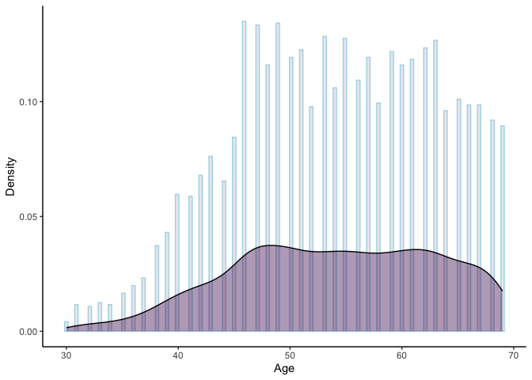
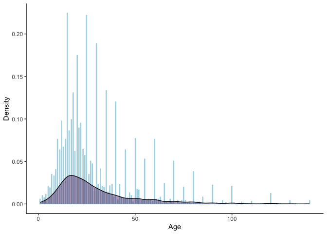
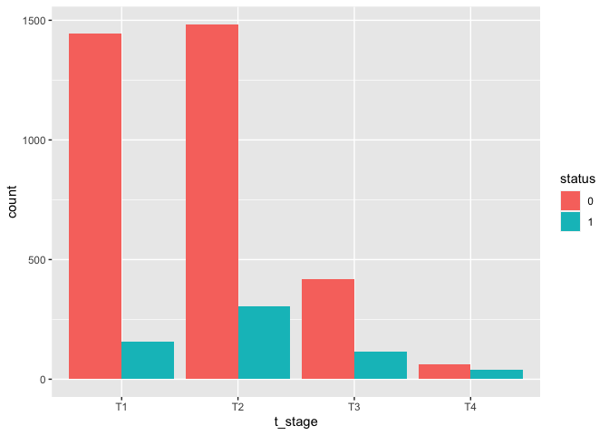

P8130_Final_Project_Report
================
Jiying Wang
2023-12-15

``` r
knitr::opts_chunk$set(echo = TRUE, message = FALSE, warning = FALSE)
library(tidyverse)
library(dplyr)
library(MASS)
library(ggplot2)
library(corrplot)
library(leaps)
library(glmnet)
library(igraph)
library(arules)
library(caret)
library(pROC)
```

## Clean the dataset

``` r
# import data
breastcancer = read_csv("./data/Project_2_data.csv")

#Data Cleaning
breastcancer_1 = breastcancer|>
  janitor::clean_names()|>
   mutate(
    race = as_factor(race),
    marital_status = factor(marital_status, levels = c("Single", "Married", "Divorced", "Separated", "Widowed")),
    t_stage = factor(t_stage, levels = c("T1", "T2", "T3", "T4")),
    n_stage = factor(n_stage, levels = c("N1", "N2", "N3")),
    x6th_stage = factor(x6th_stage, levels = c("IIA", "IIB", "IIIA", "IIIB", "IIIC")),
    differentiate = factor(differentiate, levels = c("Moderately differentiated", "Poorly differentiated", "Undifferentiated", "Well differentiated")),
    grade = factor(grade, levels = c("1", "2", "3", "anaplastic; Grade IV")),
    a_stage = factor(a_stage, levels = c("Distant", "Regional")),
    estrogen_status = as_factor(estrogen_status),
    progesterone_status = as_factor(progesterone_status),
    status = ifelse(status == "Dead", 1, 0),
    status = as_factor(status))

breastcancer_clean = breastcancer_1|>
  mutate(node_positive_prop = reginol_node_positive/regional_node_examined,
         node_positive_prop = round(node_positive_prop, 4))
  
breastcancer_clean
```

    ## # A tibble: 4,024 × 17
    ##      age race  marital_status t_stage n_stage x6th_stage differentiate     grade
    ##    <dbl> <fct> <fct>          <fct>   <fct>   <fct>      <fct>             <fct>
    ##  1    68 White Married        T1      N1      IIA        Poorly different… 3    
    ##  2    50 White Married        T2      N2      IIIA       Moderately diffe… 2    
    ##  3    58 White Divorced       T3      N3      IIIC       Moderately diffe… 2    
    ##  4    58 White Married        T1      N1      IIA        Poorly different… 3    
    ##  5    47 White Married        T2      N1      IIB        Poorly different… 3    
    ##  6    51 White Single         T1      N1      IIA        Moderately diffe… 2    
    ##  7    51 White Married        T1      N1      IIA        Well differentia… 1    
    ##  8    40 White Married        T2      N1      IIB        Moderately diffe… 2    
    ##  9    40 White Divorced       T4      N3      IIIC       Poorly different… 3    
    ## 10    69 White Married        T4      N3      IIIC       Well differentia… 1    
    ## # ℹ 4,014 more rows
    ## # ℹ 9 more variables: a_stage <fct>, tumor_size <dbl>, estrogen_status <fct>,
    ## #   progesterone_status <fct>, regional_node_examined <dbl>,
    ## #   reginol_node_positive <dbl>, survival_months <dbl>, status <fct>,
    ## #   node_positive_prop <dbl>

## EDA

``` r
# Descriptive table with summary statistics
summary(breastcancer_clean) |>
  knitr::kable()
```

|     | age           | race       | marital_status | t_stage | n_stage | x6th_stage | differentiate                  | grade                    | a_stage       | tumor_size     | estrogen_status | progesterone_status | regional_node_examined | reginol_node_positive | survival_months | status | node_positive_prop |
|:----|:--------------|:-----------|:---------------|:--------|:--------|:-----------|:-------------------------------|:-------------------------|:--------------|:---------------|:----------------|:--------------------|:-----------------------|:----------------------|:----------------|:-------|:-------------------|
|     | Min. :30.00   | White:3413 | Single : 615   | T1:1603 | N1:2732 | IIA :1305  | Moderately differentiated:2351 | 1 : 543                  | Distant : 92  | Min. : 1.00    | Positive:3755   | Positive:3326       | Min. : 1.00            | Min. : 1.000          | Min. : 1.0      | 0:3408 | Min. :0.0204       |
|     | 1st Qu.:47.00 | Black: 291 | Married :2643  | T2:1786 | N2: 820 | IIB :1130  | Poorly differentiated :1111    | 2 :2351                  | Regional:3932 | 1st Qu.: 16.00 | Negative: 269   | Negative: 698       | 1st Qu.: 9.00          | 1st Qu.: 1.000        | 1st Qu.: 56.0   | 1: 616 | 1st Qu.:0.1034     |
|     | Median :54.00 | Other: 320 | Divorced : 486 | T3: 533 | N3: 472 | IIIA:1050  | Undifferentiated : 19          | 3 :1111                  | NA            | Median : 25.00 | NA              | NA                  | Median :14.00          | Median : 2.000        | Median : 73.0   | NA     | Median :0.2143     |
|     | Mean :53.97   | NA         | Separated: 45  | T4: 102 | NA      | IIIB: 67   | Well differentiated : 543      | anaplastic; Grade IV: 19 | NA            | Mean : 30.47   | NA              | NA                  | Mean :14.36            | Mean : 4.158          | Mean : 71.3     | NA     | Mean :0.3265       |
|     | 3rd Qu.:61.00 | NA         | Widowed : 235  | NA      | NA      | IIIC: 472  | NA                             | NA                       | NA            | 3rd Qu.: 38.00 | NA              | NA                  | 3rd Qu.:19.00          | 3rd Qu.: 5.000        | 3rd Qu.: 90.0   | NA     | 3rd Qu.:0.5000     |
|     | Max. :69.00   | NA         | NA             | NA      | NA      | NA         | NA                             | NA                       | NA            | Max. :140.00   | NA              | NA                  | Max. :61.00            | Max. :46.000          | Max. :107.0     | NA     | Max. :1.0000       |

``` r
breastcancer_clean |> 
  summarise(across(where(is.numeric), list(mean = ~mean(., na.rm = TRUE), sd = ~sd(., na.rm = TRUE)))) |>
  knitr::kable()
```

| age_mean |   age_sd | tumor_size_mean | tumor_size_sd | regional_node_examined_mean | regional_node_examined_sd | reginol_node_positive_mean | reginol_node_positive_sd | survival_months_mean | survival_months_sd | node_positive_prop_mean | node_positive_prop_sd |
|---------:|---------:|----------------:|--------------:|----------------------------:|--------------------------:|---------------------------:|-------------------------:|---------------------:|-------------------:|------------------------:|----------------------:|
| 53.97217 | 8.963134 |        30.47366 |       21.1197 |                    14.35711 |                  8.099675 |                   4.158052 |                 5.109331 |             71.29796 |           22.92143 |               0.3264658 |             0.2870226 |

``` r
prop.table(table(breastcancer_clean$status)) |>
  knitr::kable()
```

| Var1 |      Freq |
|:-----|----------:|
| 0    | 0.8469185 |
| 1    | 0.1530815 |

``` r
# Correlation matrix for all variables
cor_matrix = breastcancer_clean |>
  select_if(is.numeric) |>
  cor() 
corrplot::corrplot(cor_matrix, type = "upper", diag = FALSE)
```

<!-- -->

``` r
# Heat map
corrplot::corrplot(cor_matrix, method = "color")
```

<!-- -->

``` r
# Scatter plot matrix for all variables
pairs(breastcancer_clean)
```

<!-- -->

``` r
# Histograms and density plots
breastcancer_clean |>
  ggplot(aes(x = age, y = ..density.., fill = "purple", alpha = 0.5)) +
  geom_histogram(binwidth = 0.3, colour = "lightblue", alpha = 0.1) +
  geom_density(alpha = 0.4) +
  labs(
    x = "Age",
    y = "Density") +
  scale_fill_viridis_d("") +
  theme_classic() +
  theme(legend.position = "none")
```

<!-- -->

``` r
breastcancer_clean |>
  ggplot(aes(x = tumor_size, y = ..density.., fill = "purple", alpha = 0.5)) +
  geom_histogram(binwidth = 0.3, colour = "lightblue", alpha = 0.1) +
  geom_density(alpha = 0.4) +
  labs(
    x = "Age",
    y = "Density") +
  scale_fill_viridis_d("") +
  theme_classic() +
  theme(legend.position = "none")
```

<!-- -->

``` r
breastcancer_clean |>
  ggplot(aes(x = regional_node_examined, y = ..density.., fill = "purple", alpha = 0.5)) +
  geom_histogram(binwidth = 0.3, colour = "lightblue", alpha = 0.1) +
  geom_density(alpha = 0.4) +
  labs(
    x = "Age",
    y = "Density") +
  scale_fill_viridis_d("") +
  theme_classic() +
  theme(legend.position = "none")
```

<!-- -->

``` r
breastcancer_clean |>
  ggplot(aes(x = reginol_node_positive, y = ..density.., fill = "purple", alpha = 0.5)) +
  geom_histogram(binwidth = 0.3, colour = "lightblue", alpha = 0.1) +
  geom_density(alpha = 0.4) +
  labs(
    x = "Age",
    y = "Density") +
  scale_fill_viridis_d("") +
  theme_classic() +
  theme(legend.position = "none")
```

<!-- -->

``` r
breastcancer_clean |>
  ggplot(aes(x = node_positive_prop, y = ..density.., fill = "purple", alpha = 0.5)) +
  geom_histogram(binwidth = 0.3, colour = "lightblue", alpha = 0.1) +
  geom_density(alpha = 0.4) +
  labs(
    x = "Age",
    y = "Density") +
  scale_fill_viridis_d("") +
  theme_classic() +
  theme(legend.position = "none")
```

<!-- -->

``` r
# Boxplots 
par(mfrow=c(2,3))
boxplot(breastcancer_clean$age, main='Age')
boxplot(breastcancer_clean$tumor_size, main='Tumor Size')
boxplot(breastcancer_clean$regional_node_examined,main='Node Examined' )
boxplot(breastcancer_clean$reginol_node_positive, main='Positive Node')
boxplot(breastcancer_clean$node_positive_prop, main='Proportion of Positive Nodes')
```

<!-- -->

``` r
par(mfrow = c(2,3))
boxplot(age ~ status, breastcancer_clean)
boxplot(tumor_size ~ status, breastcancer_clean)
boxplot(regional_node_examined ~ status, breastcancer_clean)
boxplot(reginol_node_positive ~ status, breastcancer_clean)
boxplot(node_positive_prop ~ status, breastcancer_clean)
```

<!-- -->

``` r
# Barplots for categorical variables
ggplot(breastcancer_clean, aes(x = race, fill = status)) + 
  geom_bar(position = "dodge")
```

<!-- -->

``` r
ggplot(breastcancer_clean, aes(x = marital_status, fill = status)) + 
  geom_bar(position = "dodge")
```

<!-- -->

``` r
ggplot(breastcancer_clean, aes(x = t_stage, fill = status)) + 
  geom_bar(position = "dodge")
```

<!-- -->

``` r
ggplot(breastcancer_clean, aes(x = n_stage, fill = status)) + 
  geom_bar(position = "dodge")
```

<!-- -->

``` r
ggplot(breastcancer_clean, aes(x = x6th_stage, fill = status)) + 
  geom_bar(position = "dodge")
```

<!-- -->

``` r
ggplot(breastcancer_clean, aes(x = differentiate, fill = status)) + 
  geom_bar(position = "dodge")
```

<!-- -->

``` r
ggplot(breastcancer_clean, aes(x = grade, fill = status)) + 
  geom_bar(position = "dodge")
```

<!-- -->

``` r
ggplot(breastcancer_clean, aes(x = a_stage, fill = status)) + 
  geom_bar(position = "dodge")
```

<!-- -->

``` r
ggplot(breastcancer_clean, aes(x = estrogen_status, fill = status)) + 
  geom_bar(position = "dodge")
```

<!-- -->

``` r
ggplot(breastcancer_clean, aes(x = progesterone_status, fill = status)) + 
  geom_bar(position = "dodge")
```

<!-- -->
