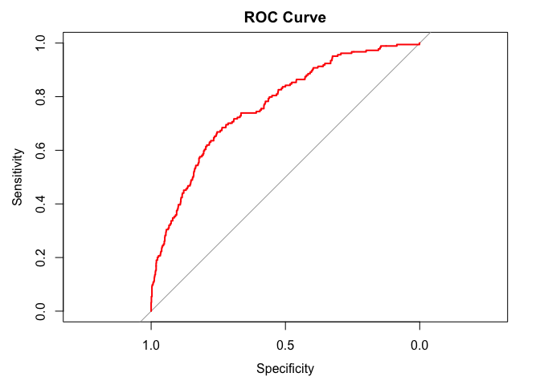
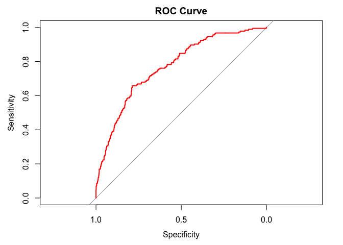
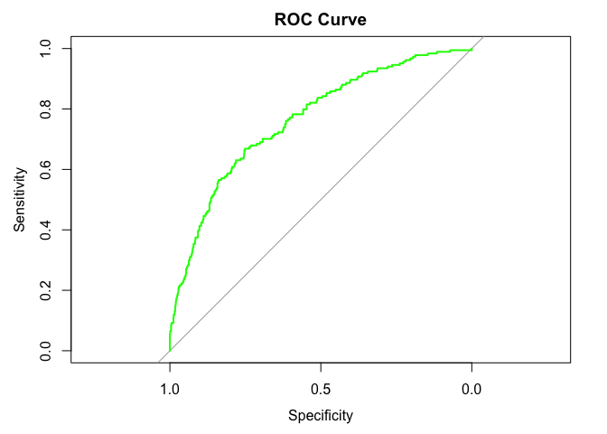

Model Building
================
Yuxin Yin
2023-12-12

``` r
knitr::opts_chunk$set(echo = TRUE, message = FALSE, warning = FALSE)
library(tidyverse)
```

    ## ── Attaching core tidyverse packages ──────────────────────── tidyverse 2.0.0 ──
    ## ✔ dplyr     1.1.4     ✔ readr     2.1.4
    ## ✔ forcats   1.0.0     ✔ stringr   1.5.1
    ## ✔ ggplot2   3.4.4     ✔ tibble    3.2.1
    ## ✔ lubridate 1.9.2     ✔ tidyr     1.3.0
    ## ✔ purrr     1.0.2     
    ## ── Conflicts ────────────────────────────────────────── tidyverse_conflicts() ──
    ## ✖ dplyr::filter() masks stats::filter()
    ## ✖ dplyr::lag()    masks stats::lag()
    ## ℹ Use the conflicted package (<http://conflicted.r-lib.org/>) to force all conflicts to become errors

``` r
library(dplyr)
library(MASS)
```

    ## 
    ## Attaching package: 'MASS'
    ## 
    ## The following object is masked from 'package:dplyr':
    ## 
    ##     select

``` r
library(ggplot2)
library(corrplot)
```

    ## corrplot 0.92 loaded

``` r
library(leaps)
library(glmnet)
```

    ## Loading required package: Matrix
    ## 
    ## Attaching package: 'Matrix'
    ## 
    ## The following objects are masked from 'package:tidyr':
    ## 
    ##     expand, pack, unpack
    ## 
    ## Loaded glmnet 4.1-8

``` r
library(igraph)
```

    ## 
    ## Attaching package: 'igraph'
    ## 
    ## The following objects are masked from 'package:lubridate':
    ## 
    ##     %--%, union
    ## 
    ## The following objects are masked from 'package:dplyr':
    ## 
    ##     as_data_frame, groups, union
    ## 
    ## The following objects are masked from 'package:purrr':
    ## 
    ##     compose, simplify
    ## 
    ## The following object is masked from 'package:tidyr':
    ## 
    ##     crossing
    ## 
    ## The following object is masked from 'package:tibble':
    ## 
    ##     as_data_frame
    ## 
    ## The following objects are masked from 'package:stats':
    ## 
    ##     decompose, spectrum
    ## 
    ## The following object is masked from 'package:base':
    ## 
    ##     union

``` r
library(arules)
```

    ## 
    ## Attaching package: 'arules'
    ## 
    ## The following object is masked from 'package:dplyr':
    ## 
    ##     recode
    ## 
    ## The following objects are masked from 'package:base':
    ## 
    ##     abbreviate, write

``` r
library(caret)
```

    ## Loading required package: lattice
    ## 
    ## Attaching package: 'caret'
    ## 
    ## The following object is masked from 'package:purrr':
    ## 
    ##     lift

``` r
library(pROC)
```

    ## Type 'citation("pROC")' for a citation.
    ## 
    ## Attaching package: 'pROC'
    ## 
    ## The following objects are masked from 'package:stats':
    ## 
    ##     cov, smooth, var

``` r
library(performance) # vif
library(ggpubr)
library(vcd)
```

    ## Loading required package: grid

# Data Cleaning

``` r
# import data
breastcancer = read_csv("./data/Project_2_data.csv")

#Data Cleaning
breastcancer_1 = breastcancer|>
  janitor::clean_names()|>
   mutate(
    race = as_factor(race),
    marital_status = factor(marital_status, levels = c("Single", "Married", "Divorced", "Separated", "Widowed")),
    t_stage = factor(t_stage, levels = c("T1", "T2", "T3", "T4")),
    n_stage = factor(n_stage, levels = c("N1", "N2", "N3")),
    x6th_stage = factor(x6th_stage, levels = c("IIA", "IIB", "IIIA", "IIIB", "IIIC")),
    differentiate = factor(differentiate, levels = c("Moderately differentiated", "Poorly differentiated", "Undifferentiated", "Well differentiated")),
    grade = factor(grade, levels = c("1", "2", "3", "anaplastic; Grade IV")),
    a_stage = factor(a_stage, levels = c("Distant", "Regional")),
    estrogen_status = as_factor(estrogen_status),
    progesterone_status = as_factor(progesterone_status),
    status = ifelse(status == "Dead", 1, 0),
    status = as_factor(status))

breastcancer_clean = breastcancer_1|>
  mutate(node_positive_prop = reginol_node_positive/regional_node_examined,
         node_positive_prop = round(node_positive_prop, 4))
  
breastcancer_clean
```

    ## # A tibble: 4,024 × 17
    ##      age race  marital_status t_stage n_stage x6th_stage differentiate     grade
    ##    <dbl> <fct> <fct>          <fct>   <fct>   <fct>      <fct>             <fct>
    ##  1    68 White Married        T1      N1      IIA        Poorly different… 3    
    ##  2    50 White Married        T2      N2      IIIA       Moderately diffe… 2    
    ##  3    58 White Divorced       T3      N3      IIIC       Moderately diffe… 2    
    ##  4    58 White Married        T1      N1      IIA        Poorly different… 3    
    ##  5    47 White Married        T2      N1      IIB        Poorly different… 3    
    ##  6    51 White Single         T1      N1      IIA        Moderately diffe… 2    
    ##  7    51 White Married        T1      N1      IIA        Well differentia… 1    
    ##  8    40 White Married        T2      N1      IIB        Moderately diffe… 2    
    ##  9    40 White Divorced       T4      N3      IIIC       Poorly different… 3    
    ## 10    69 White Married        T4      N3      IIIC       Well differentia… 1    
    ## # ℹ 4,014 more rows
    ## # ℹ 9 more variables: a_stage <fct>, tumor_size <dbl>, estrogen_status <fct>,
    ## #   progesterone_status <fct>, regional_node_examined <dbl>,
    ## #   reginol_node_positive <dbl>, survival_months <dbl>, status <fct>,
    ## #   node_positive_prop <dbl>

# Exploratory Analysis

## Checking Association Between Numerical Variables

``` r
# exploratory
pairs(breastcancer_clean)
```

<!-- -->

``` r
# correlation plot
breastcancer_num = breastcancer_clean|>
  dplyr::select(age, tumor_size, regional_node_examined, reginol_node_positive, node_positive_prop)

corrplot(cor(breastcancer_num), type = "upper", diag = FALSE)
```

<!-- -->

``` r
# Boxplots for each variable
par(mfrow=c(2,3))
boxplot(breastcancer_clean$age, main='Age')
boxplot(breastcancer_clean$tumor_size, main='Tumor Size')
boxplot(breastcancer_clean$regional_node_examined,main='Node Examined' )
boxplot(breastcancer_clean$reginol_node_positive, main='Positive Node')
boxplot(breastcancer_clean$node_positive_prop, main='Proportion of Positive Nodes')
```

<!-- -->

- `tumor_size` has substantial amounts of outliers. <br>
- `reginol_node_positive` and `node_positive_prop` are highly
  correlated.

## Checking Association Between Categorical Variables

``` r
breastcancer_cag = breastcancer_clean|>
  dplyr::select(-age, -tumor_size, -regional_node_examined, -reginol_node_positive, -node_positive_prop, -survival_months)

rules <- apriori(breastcancer_cag, parameter = list(supp = 0.001, conf = 0.8))
```

    ## Apriori
    ## 
    ## Parameter specification:
    ##  confidence minval smax arem  aval originalSupport maxtime support minlen
    ##         0.8    0.1    1 none FALSE            TRUE       5   0.001      1
    ##  maxlen target  ext
    ##      10  rules TRUE
    ## 
    ## Algorithmic control:
    ##  filter tree heap memopt load sort verbose
    ##     0.1 TRUE TRUE  FALSE TRUE    2    TRUE
    ## 
    ## Absolute minimum support count: 4 
    ## 
    ## set item appearances ...[0 item(s)] done [0.00s].
    ## set transactions ...[36 item(s), 4024 transaction(s)] done [0.00s].
    ## sorting and recoding items ... [36 item(s)] done [0.00s].
    ## creating transaction tree ... done [0.00s].
    ## checking subsets of size 1 2 3 4 5 6 7 8 9 10 done [0.10s].
    ## writing ... [424628 rule(s)] done [0.13s].
    ## creating S4 object  ... done [0.19s].

``` r
# Inspect the top 5 rules
inspect(head(sort(rules, by = "confidence"), 5))
```

    ##     lhs                                 rhs                                 support confidence   coverage       lift count
    ## [1] {grade=anaplastic; Grade IV}     => {differentiate=Undifferentiated} 0.00472167          1 0.00472167 211.789474    19
    ## [2] {differentiate=Undifferentiated} => {grade=anaplastic; Grade IV}     0.00472167          1 0.00472167 211.789474    19
    ## [3] {grade=anaplastic; Grade IV}     => {a_stage=Regional}               0.00472167          1 0.00472167   1.023398    19
    ## [4] {differentiate=Undifferentiated} => {a_stage=Regional}               0.00472167          1 0.00472167   1.023398    19
    ## [5] {x6th_stage=IIIB}                => {t_stage=T4}                     0.01665010          1 0.01665010  39.450980    67

# Checking Logistic Regression Assumption

# Fitting Model

## Training Data and Test Data

``` r
#split the data
set.seed(123)
breastcancer_test = breastcancer_clean|>
  dplyr::select(-survival_months)
split <- createDataPartition(breastcancer_test$status, p = .7, list = FALSE)
train_data <- breastcancer_test[split, ]
test_data <- breastcancer_test[-split, ]
test_data1 = test_data|> dplyr::select(-status)
```

## Backward Selection

``` r
breastcancer_clean1 <- breastcancer_test|>
  drop_na()

full_model <- glm(status ~ ., data = breastcancer_test, family = binomial())

summary(full_model)
```

    ## 
    ## Call:
    ## glm(formula = status ~ ., family = binomial(), data = breastcancer_test)
    ## 
    ## Coefficients: (4 not defined because of singularities)
    ##                                      Estimate Std. Error z value Pr(>|z|)    
    ## (Intercept)                        -3.926e+00  4.609e-01  -8.518  < 2e-16 ***
    ## age                                 2.384e-02  5.624e-03   4.239 2.24e-05 ***
    ## raceBlack                           5.147e-01  1.621e-01   3.174 0.001502 ** 
    ## raceOther                          -4.164e-01  2.025e-01  -2.056 0.039752 *  
    ## marital_statusMarried              -1.322e-01  1.350e-01  -0.980 0.327175    
    ## marital_statusDivorced              8.189e-02  1.754e-01   0.467 0.640527    
    ## marital_statusSeparated             7.206e-01  3.829e-01   1.882 0.059817 .  
    ## marital_statusWidowed               9.846e-02  2.190e-01   0.450 0.652946    
    ## t_stageT2                           2.790e-01  1.954e-01   1.428 0.153259    
    ## t_stageT3                           5.423e-01  3.139e-01   1.728 0.084036 .  
    ## t_stageT4                           9.489e-01  4.502e-01   2.108 0.035058 *  
    ## n_stageN2                           5.623e-01  2.412e-01   2.331 0.019744 *  
    ## n_stageN3                           5.862e-01  3.052e-01   1.921 0.054735 .  
    ## x6th_stageIIB                       2.160e-01  2.319e-01   0.931 0.351696    
    ## x6th_stageIIIA                     -1.006e-01  2.953e-01  -0.341 0.733307    
    ## x6th_stageIIIB                      5.262e-02  5.291e-01   0.099 0.920772    
    ## x6th_stageIIIC                             NA         NA      NA       NA    
    ## differentiatePoorly differentiated  3.907e-01  1.050e-01   3.721 0.000199 ***
    ## differentiateUndifferentiated       1.364e+00  5.352e-01   2.548 0.010831 *  
    ## differentiateWell differentiated   -5.326e-01  1.843e-01  -2.890 0.003857 ** 
    ## grade2                                     NA         NA      NA       NA    
    ## grade3                                     NA         NA      NA       NA    
    ## gradeanaplastic; Grade IV                  NA         NA      NA       NA    
    ## a_stageRegional                    -6.039e-02  2.662e-01  -0.227 0.820532    
    ## tumor_size                         -3.839e-05  3.975e-03  -0.010 0.992295    
    ## estrogen_statusNegative             7.373e-01  1.781e-01   4.141 3.46e-05 ***
    ## progesterone_statusNegative         5.885e-01  1.278e-01   4.604 4.14e-06 ***
    ## regional_node_examined             -2.072e-02  1.071e-02  -1.936 0.052924 .  
    ## reginol_node_positive               5.455e-02  2.011e-02   2.712 0.006682 ** 
    ## node_positive_prop                  5.896e-01  3.157e-01   1.868 0.061807 .  
    ## ---
    ## Signif. codes:  0 '***' 0.001 '**' 0.01 '*' 0.05 '.' 0.1 ' ' 1
    ## 
    ## (Dispersion parameter for binomial family taken to be 1)
    ## 
    ##     Null deviance: 3444.7  on 4023  degrees of freedom
    ## Residual deviance: 2948.6  on 3998  degrees of freedom
    ## AIC: 3000.6
    ## 
    ## Number of Fisher Scoring iterations: 5

``` r
backward_model <- step(full_model, direction = "backward")
```

    ## Start:  AIC=3000.61
    ## status ~ age + race + marital_status + t_stage + n_stage + x6th_stage + 
    ##     differentiate + grade + a_stage + tumor_size + estrogen_status + 
    ##     progesterone_status + regional_node_examined + reginol_node_positive + 
    ##     node_positive_prop
    ## 
    ## 
    ## Step:  AIC=3000.61
    ## status ~ age + race + marital_status + t_stage + n_stage + x6th_stage + 
    ##     differentiate + a_stage + tumor_size + estrogen_status + 
    ##     progesterone_status + regional_node_examined + reginol_node_positive + 
    ##     node_positive_prop
    ## 
    ##                          Df Deviance    AIC
    ## - x6th_stage              3   2950.4 2996.4
    ## - tumor_size              1   2948.6 2998.6
    ## - a_stage                 1   2948.7 2998.7
    ## - t_stage                 3   2953.8 2999.8
    ## - marital_status          4   2956.3 3000.3
    ## <none>                        2948.6 3000.6
    ## - node_positive_prop      1   2952.0 3002.0
    ## - regional_node_examined  1   2952.5 3002.5
    ## - n_stage                 1   2954.2 3004.2
    ## - reginol_node_positive   1   2956.1 3006.1
    ## - race                    2   2963.9 3011.9
    ## - estrogen_status         1   2965.6 3015.6
    ## - age                     1   2966.9 3016.9
    ## - progesterone_status     1   2968.7 3018.7
    ## - differentiate           3   2982.5 3028.5
    ## 
    ## Step:  AIC=2996.45
    ## status ~ age + race + marital_status + t_stage + n_stage + differentiate + 
    ##     a_stage + tumor_size + estrogen_status + progesterone_status + 
    ##     regional_node_examined + reginol_node_positive + node_positive_prop
    ## 
    ##                          Df Deviance    AIC
    ## - tumor_size              1   2950.4 2994.4
    ## - a_stage                 1   2950.5 2994.5
    ## - marital_status          4   2958.1 2996.1
    ## <none>                        2950.4 2996.4
    ## - node_positive_prop      1   2953.7 2997.7
    ## - regional_node_examined  1   2954.5 2998.5
    ## - n_stage                 2   2958.2 3000.2
    ## - reginol_node_positive   1   2958.3 3002.3
    ## - t_stage                 3   2964.9 3004.9
    ## - race                    2   2966.2 3008.2
    ## - estrogen_status         1   2967.7 3011.7
    ## - age                     1   2968.2 3012.2
    ## - progesterone_status     1   2970.4 3014.4
    ## - differentiate           3   2984.0 3024.0
    ## 
    ## Step:  AIC=2994.45
    ## status ~ age + race + marital_status + t_stage + n_stage + differentiate + 
    ##     a_stage + estrogen_status + progesterone_status + regional_node_examined + 
    ##     reginol_node_positive + node_positive_prop
    ## 
    ##                          Df Deviance    AIC
    ## - a_stage                 1   2950.5 2992.5
    ## - marital_status          4   2958.1 2994.1
    ## <none>                        2950.4 2994.4
    ## - node_positive_prop      1   2953.8 2995.8
    ## - regional_node_examined  1   2954.5 2996.5
    ## - n_stage                 2   2958.2 2998.2
    ## - reginol_node_positive   1   2958.3 3000.3
    ## - race                    2   2966.2 3006.2
    ## - estrogen_status         1   2967.7 3009.7
    ## - age                     1   2968.2 3010.2
    ## - progesterone_status     1   2970.5 3012.5
    ## - t_stage                 3   2975.9 3013.9
    ## - differentiate           3   2984.0 3022.0
    ## 
    ## Step:  AIC=2992.5
    ## status ~ age + race + marital_status + t_stage + n_stage + differentiate + 
    ##     estrogen_status + progesterone_status + regional_node_examined + 
    ##     reginol_node_positive + node_positive_prop
    ## 
    ##                          Df Deviance    AIC
    ## - marital_status          4   2958.2 2992.2
    ## <none>                        2950.5 2992.5
    ## - node_positive_prop      1   2953.8 2993.8
    ## - regional_node_examined  1   2954.6 2994.6
    ## - n_stage                 2   2958.4 2996.4
    ## - reginol_node_positive   1   2958.3 2998.3
    ## - race                    2   2966.2 3004.2
    ## - estrogen_status         1   2967.8 3007.8
    ## - age                     1   2968.3 3008.3
    ## - progesterone_status     1   2970.5 3010.5
    ## - t_stage                 3   2977.9 3013.9
    ## - differentiate           3   2984.0 3020.0
    ## 
    ## Step:  AIC=2992.23
    ## status ~ age + race + t_stage + n_stage + differentiate + estrogen_status + 
    ##     progesterone_status + regional_node_examined + reginol_node_positive + 
    ##     node_positive_prop
    ## 
    ##                          Df Deviance    AIC
    ## <none>                        2958.2 2992.2
    ## - node_positive_prop      1   2961.8 2993.8
    ## - regional_node_examined  1   2962.1 2994.1
    ## - n_stage                 2   2965.8 2995.8
    ## - reginol_node_positive   1   2966.2 2998.2
    ## - race                    2   2977.0 3007.0
    ## - estrogen_status         1   2975.3 3007.3
    ## - age                     1   2978.1 3010.1
    ## - progesterone_status     1   2979.1 3011.1
    ## - t_stage                 3   2986.5 3014.5
    ## - differentiate           3   2991.6 3019.6

``` r
summary(backward_model)
```

    ## 
    ## Call:
    ## glm(formula = status ~ age + race + t_stage + n_stage + differentiate + 
    ##     estrogen_status + progesterone_status + regional_node_examined + 
    ##     reginol_node_positive + node_positive_prop, family = binomial(), 
    ##     data = breastcancer_test)
    ## 
    ## Coefficients:
    ##                                     Estimate Std. Error z value Pr(>|z|)    
    ## (Intercept)                        -4.043002   0.364319 -11.097  < 2e-16 ***
    ## age                                 0.024037   0.005446   4.414 1.01e-05 ***
    ## raceBlack                           0.571314   0.158713   3.600 0.000319 ***
    ## raceOther                          -0.436020   0.202095  -2.157 0.030967 *  
    ## t_stageT2                           0.414742   0.112950   3.672 0.000241 ***
    ## t_stageT3                           0.536668   0.148743   3.608 0.000309 ***
    ## t_stageT4                           1.080665   0.243415   4.440 9.01e-06 ***
    ## n_stageN2                           0.359193   0.133273   2.695 0.007035 ** 
    ## n_stageN3                           0.483083   0.238891   2.022 0.043156 *  
    ## differentiatePoorly differentiated  0.390119   0.104692   3.726 0.000194 ***
    ## differentiateUndifferentiated       1.342852   0.527454   2.546 0.010899 *  
    ## differentiateWell differentiated   -0.514237   0.183185  -2.807 0.004997 ** 
    ## estrogen_statusNegative             0.736776   0.177100   4.160 3.18e-05 ***
    ## progesterone_statusNegative         0.598155   0.127456   4.693 2.69e-06 ***
    ## regional_node_examined             -0.020698   0.010690  -1.936 0.052845 .  
    ## reginol_node_positive               0.055765   0.020031   2.784 0.005370 ** 
    ## node_positive_prop                  0.603430   0.313593   1.924 0.054324 .  
    ## ---
    ## Signif. codes:  0 '***' 0.001 '**' 0.01 '*' 0.05 '.' 0.1 ' ' 1
    ## 
    ## (Dispersion parameter for binomial family taken to be 1)
    ## 
    ##     Null deviance: 3444.7  on 4023  degrees of freedom
    ## Residual deviance: 2958.2  on 4007  degrees of freedom
    ## AIC: 2992.2
    ## 
    ## Number of Fisher Scoring iterations: 5

## Backward Model Predictions

``` r
predictions_backward <- predict(backward_model, newdata = test_data1)

# Viewing predictions
print(predictions_backward)
```

    ##            1            2            3            4            5            6 
    ## -1.226793547 -3.011097529 -2.471941006 -2.041982813 -2.904755034 -1.643671648 
    ##            7            8            9           10           11           12 
    ## -1.647522277 -3.642448561 -0.628895418 -2.727396465 -1.187120305 -1.333928129 
    ##           13           14           15           16           17           18 
    ## -2.816951541 -2.150158044 -2.443708643 -3.189127293 -3.055596600 -2.869741517 
    ##           19           20           21           22           23           24 
    ## -2.361291743 -2.847547901 -0.380991845 -2.159364245 -2.327152677 -3.498244406 
    ##           25           26           27           28           29           30 
    ## -3.464231882 -1.192074207 -2.555026771 -2.869635853 -1.870905050 -2.371486024 
    ##           31           32           33           34           35           36 
    ## -2.444720893 -2.248477836 -2.367945823 -2.392953302 -1.561106604 -4.031314759 
    ##           37           38           39           40           41           42 
    ## -2.755545636 -1.441729973 -2.646010497 -2.352520081 -2.111914428 -0.477897358 
    ##           43           44           45           46           47           48 
    ## -2.368026076 -2.658274961 -2.376443876 -1.295212515 -2.172569404 -2.109775117 
    ##           49           50           51           52           53           54 
    ## -2.449018901 -2.134397367 -0.660707582 -1.402658246 -1.866293130 -2.647798221 
    ##           55           56           57           58           59           60 
    ## -0.899538530 -2.415725827 -2.637868316 -2.474017052 -2.326111442 -3.128211515 
    ##           61           62           63           64           65           66 
    ## -1.683165996 -2.114834351 -2.008104141 -1.219884391 -3.138784689 -2.400332355 
    ##           67           68           69           70           71           72 
    ## -3.134022512 -3.419531740 -1.874713438  1.019363304 -0.923701688 -2.450575818 
    ##           73           74           75           76           77           78 
    ## -2.640202592 -2.867623557 -1.185186674  1.710076194 -3.034252791 -0.926214176 
    ##           79           80           81           82           83           84 
    ## -1.493744745 -2.741378632 -2.162104858 -1.271578284 -2.586021476 -1.723869609 
    ##           85           86           87           88           89           90 
    ## -3.555735209 -2.385275774 -2.480277275 -0.956744653 -2.603189900 -1.806634847 
    ##           91           92           93           94           95           96 
    ## -0.631738721  1.058790189 -2.129373002 -3.511817438 -0.434692855 -2.462651884 
    ##           97           98           99          100          101          102 
    ## -0.665994884 -1.727521459  0.176418460 -2.501489804 -0.255138829 -3.633437713 
    ##          103          104          105          106          107          108 
    ## -2.266714340 -2.872529183 -2.254488662 -1.903834708 -0.908095976 -2.738152945 
    ##          109          110          111          112          113          114 
    ## -2.875013938 -1.489229010 -1.499286378 -2.587230164 -2.406924080 -3.354524141 
    ##          115          116          117          118          119          120 
    ## -2.442544791 -1.884630224 -1.886856283 -3.686750539 -1.890854532 -1.728792179 
    ##          121          122          123          124          125          126 
    ## -2.673800228 -2.013177801 -1.019950692 -0.915080367 -0.444076528 -2.343566304 
    ##          127          128          129          130          131          132 
    ## -1.199509478 -2.171461147 -1.342673593 -0.926093406 -1.287680338 -1.588098164 
    ##          133          134          135          136          137          138 
    ## -0.796392024 -0.538713789 -2.015764950 -2.500226611 -1.486857519 -2.620413458 
    ##          139          140          141          142          143          144 
    ## -0.772657705 -1.969031876 -2.158871029 -1.028288245 -1.667947448 -3.154439639 
    ##          145          146          147          148          149          150 
    ## -2.439736003 -2.307485192 -3.334661905 -2.531477660 -3.220446854 -3.169166099 
    ##          151          152          153          154          155          156 
    ## -3.104194207 -2.031080500 -2.073244577 -2.934789365 -2.144955417 -2.670998531 
    ##          157          158          159          160          161          162 
    ## -1.942595211 -2.992316390 -3.201399845 -2.042948807 -2.782891267 -2.653528743 
    ##          163          164          165          166          167          168 
    ## -1.042635128 -3.364763699 -2.239799646 -0.202924799 -3.312428993 -0.775874817 
    ##          169          170          171          172          173          174 
    ## -2.737704313 -1.385954670 -2.676471265 -2.210495805 -2.322872984 -2.728612273 
    ##          175          176          177          178          179          180 
    ## -2.298835615 -1.513474579 -1.473362055 -2.154562786 -2.327748749 -1.972576025 
    ##          181          182          183          184          185          186 
    ## -2.957714958 -2.937348602 -1.409491111 -1.782374368 -1.964345567 -0.044168477 
    ##          187          188          189          190          191          192 
    ## -0.731981741 -1.676151170 -2.791688341 -3.100394196 -1.077094585 -2.255073543 
    ##          193          194          195          196          197          198 
    ## -0.330459608 -1.852020973 -1.951909447 -2.596355870 -2.195213622 -1.754524661 
    ##          199          200          201          202          203          204 
    ## -1.418301090 -0.977336821 -1.245952689 -2.392051873 -2.691921980 -1.984841648 
    ##          205          206          207          208          209          210 
    ## -2.997738529 -2.303084470 -2.226674895 -1.450920378 -1.881579840 -1.656680070 
    ##          211          212          213          214          215          216 
    ## -2.081740173 -2.078750449 -1.914715163 -2.948178806 -1.237387447 -2.216017302 
    ##          217          218          219          220          221          222 
    ## -2.829318805 -0.721603208 -1.515848345 -2.381796188 -0.461063013 -2.607460469 
    ##          223          224          225          226          227          228 
    ## -2.354403814 -2.786502856 -1.777823154 -2.095830455 -2.937409438 -1.639095566 
    ##          229          230          231          232          233          234 
    ## -0.291080276 -2.266243297 -1.372984433 -2.586840706 -3.294470348 -2.217550936 
    ##          235          236          237          238          239          240 
    ## -2.072226996 -2.328559598 -2.241357560 -0.453323686 -3.262549796 -2.251299177 
    ##          241          242          243          244          245          246 
    ## -2.923041330 -2.074679184 -2.209700896 -0.224636013 -3.105537185 -2.949102981 
    ##          247          248          249          250          251          252 
    ## -2.995626747 -1.814663297 -2.381202545 -1.768347362 -1.408981873 -2.767671034 
    ##          253          254          255          256          257          258 
    ## -2.070800558 -2.876381295 -1.913356317 -2.171796483 -1.195874699 -2.571449628 
    ##          259          260          261          262          263          264 
    ## -1.121279091 -1.792650695 -1.840852951 -0.261433590 -1.890151721 -3.443391531 
    ##          265          266          267          268          269          270 
    ## -2.466922966 -0.760689064 -2.058413308 -0.698230923 -0.731291295 -2.959949928 
    ##          271          272          273          274          275          276 
    ## -1.841032866 -1.692331268 -2.496827028 -0.200907878 -1.149297320 -3.025452696 
    ##          277          278          279          280          281          282 
    ## -2.924496627 -2.969880909 -1.615148160 -1.152562980 -2.303711379 -0.806271503 
    ##          283          284          285          286          287          288 
    ## -3.197910062 -2.721047923 -2.655756181 -2.171102129 -1.021873309 -2.221826352 
    ##          289          290          291          292          293          294 
    ## -1.247432421 -0.227491233 -2.095052581 -2.661621019 -0.741594701 -2.379471980 
    ##          295          296          297          298          299          300 
    ## -2.261743018 -1.490579602 -2.846342818 -3.344892506 -3.590471434 -1.451372692 
    ##          301          302          303          304          305          306 
    ## -2.081851445 -2.247911894 -2.974101362 -1.889405788 -3.389764587 -2.510185660 
    ##          307          308          309          310          311          312 
    ## -1.733145817 -1.947135121 -0.156813759 -3.024800505 -1.964345567 -0.919498618 
    ##          313          314          315          316          317          318 
    ## -2.863820512 -2.518123768 -2.374533120 -3.890023681  0.231461787 -3.017720088 
    ##          319          320          321          322          323          324 
    ##  1.664906041 -1.860771632 -2.526970776 -2.476189241 -2.875176265 -2.404863923 
    ##          325          326          327          328          329          330 
    ## -2.499827742 -2.215961550 -1.422839444 -1.033095023 -2.372427507 -0.863379976 
    ##          331          332          333          334          335          336 
    ## -2.045041795 -0.934154525 -1.967546497 -1.746977591 -0.737374128 -1.514156005 
    ##          337          338          339          340          341          342 
    ## -0.895258971 -1.872654592 -0.824392313 -2.328369137 -2.202637525  1.022063462 
    ##          343          344          345          346          347          348 
    ## -2.230972361 -2.349006924 -2.959446965 -2.106473695 -2.207197004 -2.218991856 
    ##          349          350          351          352          353          354 
    ## -1.206280385 -1.991173407 -2.669230322  0.391986720 -1.454343727 -1.383666528 
    ##          355          356          357          358          359          360 
    ## -0.914929600 -1.186239845 -2.743633664 -0.868252606 -3.428018677 -3.056099406 
    ##          361          362          363          364          365          366 
    ## -2.086256115 -2.842413699 -1.134479292 -1.419563829 -0.431285325 -3.066006299 
    ##          367          368          369          370          371          372 
    ## -1.770641967 -2.869671657  0.164980442 -3.104194207 -0.516893703 -2.887409631 
    ##          373          374          375          376          377          378 
    ## -0.485538328 -1.986520771 -2.582973311 -2.524828642 -2.447935597 -2.442854889 
    ##          379          380          381          382          383          384 
    ## -1.896471827 -2.591975681 -2.237705649 -0.217864850 -2.913023921 -1.357202689 
    ##          385          386          387          388          389          390 
    ## -1.509519010 -2.617497115 -3.431686470 -2.405239915 -1.058376378 -3.152268946 
    ##          391          392          393          394          395          396 
    ## -2.748820982 -2.409389164 -3.707440515 -3.163064211 -2.076344300 -2.025139129 
    ##          397          398          399          400          401          402 
    ## -0.870727725 -0.442954590 -2.655510440 -2.018680218 -1.103505159 -4.063351380 
    ##          403          404          405          406          407          408 
    ## -2.157849856 -2.879833753 -2.713469855 -1.393015556 -1.296315933 -2.148139977 
    ##          409          410          411          412          413          414 
    ## -0.643700754 -2.314490964 -3.011894590 -2.220442893 -3.153325106 -1.721394502 
    ##          415          416          417          418          419          420 
    ##  1.911489528 -0.699800419 -2.352406506 -3.426836512 -2.953415362 -2.491161586 
    ##          421          422          423          424          425          426 
    ## -2.667585871 -0.411570973 -2.890910682 -1.810649061  0.683469943 -0.969712811 
    ##          427          428          429          430          431          432 
    ## -2.306210250 -2.088191746 -0.953703164 -1.179442762 -1.537392688 -2.856971627 
    ##          433          434          435          436          437          438 
    ## -0.216489107 -1.640810438 -2.583987413 -3.248418424 -0.632543957 -1.637356239 
    ##          439          440          441          442          443          444 
    ## -2.852927492 -0.921596560 -2.466514166 -2.502116713 -2.388322497 -0.502051673 
    ##          445          446          447          448          449          450 
    ## -2.749331255 -2.638680680 -2.418996960 -3.660856751 -1.070395852 -2.348750855 
    ##          451          452          453          454          455          456 
    ## -2.593561387 -2.497310267 -3.425609430 -0.575794994  0.191902536 -1.440343745 
    ##          457          458          459          460          461          462 
    ## -2.126532314  0.747904388 -3.559576840 -2.757642206 -2.094830517 -2.840287095 
    ##          463          464          465          466          467          468 
    ## -2.212940958 -1.789424260 -2.080000846 -2.999558843 -1.551156663 -2.645192953 
    ##          469          470          471          472          473          474 
    ## -2.568090484 -2.625916249 -2.437503471 -2.069430649 -1.608716095 -3.287150314 
    ##          475          476          477          478          479          480 
    ##  0.123076503 -2.835941569 -1.523895257 -0.320617232 -2.390112407 -2.724292588 
    ##          481          482          483          484          485          486 
    ## -1.864517250 -3.302726803 -1.875994531 -2.571939850 -0.712935447 -2.308669779 
    ##          487          488          489          490          491          492 
    ##  0.052475116 -2.588632443 -2.580972729 -2.194635489 -2.706208323 -1.853828217 
    ##          493          494          495          496          497          498 
    ## -2.326443527 -2.848693062 -0.473286388 -3.718058573 -3.525334576 -3.609545799 
    ##          499          500          501          502          503          504 
    ## -1.897487611 -1.910215336 -1.856611138 -2.376408369 -2.558373993 -3.049181965 
    ##          505          506          507          508          509          510 
    ## -1.569796786 -2.169978936 -1.167994228 -1.654194240 -2.151609497 -2.388207124 
    ##          511          512          513          514          515          516 
    ## -1.837948361 -2.987035782 -3.181347501 -2.409389164 -1.871038550 -3.664735828 
    ##          517          518          519          520          521          522 
    ## -2.820442066  0.023376634 -0.533932664 -1.744019887 -2.148300077 -2.241301358 
    ##          523          524          525          526          527          528 
    ## -3.593066496 -1.581264134 -2.442665750 -2.024206370 -1.949305349 -3.041207822 
    ##          529          530          531          532          533          534 
    ## -0.393789648 -3.007521861 -2.592631311 -2.498757391 -3.132034622  0.348350266 
    ##          535          536          537          538          539          540 
    ## -2.415869397 -3.127708552 -2.163684731 -0.672031200 -0.472240630 -2.414397769 
    ##          541          542          543          544          545          546 
    ## -2.523298219 -2.646340931  0.196512767 -0.409951033 -0.714496063 -2.266177753 
    ##          547          548          549          550          551          552 
    ## -1.485345542 -2.214277975 -1.179259008 -3.051800643 -2.050079899 -2.052891811 
    ##          553          554          555          556          557          558 
    ## -2.611116476 -3.761470269 -2.309817757 -1.734269461 -2.490375455 -2.712966892 
    ##          559          560          561          562          563          564 
    ## -2.555844760 -3.617908386 -1.662169926 -2.157703707 -1.442715852 -3.067635640 
    ##          565          566          567          568          569          570 
    ## -1.629065807 -2.760562745 -2.840483557 -1.035578760 -2.497411909 -1.600629438 
    ##          571          572          573          574          575          576 
    ## -3.509047077 -2.182421220 -1.729593527 -2.428114502 -1.109328021 -1.932195709 
    ##          577          578          579          580          581          582 
    ## -2.087694590 -3.059172268 -1.981115782 -3.124309127 -1.855519249 -1.950606300 
    ##          583          584          585          586          587          588 
    ## -3.328212654 -1.769117758 -2.649953619 -1.950553060 -2.525050771 -1.217002764 
    ##          589          590          591          592          593          594 
    ## -2.224787406 -0.178284196 -2.743110797 -2.963022790 -0.551844353 -3.084401401 
    ##          595          596          597          598          599          600 
    ## -2.772760066 -2.525050771 -2.205638442 -1.190725948 -1.887392737 -2.976888931 
    ##          601          602          603          604          605          606 
    ## -1.413762456 -2.981573736 -1.448822620 -2.595810414  0.924959361 -1.443712218 
    ##          607          608          609          610          611          612 
    ## -3.152248884 -0.836773772 -2.254517544 -1.196950284 -1.579567623 -2.436887249 
    ##          613          614          615          616          617          618 
    ## -2.110849326 -3.521138520 -3.279474457 -1.290296066 -2.676217849 -2.737614644 
    ##          619          620          621          622          623          624 
    ## -1.274610323 -1.299206140 -2.788886013 -2.156311593 -2.932132610 -3.089589062 
    ##          625          626          627          628          629          630 
    ## -0.997827324 -2.232815912 -2.373211297 -1.584250371 -3.296044913 -2.616817571 
    ##          631          632          633          634          635          636 
    ## -2.256453333 -1.179279156 -1.199933758 -2.450564563 -2.407064956 -2.638784568 
    ##          637          638          639          640          641          642 
    ## -1.886934979  1.879322768 -1.962821127 -2.645714021 -3.159474665  0.289554085 
    ##          643          644          645          646          647          648 
    ## -2.610643726 -1.613137148 -1.662859973 -2.133275689 -1.495413138 -2.280294398 
    ##          649          650          651          652          653          654 
    ## -2.455341906 -2.452938662 -1.869935416 -2.668628945 -2.510850441 -0.918561050 
    ##          655          656          657          658          659          660 
    ## -0.926787535 -2.923834237 -3.200969356 -2.036457676 -2.181785205 -3.003515580 
    ##          661          662          663          664          665          666 
    ## -2.279259761 -3.002503170 -2.010877278 -3.561016443 -2.142155699 -3.569833490 
    ##          667          668          669          670          671          672 
    ## -2.180206737 -2.525006105 -2.566765033 -2.109795357 -0.806570364 -2.034922073 
    ##          673          674          675          676          677          678 
    ## -2.515171941 -1.020443429 -1.416827915 -1.710976356 -1.723136171  0.436789596 
    ##          679          680          681          682          683          684 
    ## -2.147973789 -3.079580296 -2.761041631 -2.423111555 -1.953594924 -1.717993108 
    ##          685          686          687          688          689          690 
    ## -1.928308868 -1.758935926 -1.529074756 -2.824985663 -0.713627866 -2.465169965 
    ##          691          692          693          694          695          696 
    ## -2.313217161  0.593670076 -2.179187068 -2.486689254 -1.937480527 -1.197706006 
    ##          697          698          699          700          701          702 
    ## -0.188878695 -2.392849966 -2.661996317 -2.343049404 -0.909070087 -1.618906785 
    ##          703          704          705          706          707          708 
    ## -3.207504738 -3.177207146  0.857163133 -3.472879649 -1.583174996 -2.106362423 
    ##          709          710          711          712          713          714 
    ## -2.635153846 -2.234533175 -3.893644990 -2.797813928 -2.346861742 -2.595048247 
    ##          715          716          717          718          719          720 
    ## -2.065035516 -2.993963598 -2.973966781 -0.650608134 -1.161948589 -2.774411619 
    ##          721          722          723          724          725          726 
    ## -2.140452859 -1.307506654 -2.521891375 -1.687889165 -3.663689680 -2.731303324 
    ##          727          728          729          730          731          732 
    ##  0.481507358 -1.191651873 -2.903355250 -0.754296034 -2.033161976 -2.539004367 
    ##          733          734          735          736          737          738 
    ## -2.742306276 -3.365570889 -2.341544091  0.214525667 -2.521278318 -2.779378063 
    ##          739          740          741          742          743          744 
    ## -2.632346898 -2.496299678 -3.019902816 -1.692840375 -1.962619364 -2.977452732 
    ##          745          746          747          748          749          750 
    ## -2.669230322 -1.426517321 -2.703359095 -3.059465377 -1.622693611 -0.752389203 
    ##          751          752          753          754          755          756 
    ## -1.525417555 -2.407243410 -2.563246680 -2.665502535 -2.644579685 -0.668301664 
    ##          757          758          759          760          761          762 
    ## -2.058413308 -2.261967213 -1.888928225 -2.109964486 -3.576593340 -1.708874774 
    ##          763          764          765          766          767          768 
    ## -1.949990573 -2.678727275 -3.182162365 -1.645358181 -1.072303335 -2.297911097 
    ##          769          770          771          772          773          774 
    ## -1.985590695 -1.856196149 -2.076772849 -2.851637058 -2.368140128 -1.470109838 
    ##          775          776          777          778          779          780 
    ## -2.994369069 -2.717124313 -1.966813549 -0.329739045 -0.760702562 -1.619275388 
    ##          781          782          783          784          785          786 
    ## -2.993393117 -1.913407837 -1.555683660 -2.851490171 -1.109307847 -2.463237375 
    ##          787          788          789          790          791          792 
    ## -2.104609422 -1.896919768 -2.912051927 -1.849997752 -1.460935901 -2.892102445 
    ##          793          794          795          796          797          798 
    ## -1.918010155 -2.598207246 -2.021954151 -2.464935345 -1.924124572 -2.519431572 
    ##          799          800          801          802          803          804 
    ## -2.546571309 -2.452893996 -1.926673047  1.098450382 -1.213187581 -2.239276798 
    ##          805          806          807          808          809          810 
    ## -2.704459006 -2.353494192 -1.831947500 -2.888958707 -1.958333752 -2.713577275 
    ##          811          812          813          814          815          816 
    ## -2.352222186 -1.131790738 -2.391641043 -0.973722230 -1.961776258 -1.079898371 
    ##          817          818          819          820          821          822 
    ## -2.783168402 -1.069941562 -1.964775877 -3.126461411 -2.298772651 -2.043838246 
    ##          823          824          825          826          827          828 
    ##  0.310812933 -2.702729518 -1.579876469 -1.904766638 -2.969629997 -0.181955362 
    ##          829          830          831          832          833          834 
    ## -1.747089009 -2.196959697 -1.105335246 -1.060860982 -3.461876696 -1.139977526 
    ##          835          836          837          838          839          840 
    ## -3.545796120 -2.529834877 -2.024489785 -1.888406622 -3.738598039 -1.416515438 
    ##          841          842          843          844          845          846 
    ## -2.053837226 -2.733733128 -2.935409753 -1.059072161 -1.331469360 -0.860427111 
    ##          847          848          849          850          851          852 
    ## -1.216976127  0.150529813 -1.004763907 -2.527725233  0.595225686 -3.437839326 
    ##          853          854          855          856          857          858 
    ## -2.768696559 -0.352307208  0.543418692 -2.307165206 -2.962439423 -2.447903636 
    ##          859          860          861          862          863          864 
    ## -0.109135462  0.576725797  0.258090852 -3.072541099 -2.832501549 -2.002635090 
    ##          865          866          867          868          869          870 
    ## -2.425606301 -2.736855528 -2.593303069 -2.038197003 -0.835714042 -1.090522077 
    ##          871          872          873          874          875          876 
    ## -1.524069681 -1.835844981 -3.591960261 -1.860532592 -1.909513955 -1.123734966 
    ##          877          878          879          880          881          882 
    ## -2.165227680 -2.851744084 -3.070987900 -2.695035900 -1.133351008  0.449081702 
    ##          883          884          885          886          887          888 
    ## -2.626338048 -1.928419854 -2.715959350 -0.580864071 -2.550313713 -2.024569332 
    ##          889          890          891          892          893          894 
    ## -3.268692167  0.090910275 -2.897738062 -1.312306455 -2.683433527 -2.683663944 
    ##          895          896          897          898          899          900 
    ## -2.867512575 -1.710232605 -2.589380619 -1.126957663 -2.496593104 -2.116415489 
    ##          901          902          903          904          905          906 
    ## -1.788698352 -1.426720960 -1.051050614 -0.564223442 -2.161731244 -3.209759750 
    ##          907          908          909          910          911          912 
    ## -3.271932926 -1.909602235 -2.443708643 -1.883416262 -2.535348873 -2.106016293 
    ##          913          914          915          916          917          918 
    ## -1.492145751 -2.566198507 -1.153776049 -0.521627876 -2.197160142 -2.057814075 
    ##          919          920          921          922          923          924 
    ## -1.198345892 -2.028344395 -2.094162877 -2.328954017 -1.576818802 -2.298787003 
    ##          925          926          927          928          929          930 
    ## -0.727229033 -2.640854941 -0.395757306 -1.609776739 -2.090554818 -3.067475221 
    ##          931          932          933          934          935          936 
    ## -1.806255407 -1.691746387 -1.887096581 -2.970772661 -2.420693003 -3.258720695 
    ##          937          938          939          940          941          942 
    ## -2.097499526 -1.029877145 -2.269420546 -1.250575455 -0.012589542 -2.578151094 
    ##          943          944          945          946          947          948 
    ## -2.689452547 -2.543458165  0.914542475 -0.642095987 -1.449191570 -2.731853607 
    ##          949          950          951          952          953          954 
    ## -1.100756140  0.467725559 -1.907595008 -3.475550015 -3.056119468 -1.022176369 
    ##          955          956          957          958          959          960 
    ## -2.597901294 -2.774876753 -1.636632449 -1.908667594 -2.252601377 -2.308669779 
    ##          961          962          963          964          965          966 
    ## -1.841117942 -2.839260117  0.829688555 -3.232063176 -1.131611681 -1.943823023 
    ##          967          968          969          970          971          972 
    ## -2.278383642 -2.479031999 -3.248743028 -3.080660790 -2.881838861 -1.251408685 
    ##          973          974          975          976          977          978 
    ## -2.733169327 -0.448663459 -1.808685211 -1.336445106 -1.476077606 -1.341061447 
    ##          979          980          981          982          983          984 
    ## -3.215038206 -2.009628065 -1.747474346 -1.002656530 -2.333712687 -1.665120119 
    ##          985          986          987          988          989          990 
    ## -1.207999800 -1.344995614 -0.878064114 -0.193253545 -2.787037777 -2.911875189 
    ##          991          992          993          994          995          996 
    ## -2.689452547 -2.804269186 -2.372766922 -1.845898046 -1.118185832 -2.473917717 
    ##          997          998          999         1000         1001         1002 
    ## -2.724637480 -2.933259509 -3.254235250  0.616747384 -2.613546280 -3.197564639 
    ##         1003         1004         1005         1006         1007         1008 
    ## -2.379436176 -1.771544419 -1.359429167 -2.210048135 -3.354524141 -1.947657989 
    ##         1009         1010         1011         1012         1013         1014 
    ## -1.848506555 -1.910743000 -0.986028014 -1.300133806 -1.879469261 -1.909426597 
    ##         1015         1016         1017         1018         1019         1020 
    ## -1.050775688 -2.009461259 -2.341532654 -1.510935180 -1.475231730 -2.776571115 
    ##         1021         1022         1023         1024         1025         1026 
    ## -2.769014012 -3.058137989 -1.316033869 -2.106859920 -0.713336759 -2.298661379 
    ##         1027         1028         1029         1030         1031         1032 
    ## -2.492795632 -2.203191385 -1.291119189 -1.810086519  1.176188840 -2.179187068 
    ##         1033         1034         1035         1036         1037         1038 
    ## -2.148260061 -2.755340693 -2.379597300 -1.820465793 -3.806059583 -1.943150836 
    ##         1039         1040         1041         1042         1043         1044 
    ## -1.942047525 -2.670945014 -0.905388721 -0.443902916 -3.844943332 -2.528477080 
    ##         1045         1046         1047         1048         1049         1050 
    ## -2.718268907 -2.322113868 -1.319300857 -2.645622372 -2.857060610 -2.520742711 
    ##         1051         1052         1053         1054         1055         1056 
    ## -0.199492657 -2.120113685 -1.675354364 -3.001133512 -1.439980618 -2.356314029 
    ##         1057         1058         1059         1060         1061         1062 
    ## -1.244971847 -0.755501225 -1.783356168 -1.037806640 -2.938606771 -2.788927841 
    ##         1063         1064         1065         1066         1067         1068 
    ## -1.817605390 -1.583271739 -3.000904512 -2.159591506 -3.621061811 -2.057580664 
    ##         1069         1070         1071         1072         1073         1074 
    ## -2.471941006 -1.154289601 -1.318532739 -2.884016308 -1.523432006 -0.006538615 
    ##         1075         1076         1077         1078         1079         1080 
    ## -3.104174145 -1.871038728 -1.019608116 -2.890930901 -3.319345331 -2.084621636 
    ##         1081         1082         1083         1084         1085         1086 
    ## -2.580776224 -0.534624503 -1.942002859 -1.961939102 -2.472925621 -3.271932926 
    ##         1087         1088         1089         1090         1091         1092 
    ## -2.515464059 -2.616668681 -1.092174147 -3.033657842 -2.789938238 -2.497153591 
    ##         1093         1094         1095         1096         1097         1098 
    ##  0.357955929 -2.644051959 -2.768876802 -2.944506487 -2.249488233 -2.494862358 
    ##         1099         1100         1101         1102         1103         1104 
    ## -1.334573116 -1.405650546 -2.542486433 -2.573125510 -1.467422923 -2.325050431 
    ##         1105         1106         1107         1108         1109         1110 
    ## -0.236238209 -1.198829495 -2.772858351 -2.935912558 -3.184856235 -3.094153629 
    ##         1111         1112         1113         1114         1115         1116 
    ## -1.280131820 -1.050973515 -3.126904189  0.439956722 -1.105427721 -1.118553606 
    ##         1117         1118         1119         1120         1121         1122 
    ##  0.600555719 -3.024048824 -3.151256895 -2.857769189 -3.374842097 -0.543247323 
    ##         1123         1124         1125         1126         1127         1128 
    ## -1.899372189 -3.005371618 -1.377414927 -2.076189217 -3.545992582 -3.409135698 
    ##         1129         1130         1131         1132         1133         1134 
    ## -2.733604837 -2.049209596 -3.078132537 -1.942711320 -1.306115666 -1.845853380 
    ##         1135         1136         1137         1138         1139         1140 
    ## -3.193203468 -2.544800647 -2.130525417 -2.510420723 -1.638447115 -1.858340156 
    ##         1141         1142         1143         1144         1145         1146 
    ## -0.145832719 -2.664223334 -3.008175177 -1.201760925 -1.733191041 -1.806493679 
    ##         1147         1148         1149         1150         1151         1152 
    ##  0.376902776 -3.170290639 -3.239020659 -2.201927021 -2.578849667 -2.469798862 
    ##         1153         1154         1155         1156         1157         1158 
    ## -2.974857044 -3.176286254 -2.350460677 -0.767598138 -2.803416838 -2.761564656 
    ##         1159         1160         1161         1162         1163         1164 
    ## -2.861386889 -2.417356340 -2.375689810 -1.548799528 -3.028240525 -2.113037836 
    ##         1165         1166         1167         1168         1169         1170 
    ## -1.786298764 -2.393245766 -2.454041974 -0.367457689 -1.808780791 -1.828930090 
    ##         1171         1172         1173         1174         1175         1176 
    ## -2.394225977 -0.875707855 -1.912194010 -1.959015805 -1.623258096 -3.165276346 
    ##         1177         1178         1179         1180         1181         1182 
    ## -3.039672571 -0.740767898 -2.350638141 -2.030999623 -2.161345746 -2.006690755 
    ##         1183         1184         1185         1186         1187         1188 
    ## -3.727211903 -2.842226684 -0.080895175 -1.404061611 -0.381437584 -1.536808825 
    ##         1189         1190         1191         1192         1193         1194 
    ## -2.085737747 -1.377942880 -2.018911438 -2.112773203 -0.851858497 -2.256759834 
    ##         1195         1196         1197         1198         1199         1200 
    ##  0.262058510 -1.129468364 -0.092214539 -2.555482989 -0.130947548 -3.039764220 
    ##         1201         1202         1203         1204         1205         1206 
    ## -3.114150446 -1.487582525 -3.333196587 -0.618300863 -1.951862033 -0.962943140

``` r
roc_curve_backward <- roc(response = as.matrix(test_data$status), predictor = as.numeric(predictions_backward) )
auc(roc_curve_backward)
```

    ## Area under the curve: 0.7649

``` r
#plot the roc curve
plot(roc_curve_backward, main = "ROC Curve", col = "yellow")
```

<!-- -->

## Forward Selection

``` r
null_model <- glm(status ~ 1, data = breastcancer_test, family = binomial())
forward_model <- step(null_model, scope = list(lower = null_model, upper = full_model), direction = "forward")
```

    ## Start:  AIC=3446.68
    ## status ~ 1
    ## 
    ##                          Df Deviance    AIC
    ## + x6th_stage              4   3197.4 3207.4
    ## + n_stage                 2   3214.0 3220.0
    ## + reginol_node_positive   1   3236.8 3240.8
    ## + node_positive_prop      1   3237.8 3241.8
    ## + progesterone_status     1   3335.1 3339.1
    ## + estrogen_status         1   3338.7 3342.7
    ## + differentiate           3   3337.3 3345.3
    ## + grade                   3   3337.3 3345.3
    ## + t_stage                 3   3349.2 3357.2
    ## + tumor_size              1   3380.1 3384.1
    ## + a_stage                 1   3415.7 3419.7
    ## + race                    2   3418.9 3424.9
    ## + marital_status          4   3419.2 3429.2
    ## + age                     1   3432.0 3436.0
    ## + regional_node_examined  1   3439.9 3443.9
    ## <none>                        3444.7 3446.7
    ## 
    ## Step:  AIC=3207.4
    ## status ~ x6th_stage
    ## 
    ##                          Df Deviance    AIC
    ## + progesterone_status     1   3114.6 3126.6
    ## + estrogen_status         1   3120.1 3132.1
    ## + differentiate           3   3137.0 3153.0
    ## + grade                   3   3137.0 3153.0
    ## + node_positive_prop      1   3153.6 3165.6
    ## + race                    2   3173.1 3187.1
    ## + age                     1   3182.6 3194.6
    ## + reginol_node_positive   1   3182.9 3194.9
    ## + regional_node_examined  1   3184.6 3196.6
    ## + marital_status          4   3178.9 3196.9
    ## + n_stage                 1   3187.3 3199.3
    ## + t_stage                 3   3189.9 3205.9
    ## <none>                        3197.4 3207.4
    ## + tumor_size              1   3195.7 3207.7
    ## + a_stage                 1   3197.2 3209.2
    ## 
    ## Step:  AIC=3126.58
    ## status ~ x6th_stage + progesterone_status
    ## 
    ##                          Df Deviance    AIC
    ## + node_positive_prop      1   3071.2 3085.2
    ## + differentiate           3   3074.8 3092.8
    ## + grade                   3   3074.8 3092.8
    ## + estrogen_status         1   3092.9 3106.9
    ## + race                    2   3091.9 3107.9
    ## + reginol_node_positive   1   3098.1 3112.1
    ## + age                     1   3101.0 3115.0
    ## + regional_node_examined  1   3103.1 3117.1
    ## + n_stage                 1   3104.1 3118.1
    ## + marital_status          4   3098.7 3118.7
    ## + t_stage                 3   3106.5 3124.5
    ## <none>                        3114.6 3126.6
    ## + tumor_size              1   3113.4 3127.4
    ## + a_stage                 1   3114.3 3128.3
    ## 
    ## Step:  AIC=3085.18
    ## status ~ x6th_stage + progesterone_status + node_positive_prop
    ## 
    ##                          Df Deviance    AIC
    ## + differentiate           3   3028.9 3048.9
    ## + grade                   3   3028.9 3048.9
    ## + estrogen_status         1   3048.4 3064.4
    ## + race                    2   3048.3 3066.3
    ## + age                     1   3059.8 3075.8
    ## + marital_status          4   3057.5 3079.5
    ## + n_stage                 1   3066.9 3082.9
    ## + reginol_node_positive   1   3067.3 3083.3
    ## + t_stage                 3   3063.7 3083.7
    ## <none>                        3071.2 3085.2
    ## + tumor_size              1   3069.6 3085.6
    ## + a_stage                 1   3070.8 3086.8
    ## + regional_node_examined  1   3071.1 3087.1
    ## 
    ## Step:  AIC=3048.86
    ## status ~ x6th_stage + progesterone_status + node_positive_prop + 
    ##     differentiate
    ## 
    ##                          Df Deviance    AIC
    ## + race                    2   3009.6 3033.6
    ## + age                     1   3012.6 3034.6
    ## + estrogen_status         1   3014.6 3036.6
    ## + marital_status          4   3015.6 3043.6
    ## + reginol_node_positive   1   3024.5 3046.5
    ## + n_stage                 1   3024.7 3046.7
    ## <none>                        3028.9 3048.9
    ## + t_stage                 3   3023.6 3049.6
    ## + tumor_size              1   3027.8 3049.8
    ## + a_stage                 1   3028.3 3050.3
    ## + regional_node_examined  1   3028.8 3050.8
    ## 
    ## Step:  AIC=3033.6
    ## status ~ x6th_stage + progesterone_status + node_positive_prop + 
    ##     differentiate + race
    ## 
    ##                          Df Deviance    AIC
    ## + age                     1   2993.7 3019.7
    ## + estrogen_status         1   2995.7 3021.7
    ## + reginol_node_positive   1   3004.8 3030.8
    ## + marital_status          4   2999.8 3031.8
    ## + n_stage                 1   3005.9 3031.9
    ## <none>                        3009.6 3033.6
    ## + t_stage                 3   3004.2 3034.2
    ## + tumor_size              1   3008.5 3034.5
    ## + a_stage                 1   3009.0 3035.0
    ## + regional_node_examined  1   3009.5 3035.5
    ## 
    ## Step:  AIC=3019.65
    ## status ~ x6th_stage + progesterone_status + node_positive_prop + 
    ##     differentiate + race + age
    ## 
    ##                          Df Deviance    AIC
    ## + estrogen_status         1   2976.8 3004.8
    ## + reginol_node_positive   1   2989.0 3017.0
    ## + n_stage                 1   2989.8 3017.8
    ## + marital_status          4   2985.6 3019.6
    ## <none>                        2993.7 3019.7
    ## + t_stage                 3   2987.8 3019.8
    ## + tumor_size              1   2991.9 3019.9
    ## + a_stage                 1   2992.8 3020.8
    ## + regional_node_examined  1   2993.6 3021.6
    ## 
    ## Step:  AIC=3004.83
    ## status ~ x6th_stage + progesterone_status + node_positive_prop + 
    ##     differentiate + race + age + estrogen_status
    ## 
    ##                          Df Deviance    AIC
    ## + reginol_node_positive   1   2972.5 3002.5
    ## + n_stage                 1   2973.7 3003.7
    ## + t_stage                 3   2970.6 3004.6
    ## + marital_status          4   2968.6 3004.6
    ## <none>                        2976.8 3004.8
    ## + tumor_size              1   2974.9 3004.9
    ## + a_stage                 1   2976.2 3006.2
    ## + regional_node_examined  1   2976.8 3006.8
    ## 
    ## Step:  AIC=3002.46
    ## status ~ x6th_stage + progesterone_status + node_positive_prop + 
    ##     differentiate + race + age + estrogen_status + reginol_node_positive
    ## 
    ##                          Df Deviance    AIC
    ## + t_stage                 3   2965.0 3001.0
    ## + regional_node_examined  1   2969.2 3001.2
    ## + tumor_size              1   2969.8 3001.8
    ## + marital_status          4   2964.4 3002.4
    ## <none>                        2972.5 3002.5
    ## + n_stage                 1   2970.6 3002.6
    ## + a_stage                 1   2971.8 3003.8
    ## 
    ## Step:  AIC=3000.99
    ## status ~ x6th_stage + progesterone_status + node_positive_prop + 
    ##     differentiate + race + age + estrogen_status + reginol_node_positive + 
    ##     t_stage
    ## 
    ##                          Df Deviance    AIC
    ## + n_stage                 1   2960.2 2998.2
    ## + regional_node_examined  1   2961.9 2999.9
    ## <none>                        2965.0 3001.0
    ## + marital_status          4   2957.6 3001.6
    ## + a_stage                 1   2964.8 3002.8
    ## + tumor_size              1   2964.9 3002.9
    ## 
    ## Step:  AIC=2998.21
    ## status ~ x6th_stage + progesterone_status + node_positive_prop + 
    ##     differentiate + race + age + estrogen_status + reginol_node_positive + 
    ##     t_stage + n_stage
    ## 
    ##                          Df Deviance    AIC
    ## + regional_node_examined  1   2956.4 2996.4
    ## <none>                        2960.2 2998.2
    ## + marital_status          4   2952.6 2998.6
    ## + a_stage                 1   2960.1 3000.1
    ## + tumor_size              1   2960.2 3000.2
    ## 
    ## Step:  AIC=2996.43
    ## status ~ x6th_stage + progesterone_status + node_positive_prop + 
    ##     differentiate + race + age + estrogen_status + reginol_node_positive + 
    ##     t_stage + n_stage + regional_node_examined
    ## 
    ##                  Df Deviance    AIC
    ## <none>                2956.4 2996.4
    ## + marital_status  4   2948.7 2996.7
    ## + a_stage         1   2956.3 2998.3
    ## + tumor_size      1   2956.4 2998.4

``` r
summary(forward_model)
```

    ## 
    ## Call:
    ## glm(formula = status ~ x6th_stage + progesterone_status + node_positive_prop + 
    ##     differentiate + race + age + estrogen_status + reginol_node_positive + 
    ##     t_stage + n_stage + regional_node_examined, family = binomial(), 
    ##     data = breastcancer_test)
    ## 
    ## Coefficients: (1 not defined because of singularities)
    ##                                     Estimate Std. Error z value Pr(>|z|)    
    ## (Intercept)                        -4.100706   0.368581 -11.126  < 2e-16 ***
    ## x6th_stageIIB                       0.216934   0.231471   0.937 0.348657    
    ## x6th_stageIIIA                     -0.094910   0.293344  -0.324 0.746282    
    ## x6th_stageIIIB                     -0.002374   0.525696  -0.005 0.996397    
    ## x6th_stageIIIC                      0.583552   0.302424   1.930 0.053658 .  
    ## progesterone_statusNegative         0.600631   0.127583   4.708 2.50e-06 ***
    ## node_positive_prop                  0.614358   0.314318   1.955 0.050633 .  
    ## differentiatePoorly differentiated  0.391798   0.104770   3.740 0.000184 ***
    ## differentiateUndifferentiated       1.365911   0.530708   2.574 0.010060 *  
    ## differentiateWell differentiated   -0.516520   0.183377  -2.817 0.004852 ** 
    ## raceBlack                           0.566698   0.158777   3.569 0.000358 ***
    ## raceOther                          -0.429648   0.202132  -2.126 0.033538 *  
    ## age                                 0.024419   0.005455   4.477 7.59e-06 ***
    ## estrogen_statusNegative             0.732009   0.177393   4.126 3.68e-05 ***
    ## reginol_node_positive               0.054849   0.020068   2.733 0.006273 ** 
    ## t_stageT2                           0.289452   0.181160   1.598 0.110093    
    ## t_stageT3                           0.539008   0.207548   2.597 0.009403 ** 
    ## t_stageT4                           1.014926   0.402742   2.520 0.011734 *  
    ## n_stageN2                           0.551156   0.238727   2.309 0.020959 *  
    ## n_stageN3                                 NA         NA      NA       NA    
    ## regional_node_examined             -0.020397   0.010704  -1.906 0.056709 .  
    ## ---
    ## Signif. codes:  0 '***' 0.001 '**' 0.01 '*' 0.05 '.' 0.1 ' ' 1
    ## 
    ## (Dispersion parameter for binomial family taken to be 1)
    ## 
    ##     Null deviance: 3444.7  on 4023  degrees of freedom
    ## Residual deviance: 2956.4  on 4004  degrees of freedom
    ## AIC: 2996.4
    ## 
    ## Number of Fisher Scoring iterations: 5

``` r
predictions_forward <- predict(forward_model, newdata = test_data1)

# Viewing predictions
print(predictions_forward)
```

    ##            1            2            3            4            5            6 
    ## -1.156292372 -3.044543655 -2.500695946 -1.978803902 -2.933536192 -1.578054214 
    ##            7            8            9           10           11           12 
    ## -1.770218804 -3.680807241 -0.558492184 -2.760651603 -1.116356867 -1.273289921 
    ##           13           14           15           16           17           18 
    ## -2.764595490 -2.270921730 -2.380735964 -3.211220991 -3.089897000 -2.890929344 
    ##           19           20           21           22           23           24 
    ## -2.393456537 -2.883400233 -0.312882284 -2.111950137 -2.452224440 -3.534936635 
    ##           25           26           27           28           29           30 
    ## -3.505017534 -1.249382522 -2.586625255 -2.810516261 -1.810787435 -2.313897856 
    ##           31           32           33           34           35           36 
    ## -2.472880652 -2.191746139 -2.496137082 -2.332337127 -1.664887578 -4.058666265 
    ##           37           38           39           40           41           42 
    ## -2.702963346 -1.469142094 -2.670991343 -2.393984097 -2.149249404 -0.409574196 
    ##           43           44           45           46           47           48 
    ## -2.304830188 -2.598081499 -2.314902918 -1.234034772 -2.112431607 -2.046329269 
    ##           49           50           51           52           53           54 
    ## -2.376488397 -2.160918008 -0.586798893 -1.438715379 -1.925541243 -2.575879498 
    ##           55           56           57           58           59           60 
    ## -1.018079184 -2.449752021 -2.769111528 -2.410761270 -2.266098964 -3.164287574 
    ##           61           62           63           64           65           66 
    ## -1.623755071 -2.057817827 -1.947557590 -1.239621164 -3.162833651 -2.429764428 
    ##           67           68           69           70           71           72 
    ## -3.065580228 -3.353500714 -1.812616517  1.087297547 -0.985643607 -2.487705914 
    ##           73           74           75           76           77           78 
    ## -2.671627931 -2.892053509 -1.117971749  1.697663931 -3.066053323 -0.871224533 
    ##           79           80           81           82           83           84 
    ## -1.557185609 -2.678452915 -2.282542071 -1.202640281 -2.531524077 -1.746929995 
    ##           85           86           87           88           89           90 
    ## -3.580811319 -2.325191070 -2.421183271 -0.891088527 -2.546825009 -1.733391246 
    ##           91           92           93           94           95           96 
    ## -0.663159972  1.141611311 -2.254092005 -3.551033983 -0.491653786 -2.406033364 
    ##           97           98           99          100          101          102 
    ## -0.722879515 -1.672306944  0.241193666 -2.529481843 -0.257859933 -3.667278521 
    ##          103          104          105          106          107          108 
    ## -2.323862397 -2.817961487 -2.197689863 -1.835346530 -0.842183982 -2.771446823 
    ##          109          110          111          112          113          114 
    ## -2.912379134 -1.547742739 -1.559655271 -2.615057153 -2.352202372 -3.393805723 
    ##          115          116          117          118          119          120 
    ## -2.506281315 -1.912412648 -1.820184458 -3.708771685 -1.830888315 -1.665696743 
    ##          121          122          123          124          125          126 
    ## -2.710717634 -1.955265024 -0.954147097 -0.969653434 -0.448705917 -2.284142703 
    ##          127          128          129          130          131          132 
    ## -1.132862336 -2.118825941 -1.401183115 -0.869945126 -1.414378704 -1.651559154 
    ##          133          134          135          136          137          138 
    ## -0.713259206 -0.466621217 -2.051573984 -2.439257947 -1.608402220 -2.561352222 
    ##          139          140          141          142          143          144 
    ## -0.713000698 -1.906985098 -2.280649931 -0.961649733 -1.604246888 -3.188147597 
    ##          145          146          147          148          149          150 
    ## -2.376433092 -2.242834534 -3.370001423 -2.475242669 -3.247788871 -3.202143596 
    ##          151          152          153          154          155          156 
    ## -3.140511243 -1.966697588 -2.015040630 -2.974367164 -2.173686842 -2.701061455 
    ##          157          158          159          160          161          162 
    ## -1.891569355 -3.026928587 -3.231399772 -2.167198378 -2.717186887 -2.710154315 
    ##          163          164          165          166          167          168 
    ## -0.973071608 -3.402097013 -2.272420177 -0.129737162 -3.355346557 -0.709825126 
    ##          169          170          171          172          173          174 
    ## -2.773371859 -1.323358156 -2.709610694 -2.153027856 -2.263423957 -2.768469854 
    ##          175          176          177          178          179          180 
    ## -2.239005102 -1.444493886 -1.529694395 -2.182116311 -2.272629647 -1.909559114 
    ##          181          182          183          184          185          186 
    ## -2.898222610 -3.068401754 -1.355484141 -1.723471085 -2.090013034 -0.104920749 
    ##          187          188          189          190          191          192 
    ## -0.662592419 -1.733698969 -2.822423605 -3.126635020 -0.985146401 -2.287859747 
    ##          193          194          195          196          197          198 
    ## -0.270282490 -1.892093575 -1.884184240 -2.538156978 -2.236737022 -1.817733404 
    ##          199          200          201          202          203          204 
    ## -1.349044520 -0.917202652 -1.307708075 -2.327510447 -2.635860564 -1.931694624 
    ##          205          206          207          208          209          210 
    ## -3.038712479 -2.242864860 -2.255372876 -1.390031134 -1.917608689 -1.592440178 
    ##          211          212          213          214          215          216 
    ## -2.021053170 -2.106724295 -1.850982424 -2.890034088 -1.181097876 -2.154124116 
    ##          217          218          219          220          221          222 
    ## -2.863582332 -0.787886882 -1.636358105 -2.414849532 -0.528630922 -2.547821506 
    ##          223          224          225          226          227          228 
    ## -2.477892911 -2.728206385 -1.713488467 -2.032029841 -2.877913172 -1.697770285 
    ##          229          230          231          232          233          234 
    ## -0.350982102 -2.327730658 -1.434154197 -2.530495135 -3.316770453 -2.283498528 
    ##          235          236          237          238          239          240 
    ## -1.983807663 -2.399718999 -2.176313577 -0.509341947 -3.296744858 -2.191803581 
    ##          241          242          243          244          245          246 
    ## -2.868460012 -2.011283512 -2.144888919 -0.164040753 -3.141722485 -3.077661610 
    ##          247          248          249          250          251          252 
    ## -2.923311521 -1.751822338 -2.326171086 -1.704801666 -1.341703455 -2.798647273 
    ##          253          254          255          256          257          258 
    ## -2.012953741 -2.820275354 -1.854801393 -2.207619863 -1.246268980 -2.601169244 
    ##          259          260          261          262          263          264 
    ## -1.177233309 -1.850317705 -1.777810357 -0.364115543 -1.913508907 -3.483498904 
    ##          265          266          267          268          269          270 
    ## -2.501924733 -0.821170118 -2.084440892 -0.637250166 -0.844360621 -2.993355589 
    ##          271          272          273          274          275          276 
    ## -1.782827686 -1.717061808 -2.438907291 -0.255199161 -1.083319440 -2.976078136 
    ##          277          278          279          280          281          282 
    ## -2.963272389 -3.002699978 -1.640926379 -1.088061982 -2.248210792 -0.715055954 
    ##          283          284          285          286          287          288 
    ## -3.233220574 -2.756432038 -2.591339130 -2.197455503 -1.077599294 -2.256345440 
    ##          289          290          291          292          293          294 
    ## -1.182622813 -0.153167507 -2.035587155 -2.695036829 -0.670229569 -2.509062347 
    ##          295          296          297          298          299          300 
    ## -2.290639226 -1.519378749 -2.785611024 -3.287704303 -3.630484865 -1.382703375 
    ##          301          302          303          304          305          306 
    ## -2.021476442 -2.188890064 -3.003718599 -1.951453210 -3.427818067 -2.550605473 
    ##          307          308          309          310          311          312 
    ## -1.795907786 -1.975373608 -0.221717629 -3.062329610 -2.090013034 -0.860375935 
    ##          313          314          315          316          317          318 
    ## -2.896322693 -2.459971313 -2.311713363 -3.924615677  0.174171718 -3.055226488 
    ##          319          320          321          322          323          324 
    ##  1.626845952 -1.924444983 -2.554592289 -2.414839092 -2.901351000 -2.436435868 
    ##          325          326          327          328          329          330 
    ## -2.439897417 -2.151551207 -1.460072002 -0.972189941 -2.312490885 -0.796989443 
    ##          331          332          333          334          335          336 
    ## -2.070625572 -0.988526020 -1.904850111 -1.686075181 -0.827700954 -1.461613413 
    ##          337          338          339          340          341          342 
    ## -0.829459599 -1.891595552 -0.879937416 -2.266065208 -2.230954021  1.088336365 
    ##          343          344          345          346          347          348 
    ## -2.169608295 -2.290133407 -2.994087715 -2.136065181 -2.150291413 -2.157797555 
    ##          349          350          351          352          353          354 
    ## -1.138608484 -1.942732112 -2.704076541  0.449314601 -1.485459793 -1.318481557 
    ##          355          356          357          358          359          360 
    ## -0.963639100 -1.129909810 -2.774228418 -0.812010959 -3.459711965 -3.091031009 
    ##          361          362          363          364          365          366 
    ## -2.206259357 -2.871315486 -1.067692106 -1.477642509 -0.358017358 -3.102049396 
    ##          367          368          369          370          371          372 
    ## -1.709043154 -3.001163159  0.225293026 -3.140511243 -0.581514023 -2.918530237 
    ##          373          374          375          376          377          378 
    ## -0.539769035 -1.925015077 -2.531890644 -2.555070297 -2.394723922 -2.471759011 
    ##          379          380          381          382          383          384 
    ## -1.833415270 -2.533231424 -2.266220371 -0.155146378 -2.941821730 -1.289381027 
    ##          385          386          387          388          389          390 
    ## -1.455548623 -2.564550223 -3.468203969 -2.350589941 -1.128278490 -3.189348953 
    ##          391          392          393          394          395          396 
    ## -2.785359309 -2.442110229 -3.743082118 -3.194283908 -2.017593603 -2.125725264 
    ##          397          398          399          400          401          402 
    ## -0.801313559 -0.380461043 -2.606449069 -2.140419532 -1.168284403 -4.005660189 
    ##          403          404          405          406          407          408 
    ## -2.095166979 -2.906647174 -2.657900897 -1.491330843 -1.330335936 -2.269466254 
    ##          409          410          411          412          413          414 
    ## -0.580926566 -2.439503969 -2.960675611 -2.166470040 -3.182562062 -1.664344579 
    ##          415          416          417          418          419          420 
    ##  1.914497408 -0.643061202 -2.290484063 -3.556604477 -2.900520658 -2.521142865 
    ##          421          422          423          424          425          426 
    ## -2.608504355 -0.409392843 -2.922449381 -1.751309168  0.613215121 -0.901406662 
    ##          427          428          429          430          431          432 
    ## -2.246994574 -2.023786756 -0.889934260 -1.244160137 -1.596520355 -2.892008713 
    ##          433          434          435          436          437          438 
    ## -0.284125711 -1.705129583 -2.620684005 -3.287024372 -0.586701795 -1.570308718 
    ##          439          440          441          442          443          444 
    ## -2.883375227 -0.978889729 -2.492850207 -2.534827775 -2.321707757 -0.564258830 
    ##          445          446          447          448          449          450 
    ## -2.685438656 -2.574388619 -2.364510503 -3.697875723 -1.128775037 -2.292375579 
    ##          451          452          453          454          455          456 
    ## -2.626752594 -2.442455948 -3.459903537 -0.503380257  0.260861368 -1.372670483 
    ##          457          458          459          460          461          462 
    ## -2.067206076  0.819788031 -3.601251766 -2.705253941 -2.223036979 -2.877286056 
    ##          463          464          465          466          467          468 
    ## -2.155239101 -1.852106446 -2.205435869 -2.935239875 -1.587543275 -2.679657686 
    ##          469          470          471          472          473          474 
    ## -2.598371366 -2.653870142 -2.372293834 -2.007873177 -1.665601869 -3.322359158 
    ##          475          476          477          478          479          480 
    ##  0.065234692 -2.864882204 -1.458210242 -0.255975679 -2.330801995 -2.663266918 
    ##          481          482          483          484          485          486 
    ## -1.797231751 -3.422466186 -1.822679833 -2.513153982 -0.656611127 -2.337793717 
    ##          487          488          489          490          491          492 
    ## -0.003481132 -2.524694798 -2.527005998 -2.320687017 -2.653618352 -1.978283233 
    ##          493          494          495          496          497          498 
    ## -2.267229703 -2.792503328 -0.414145374 -3.652379378 -3.561063322 -3.641672841 
    ##          499          500          501          502          503          504 
    ## -1.961959905 -2.034264869 -1.925600487 -2.411637241 -2.501733980 -2.990630795 
    ##          505          506          507          508          509          510 
    ## -1.693029214 -2.202885933 -1.229078384 -1.713875421 -2.276367387 -2.321403201 
    ##          511          512          513          514          515          516 
    ## -1.902640439 -3.019128560 -3.123452126 -2.442110229 -1.811596503 -3.705310594 
    ##          517          518          519          520          521          522 
    ## -2.760942338  0.087415255 -0.453436759 -1.807697700 -2.087466609 -2.271406225 
    ##          523          524          525          526          527          528 
    ## -3.629394333 -1.642891123 -2.474257179 -1.961238666 -2.072305074 -3.071111956 
    ##          529          530          531          532          533          534 
    ## -0.326531859 -3.041059290 -2.625115267 -2.534954997 -3.160660914  0.423904041 
    ##          535          536          537          538          539          540 
    ## -2.348680602 -3.165019699 -2.188815639 -0.614532931 -0.528143859 -2.353505563 
    ##          541          542          543          544          545          546 
    ## -2.561698898 -2.681340905  0.136242014 -0.476887216 -0.654198340 -2.308310368 
    ##          547          548          549          550          551          552 
    ## -1.427307972 -2.338506814 -1.236912762 -2.997479356 -2.170896564 -2.083344632 
    ##          553          554          555          556          557          558 
    ## -2.642690996 -3.792952077 -2.339476935 -1.666949242 -2.436173704 -2.658633022 
    ##          559          560          561          562          563          564 
    ## -2.684941163 -3.655254377 -1.697320271 -2.093924020 -1.393097390 -3.007665761 
    ##          565          566          567          568          569          570 
    ## -1.568438884 -2.778900534 -2.877330020 -0.965991090 -2.529077175 -1.663695266 
    ##          571          572          573          574          575          576 
    ## -3.539660133 -2.125400030 -1.671998469 -2.366001382 -1.039743146 -1.868243057 
    ##          577          578          579          580          581          582 
    ## -2.151039780 -3.093381365 -1.920628245 -3.162802908 -1.787454114 -2.076523850 
    ##          583          584          585          586          587          588 
    ## -3.363446624 -1.834375808 -2.678288997 -1.890206917 -2.558530142 -1.274513479 
    ##          589          590          591          592          593          594 
    ## -2.164103974 -0.229248919 -2.772451885 -2.995705946 -0.492438656 -3.124092585 
    ##          595          596          597          598          599          600 
    ## -2.899280102 -2.558530142 -2.326912444 -1.116167350 -1.812351185 -2.922553031 
    ##          601          602          603          604          605          606 
    ## -1.459166000 -3.013450880 -1.386118267 -2.540554370  0.991716874 -1.377398815 
    ##          607          608          609          610          611          612 
    ## -3.188706429 -0.779955270 -2.379057476 -1.142485079 -1.521078945 -2.479819889 
    ##          613          614          615          616          617          618 
    ## -2.141346618 -3.564143396 -3.310200852 -1.230646333 -2.614429208 -2.769810634 
    ##          619          620          621          622          623          624 
    ## -1.338230356 -1.331426642 -2.822882482 -2.219649803 -2.955703035 -3.119173577 
    ##          625          626          627          628          629          630 
    ## -1.055064614 -2.176624646 -2.427357429 -1.703303599 -3.333650771 -2.559091467 
    ##          631          632          633          634          635          636 
    ## -2.194718741 -1.239929340 -1.132778704 -2.476512299 -2.536323044 -2.769269923 
    ##          637          638          639          640          641          642 
    ## -1.946196386  1.903225012 -1.898183311 -2.675994973 -3.197144084  0.342235809 
    ##          643          644          645          646          647          648 
    ## -2.646112816 -1.646144535 -1.719894296 -2.066290970 -1.431478509 -2.217227498 
    ##          649          650          651          652          653          654 
    ## -2.484884382 -2.485273578 -1.807954915 -2.610955327 -2.450497636 -0.974116758 
    ##          655          656          657          658          659          660 
    ## -0.855292938 -2.960682254 -3.225959209 -2.163269599 -2.310499216 -2.941120076 
    ##          661          662          663          664          665          666 
    ## -2.226734181 -3.041097040 -1.915855684 -3.593695951 -2.091202739 -3.608282801 
    ##          667          668          669          670          671          672 
    ## -2.303375435 -2.557563411 -2.501176018 -2.228418718 -0.740836713 -1.973719222 
    ##          673          674          675          676          677          678 
    ## -2.458774796 -0.955378536 -1.363255131 -1.740709268 -1.783739642  0.372280552 
    ##          679          680          681          682          683          684 
    ## -2.084734985 -3.026422768 -2.707470732 -2.551882087 -1.888398286 -1.745188742 
    ##          685          686          687          688          689          690 
    ## -1.873811567 -1.781381741 -1.463741830 -2.756427989 -0.776405836 -2.498837486 
    ##          691          692          693          694          695          696 
    ## -2.342752692  0.602249322 -2.118547016 -2.430452219 -2.000290919 -1.256776555 
    ##          697          698          699          700          701          702 
    ## -0.284147054 -2.508320521 -2.697854540 -2.279214102 -0.846305365 -1.718479527 
    ##          703          704          705          706          707          708 
    ## -3.245015063 -3.210174207  0.921909235 -3.507300059 -1.608740128 -2.135641909 
    ##          709          710          711          712          713          714 
    ## -2.667109851 -2.177446711 -3.930361812 -2.732305528 -2.377467151 -2.625931273 
    ##          715          716          717          718          719          720 
    ## -1.997899495 -3.027522899 -2.912334178 -0.712974583 -1.088836623 -2.714035107 
    ##          721          722          723          724          725          726 
    ## -2.167828463 -1.342363097 -2.468618762 -1.623747462 -3.691840700 -2.764785271 
    ##          727          728          729          730          731          732 
    ##  0.421461845 -1.123028307 -2.848928172 -0.872336393 -1.969890413 -2.569434431 
    ##          733          734          735          736          737          738 
    ## -2.771010697 -3.307459145 -2.372368639  0.156154382 -2.550040939 -2.813622981 
    ##          739          740          741          742          743          744 
    ## -2.571115612 -2.438374095 -3.054596543 -1.635876491 -1.902444885 -2.924939513 
    ##          745          746          747          748          749          750 
    ## -2.704076541 -1.485748439 -2.736232748 -3.004131102 -1.723681360 -0.856997193 
    ##          751          752          753          754          755          756 
    ## -1.588594350 -2.437031353 -2.507612506 -2.696554069 -2.662330373 -0.616319125 
    ##          757          758          759          760          761          762 
    ## -2.084440892 -2.205716067 -1.825174024 -2.048712191 -3.607023969 -1.831316688 
    ##          763          764          765          766          767          768 
    ## -2.007592368 -2.708766985 -3.118757342 -1.709791479 -1.190877767 -2.349227933 
    ##          769          770          771          772          773          774 
    ## -1.923377750 -1.794465731 -2.104379928 -2.978141260 -2.300728285 -1.526985854 
    ##          775          776          777          778          779          780 
    ## -2.927371660 -2.660876177 -1.920599327 -0.387804539 -0.816397698 -1.678184758 
    ##          781          782          783          784          785          786 
    ## -3.033502146 -1.848407226 -1.618054382 -2.886879546 -1.035972319 -2.502292519 
    ##          787          788          789          790          791          792 
    ## -2.132554662 -1.833728533 -2.948842626 -1.786357855 -1.392684836 -2.928741746 
    ##          793          794          795          796          797          798 
    ## -1.856792625 -2.637216548 -1.961010397 -2.410534458 -1.958113505 -2.646932756 
    ##          799          800          801          802          803          804 
    ## -2.488822678 -2.484306846 -1.987995113  1.160642145 -1.306146328 -2.182100284 
    ##          805          806          807          808          809          810 
    ## -2.644372177 -2.381787956 -1.763878534 -2.914921388 -2.013298356 -2.745391779 
    ##          811          812          813          814          815          816 
    ## -2.289743373 -1.251297880 -2.332980412 -1.002202139 -1.890580676 -1.014552896 
    ##          817          818          819          820          821          822 
    ## -2.726833897 -1.129990588 -2.004471451 -3.164372072 -2.331416020 -1.977745745 
    ##          823          824          825          826          827          828 
    ##  0.251550768 -2.830372897 -1.518677371 -1.958783919 -2.910486721 -0.237278487 
    ##          829          830          831          832          833          834 
    ## -1.690223007 -2.226474202 -1.162824023 -1.005621121 -3.501074632 -1.076726818 
    ##          835          836          837          838          839          840 
    ## -3.583863946 -2.469415944 -1.963048228 -1.830310780 -3.778482661 -1.341593307 
    ##          841          842          843          844          845          846 
    ## -1.987222738 -2.768293394 -2.967802725 -1.114818487 -1.263482277 -0.800621110 
    ##          847          848          849          850          851          852 
    ## -1.274046701  0.227456942 -0.934784311 -2.475126544  0.531133317 -3.476655777 
    ##          853          854          855          856          857          858 
    ## -2.706242799 -0.445867775  0.543404518 -2.229643132 -2.995734111 -2.476277091 
    ##          859          860          861          862          863          864 
    ## -0.040520943  0.642169868  0.328689419 -3.201418738 -2.866978770 -2.069412961 
    ##          865          866          867          868          869          870 
    ## -2.455044521 -2.771628397 -2.536449145 -1.978886900 -0.766974637 -1.040562850 
    ##          871          872          873          874          875          876 
    ## -1.546129823 -1.775768361 -3.627645966 -1.796710773 -1.847395891 -1.184872994 
    ##          877          878          879          880          881          882 
    ## -2.291956915 -2.790508664 -3.187563018 -2.725480310 -1.187921252  0.513118072 
    ##          883          884          885          886          887          888 
    ## -2.651200804 -1.868945022 -2.660279419 -0.608701189 -2.574841552 -1.966620442 
    ##          889          890          891          892          893          894 
    ## -3.399083445  0.034820677 -2.845133081 -1.246696687 -2.629706781 -2.634033401 
    ##          895          896          897          898          899          900 
    ## -2.904070369 -1.832335300 -2.534321956 -1.062278427 -2.527863119 -2.143409608 
    ##          901          902          903          904          905          906 
    ## -1.726424136 -1.461589242 -1.108787599 -0.491727763 -2.091089597 -3.235223637 
    ##          907          908          909          910          911          912 
    ## -3.309666694 -1.858498753 -2.380735964 -1.822281024 -2.569459813 -2.141944760 
    ##          913          914          915          916          917          918 
    ## -1.550393065 -2.508809023 -1.085429030 -0.453769067 -2.318644413 -1.997057587 
    ##          919          920          921          922          923          924 
    ## -1.321029870 -2.053210798 -2.133267039 -2.356235092 -1.639024968 -2.328629441 
    ##          925          926          927          928          929          930 
    ## -0.781112046 -2.583510322 -0.452845557 -1.548377720 -2.120445550 -3.096701839 
    ##          931          932          933          934          935          936 
    ## -1.744506380 -1.626891924 -1.822929216 -2.998721611 -2.357480232 -3.279932993 
    ##          937          938          939          940          941          942 
    ## -2.033572891 -1.087635610 -2.297785283 -1.198254661 -0.075204499 -2.613136630 
    ##          943          944          945          946          947          948 
    ## -2.634124565 -2.487053410  0.996823995 -0.693832092 -1.506616426 -2.660517475 
    ##          949          950          951          952          953          954 
    ## -1.043842928  0.397109796 -1.840000736 -3.511729023 -3.091673533 -1.028705604 
    ##          955          956          957          958          959          960 
    ## -2.632259236 -2.806442405 -1.574281066 -1.936831503 -2.194700159 -2.337793717 
    ##          961          962          963          964          965          966 
    ## -1.777819086 -2.871993440  0.772876288 -3.265771204 -1.060459685 -1.883336048 
    ##          967          968          969          970          971          972 
    ## -2.214037943 -2.507603241 -3.190028883 -3.121474606 -2.916323764 -1.277329724 
    ##          973          974          975          976          977          978 
    ## -2.765906912 -0.355961488 -1.748014503 -1.394836419 -1.416209456 -1.394640838 
    ##          979          980          981          982          983          984 
    ## -3.249102593 -1.947796605 -1.681379169 -1.060114916 -2.367503260 -1.726490824 
    ##          985          986          987          988          989          990 
    ## -1.144673321 -1.281296790 -0.938498485 -0.245897668 -2.811311781 -2.944517879 
    ##          991          992          993          994          995          996 
    ## -2.634124565 -2.747018789 -2.403822250 -1.783536060 -1.179031664 -2.419024233 
    ##          997          998          999         1000         1001         1002 
    ## -2.659493882 -2.877619043 -3.278868793  0.683303898 -2.646199119 -3.136386417 
    ##         1003         1004         1005         1006         1007         1008 
    ## -2.318415449 -1.704286973 -1.295036957 -2.146958709 -3.393805723 -1.977150141 
    ##         1009         1010         1011         1012         1013         1014 
    ## -1.784130877 -1.974833247 -0.914278138 -1.230877705 -1.941958834 -1.977481756 
    ##         1015         1016         1017         1018         1019         1020 
    ## -1.111650355 -1.950778138 -2.371041847 -1.572115100 -1.533292919 -2.717628742 
    ##         1021         1022         1023         1024         1025         1026 
    ## -2.799858516 -3.000913381 -1.337296584 -2.038680545 -0.803282099 -2.330992748 
    ##         1027         1028         1029         1030         1031         1032 
    ## -2.521718362 -2.257666295 -1.228052685 -1.735549950  1.114619522 -2.118547016 
    ##         1033         1034         1035         1036         1037         1038 
    ## -2.209097716 -2.789204126 -2.316091099 -1.838065508 -3.840627402 -1.881927968 
    ##         1039         1040         1041         1042         1043         1044 
    ## -1.881211480 -2.611302234 -0.842431508 -0.371749520 -3.783159155 -2.452457161 
    ##         1045         1046         1047         1048         1049         1050 
    ## -2.746591842 -2.265241720 -1.249512842 -2.593287053 -2.788450459 -2.460981269 
    ##         1051         1052         1053         1054         1055         1056 
    ## -0.261187976 -2.145960664 -1.737759514 -2.933212705 -1.374337661 -2.381190864 
    ##         1057         1058         1059         1060         1061         1062 
    ## -1.183119423 -0.813439916 -1.723138334 -0.958516179 -2.970702949 -2.821323351 
    ##         1063         1064         1065         1066         1067         1068 
    ## -1.879083860 -1.529204941 -3.031211611 -2.286718637 -3.656442557 -2.000582579 
    ##         1069         1070         1071         1072         1073         1074 
    ## -2.500695946 -1.085210123 -1.443124144 -2.913719914 -1.460235638 -0.006893748 
    ##         1075         1076         1077         1078         1079         1080 
    ## -3.139868719 -1.808671403 -1.078461629 -2.921225770 -3.349688975 -2.015249686 
    ##         1081         1082         1083         1084         1085         1086 
    ## -2.518362527 -0.462963898 -1.880244749 -2.028408441 -2.416337098 -3.309666694 
    ##         1087         1088         1089         1090         1091         1092 
    ## -2.456754354 -2.649534122 -1.212990429 -2.979154222 -2.822508103 -2.438773725 
    ##         1093         1094         1095         1096         1097         1098 
    ##  0.350911861 -2.586410547 -2.715757780 -2.882806433 -2.192930891 -2.441878413 
    ##         1099         1100         1101         1102         1103         1104 
    ## -1.382175694 -1.442227910 -2.481504734 -2.607367852 -1.402956596 -2.260820107 
    ##         1105         1106         1107         1108         1109         1110 
    ## -0.294815100 -1.261167666 -2.809778164 -2.968936734 -3.215575659 -3.034428453 
    ##         1111         1112         1113         1114         1115         1116 
    ## -1.339326616 -0.999140705 -3.161712376  0.384603729 -1.039211208 -1.059469827 
    ##         1117         1118         1119         1120         1121         1122 
    ##  0.660678529 -3.148332623 -3.184751159 -2.972211593 -3.407949417 -0.487620865 
    ##         1123         1124         1125         1126         1127         1128 
    ## -1.958713974 -2.950875608 -1.313944141 -2.012887847 -3.583907910 -3.437768468 
    ##         1129         1130         1131         1132         1133         1134 
    ## -2.680835086 -2.113053622 -3.019349906 -1.875199961 -1.242672263 -1.782569329 
    ##         1135         1136         1137         1138         1139         1140 
    ## -3.226562451 -2.478288654 -2.157697457 -2.633404036 -1.664872705 -1.957512091 
    ##         1141         1142         1143         1144         1145         1146 
    ## -0.203577921 -2.595625566 -2.950400449 -1.133395908 -1.792377296 -1.931233446 
    ##         1147         1148         1149         1150         1151         1152 
    ##  0.378357042 -3.195758336 -3.277460121 -2.143147445 -2.510931940 -2.408154939 
    ##         1153         1154         1155         1156         1157         1158 
    ## -2.997849352 -3.213125284 -2.292872169 -0.703909054 -2.834853504 -2.707381130 
    ##         1159         1160         1161         1162         1163         1164 
    ## -2.891356605 -2.364110750 -2.323583389 -1.579262507 -3.060233044 -2.173625554 
    ##         1165         1166         1167         1168         1169         1170 
    ## -1.849643266 -2.521063220 -2.485990065 -0.428347745 -1.738300392 -1.758807985 
    ##         1171         1172         1173         1174         1175         1176 
    ## -2.338498284 -0.815937140 -1.968041953 -1.985793776 -1.557953151 -3.095945982 
    ##         1177         1178         1179         1180         1181         1182 
    ## -2.987712445 -0.683052927 -2.295365283 -1.971592033 -2.094644267 -2.067156812 
    ##         1183         1184         1185         1186         1187         1188 
    ## -3.760138232 -2.782445547 -0.138199539 -1.460486739 -0.408840416 -1.593491349 
    ##         1189         1190         1191         1192         1193         1194 
    ## -2.021910414 -1.409421054 -2.142779523 -2.044061712 -0.783277433 -2.193942652 
    ##         1195         1196         1197         1198         1199         1200 
    ##  0.258881696 -1.066773820 -0.163098763 -2.581348637 -0.186045277 -3.070420365 
    ##         1201         1202         1203         1204         1205         1206 
    ## -3.149617174 -1.421279236 -3.365254266 -0.559601316 -2.008765711 -1.015617728

``` r
roc_curve_forward <- roc(response = as.matrix(test_data$status), predictor = as.numeric(predictions_forward) )
auc(roc_curve_forward)
```

    ## Area under the curve: 0.7668

``` r
#plot the roc curve
plot(roc_curve_forward, main = "ROC Curve", col = "red")
```

<!-- -->

``` r
check_collinearity(forward_model)
```

    ## # Check for Multicollinearity
    ## 
    ## Low Correlation
    ## 
    ##                    Term  VIF       VIF 95% CI Increased SE Tolerance
    ##     progesterone_status 1.43 [  1.38,   1.49]         1.20      0.70
    ##      node_positive_prop 4.39 [  4.16,   4.64]         2.10      0.23
    ##           differentiate 1.12 [  1.09,   1.16]         1.06      0.89
    ##                    race 1.02 [  1.01,   1.09]         1.01      0.98
    ##                     age 1.05 [  1.02,   1.10]         1.02      0.96
    ##         estrogen_status 1.48 [  1.42,   1.54]         1.22      0.68
    ##                 n_stage 4.99 [  4.72,   5.27]         2.23      0.20
    ##  regional_node_examined 3.43 [  3.26,   3.62]         1.85      0.29
    ##  Tolerance 95% CI
    ##      [0.67, 0.73]
    ##      [0.22, 0.24]
    ##      [0.86, 0.92]
    ##      [0.91, 0.99]
    ##      [0.91, 0.98]
    ##      [0.65, 0.70]
    ##      [0.19, 0.21]
    ##      [0.28, 0.31]
    ## 
    ## Moderate Correlation
    ## 
    ##                   Term  VIF       VIF 95% CI Increased SE Tolerance
    ##  reginol_node_positive 7.36 [  6.96,   7.80]         2.71      0.14
    ##  Tolerance 95% CI
    ##      [0.13, 0.14]
    ## 
    ## High Correlation
    ## 
    ##        Term    VIF       VIF 95% CI Increased SE Tolerance Tolerance 95% CI
    ##  x6th_stage 156.64 [147.33, 166.53]        12.52  6.38e-03     [0.01, 0.01]
    ##     t_stage  11.79 [ 11.12,  12.51]         3.43      0.08     [0.08, 0.09]

``` r
breastcancer_for = breastcancer_test|>
  dplyr::select(-t_stage)

null_model_1 <- glm(status ~ 1, data = breastcancer_for, family = binomial())
full_model_1 <- glm(status ~ ., data = breastcancer_for, family = binomial())
forward_model_1 <- step(null_model_1, scope = list(lower = null_model_1, upper = full_model_1), direction = "forward")
```

    ## Start:  AIC=3446.68
    ## status ~ 1
    ## 
    ##                          Df Deviance    AIC
    ## + x6th_stage              4   3197.4 3207.4
    ## + n_stage                 2   3214.0 3220.0
    ## + reginol_node_positive   1   3236.8 3240.8
    ## + node_positive_prop      1   3237.8 3241.8
    ## + progesterone_status     1   3335.1 3339.1
    ## + estrogen_status         1   3338.7 3342.7
    ## + differentiate           3   3337.3 3345.3
    ## + grade                   3   3337.3 3345.3
    ## + tumor_size              1   3380.1 3384.1
    ## + a_stage                 1   3415.7 3419.7
    ## + race                    2   3418.9 3424.9
    ## + marital_status          4   3419.2 3429.2
    ## + age                     1   3432.0 3436.0
    ## + regional_node_examined  1   3439.9 3443.9
    ## <none>                        3444.7 3446.7
    ## 
    ## Step:  AIC=3207.4
    ## status ~ x6th_stage
    ## 
    ##                          Df Deviance    AIC
    ## + progesterone_status     1   3114.6 3126.6
    ## + estrogen_status         1   3120.1 3132.1
    ## + differentiate           3   3137.0 3153.0
    ## + grade                   3   3137.0 3153.0
    ## + node_positive_prop      1   3153.6 3165.6
    ## + race                    2   3173.1 3187.1
    ## + age                     1   3182.6 3194.6
    ## + reginol_node_positive   1   3182.9 3194.9
    ## + regional_node_examined  1   3184.6 3196.6
    ## + marital_status          4   3178.9 3196.9
    ## + n_stage                 1   3187.3 3199.3
    ## <none>                        3197.4 3207.4
    ## + tumor_size              1   3195.7 3207.7
    ## + a_stage                 1   3197.2 3209.2
    ## 
    ## Step:  AIC=3126.58
    ## status ~ x6th_stage + progesterone_status
    ## 
    ##                          Df Deviance    AIC
    ## + node_positive_prop      1   3071.2 3085.2
    ## + differentiate           3   3074.8 3092.8
    ## + grade                   3   3074.8 3092.8
    ## + estrogen_status         1   3092.9 3106.9
    ## + race                    2   3091.9 3107.9
    ## + reginol_node_positive   1   3098.1 3112.1
    ## + age                     1   3101.0 3115.0
    ## + regional_node_examined  1   3103.1 3117.1
    ## + n_stage                 1   3104.1 3118.1
    ## + marital_status          4   3098.7 3118.7
    ## <none>                        3114.6 3126.6
    ## + tumor_size              1   3113.4 3127.4
    ## + a_stage                 1   3114.3 3128.3
    ## 
    ## Step:  AIC=3085.18
    ## status ~ x6th_stage + progesterone_status + node_positive_prop
    ## 
    ##                          Df Deviance    AIC
    ## + differentiate           3   3028.9 3048.9
    ## + grade                   3   3028.9 3048.9
    ## + estrogen_status         1   3048.4 3064.4
    ## + race                    2   3048.3 3066.3
    ## + age                     1   3059.8 3075.8
    ## + marital_status          4   3057.5 3079.5
    ## + n_stage                 1   3066.9 3082.9
    ## + reginol_node_positive   1   3067.3 3083.3
    ## <none>                        3071.2 3085.2
    ## + tumor_size              1   3069.6 3085.6
    ## + a_stage                 1   3070.8 3086.8
    ## + regional_node_examined  1   3071.1 3087.1
    ## 
    ## Step:  AIC=3048.86
    ## status ~ x6th_stage + progesterone_status + node_positive_prop + 
    ##     differentiate
    ## 
    ##                          Df Deviance    AIC
    ## + race                    2   3009.6 3033.6
    ## + age                     1   3012.6 3034.6
    ## + estrogen_status         1   3014.6 3036.6
    ## + marital_status          4   3015.6 3043.6
    ## + reginol_node_positive   1   3024.5 3046.5
    ## + n_stage                 1   3024.7 3046.7
    ## <none>                        3028.9 3048.9
    ## + tumor_size              1   3027.8 3049.8
    ## + a_stage                 1   3028.3 3050.3
    ## + regional_node_examined  1   3028.8 3050.8
    ## 
    ## Step:  AIC=3033.6
    ## status ~ x6th_stage + progesterone_status + node_positive_prop + 
    ##     differentiate + race
    ## 
    ##                          Df Deviance    AIC
    ## + age                     1   2993.7 3019.7
    ## + estrogen_status         1   2995.7 3021.7
    ## + reginol_node_positive   1   3004.8 3030.8
    ## + marital_status          4   2999.8 3031.8
    ## + n_stage                 1   3005.9 3031.9
    ## <none>                        3009.6 3033.6
    ## + tumor_size              1   3008.5 3034.5
    ## + a_stage                 1   3009.0 3035.0
    ## + regional_node_examined  1   3009.5 3035.5
    ## 
    ## Step:  AIC=3019.65
    ## status ~ x6th_stage + progesterone_status + node_positive_prop + 
    ##     differentiate + race + age
    ## 
    ##                          Df Deviance    AIC
    ## + estrogen_status         1   2976.8 3004.8
    ## + reginol_node_positive   1   2989.0 3017.0
    ## + n_stage                 1   2989.8 3017.8
    ## + marital_status          4   2985.6 3019.6
    ## <none>                        2993.7 3019.7
    ## + tumor_size              1   2991.9 3019.9
    ## + a_stage                 1   2992.8 3020.8
    ## + regional_node_examined  1   2993.6 3021.6
    ## 
    ## Step:  AIC=3004.83
    ## status ~ x6th_stage + progesterone_status + node_positive_prop + 
    ##     differentiate + race + age + estrogen_status
    ## 
    ##                          Df Deviance    AIC
    ## + reginol_node_positive   1   2972.5 3002.5
    ## + n_stage                 1   2973.7 3003.7
    ## + marital_status          4   2968.6 3004.6
    ## <none>                        2976.8 3004.8
    ## + tumor_size              1   2974.9 3004.9
    ## + a_stage                 1   2976.2 3006.2
    ## + regional_node_examined  1   2976.8 3006.8
    ## 
    ## Step:  AIC=3002.46
    ## status ~ x6th_stage + progesterone_status + node_positive_prop + 
    ##     differentiate + race + age + estrogen_status + reginol_node_positive
    ## 
    ##                          Df Deviance    AIC
    ## + regional_node_examined  1   2969.2 3001.2
    ## + tumor_size              1   2969.8 3001.8
    ## + marital_status          4   2964.4 3002.4
    ## <none>                        2972.5 3002.5
    ## + n_stage                 1   2970.6 3002.6
    ## + a_stage                 1   2971.8 3003.8
    ## 
    ## Step:  AIC=3001.23
    ## status ~ x6th_stage + progesterone_status + node_positive_prop + 
    ##     differentiate + race + age + estrogen_status + reginol_node_positive + 
    ##     regional_node_examined
    ## 
    ##                  Df Deviance    AIC
    ## + tumor_size      1   2966.7 3000.7
    ## + n_stage         1   2966.8 3000.8
    ## + marital_status  4   2961.0 3001.0
    ## <none>                2969.2 3001.2
    ## + a_stage         1   2968.7 3002.7
    ## 
    ## Step:  AIC=3000.7
    ## status ~ x6th_stage + progesterone_status + node_positive_prop + 
    ##     differentiate + race + age + estrogen_status + reginol_node_positive + 
    ##     regional_node_examined + tumor_size
    ## 
    ##                  Df Deviance    AIC
    ## + n_stage         1   2962.2 2998.2
    ## + marital_status  4   2958.6 3000.6
    ## <none>                2966.7 3000.7
    ## + a_stage         1   2966.2 3002.2
    ## 
    ## Step:  AIC=2998.19
    ## status ~ x6th_stage + progesterone_status + node_positive_prop + 
    ##     differentiate + race + age + estrogen_status + reginol_node_positive + 
    ##     regional_node_examined + tumor_size + n_stage
    ## 
    ##                  Df Deviance    AIC
    ## + marital_status  4   2954.1 2998.1
    ## <none>                2962.2 2998.2
    ## + a_stage         1   2961.7 2999.7
    ## 
    ## Step:  AIC=2998.09
    ## status ~ x6th_stage + progesterone_status + node_positive_prop + 
    ##     differentiate + race + age + estrogen_status + reginol_node_positive + 
    ##     regional_node_examined + tumor_size + n_stage + marital_status
    ## 
    ##           Df Deviance    AIC
    ## <none>         2954.1 2998.1
    ## + a_stage  1   2953.8 2999.8

``` r
predictions_forward_1 <- predict(forward_model_1, newdata = test_data1)

# Viewing predictions
print(predictions_forward_1)
```

    ##             1             2             3             4             5 
    ## -1.0641490669 -2.9220290751 -2.3366806143 -1.8867015533 -2.9692777827 
    ##             6             7             8             9            10 
    ## -1.4380247488 -1.8357447531 -3.7344717238 -0.5213000393 -2.8679302803 
    ##            11            12            13            14            15 
    ## -1.3824418581 -1.1317522216 -2.7191553719 -2.3375540490 -2.4852311699 
    ##            16            17            18            19            20 
    ## -3.2763434331 -3.1364960216 -2.9501189263 -2.4487475717 -2.9301275131 
    ##            21            22            23            24            25 
    ## -0.1761759030 -2.2323677876 -2.5836631357 -3.4546337130 -3.5437799190 
    ##            26            27            28            29            30 
    ## -1.3425550469 -2.4478006646 -2.9376771079 -1.8965149878 -2.2797622963 
    ##            31            32            33            34            35 
    ## -2.5104687698 -2.1779043150 -2.5103535589 -2.4119940127 -1.5465464350 
    ##            36            37            38            39            40 
    ## -4.1327583148 -2.7919037597 -1.5219970688 -2.7227578581 -2.3496062447 
    ##            41            42            43            44            45 
    ## -2.1370850469 -0.5942192597 -2.1149836114 -2.6489238841 -2.1739436109 
    ##            46            47            48            49            50 
    ## -1.3767150054 -2.2212507589 -2.1783625872 -2.2862574106 -1.9908153165 
    ##            51            52            53            54            55 
    ## -0.3816596580 -1.4903374138 -2.0417224575 -2.3738656115 -0.8689204816 
    ##            56            57            58            59            60 
    ## -2.5142066727 -2.8884024890 -2.4929325009 -2.1533063940 -3.2074516002 
    ##            61            62            63            64            65 
    ## -1.5272251842 -2.1516216282 -2.0478215475 -1.3555177797 -3.0014600402 
    ##            66            67            68            69            70 
    ## -2.2758471906 -2.9796171596 -3.4959596794 -1.9283205680  0.9696544615 
    ##            71            72            73            74            75 
    ## -0.9269284352 -2.4511406310 -2.4979657298 -2.9623466723 -1.2922566609 
    ##            76            77            78            79            80 
    ##  1.3349511557 -3.0336930474 -0.9717076859 -1.5741733523 -2.6480894058 
    ##            81            82            83            84            85 
    ## -2.1342583449 -1.3439192747 -2.6365438064 -1.8492155883 -3.4622344062 
    ##            86            87            88            89            90 
    ## -2.3057628791 -2.5630583065 -0.8053353908 -2.3770579710 -1.6502056536 
    ##            91            92            93            94            95 
    ## -0.5712674079  1.3078228560 -2.3844523170 -3.4597587219 -0.5905714520 
    ##            96            97            98            99           100 
    ## -1.6635570850 -0.7663621405 -1.7916251287  0.5307647235 -2.5736328080 
    ##           101           102           103           104           105 
    ## -0.8687101317 -3.7662413323 -2.4091010640 -2.9348341441 -2.2665947810 
    ##           106           107           108           109           110 
    ## -1.7573475358 -1.0119664486 -2.8292704697 -2.8769152801 -1.7070080845 
    ##           111           112           113           114           115 
    ## -1.4952261148 -2.4875563894 -2.3907666892 -3.3209107492 -2.4177009899 
    ##           116           117           118           119           120 
    ## -1.9928981598 -1.9489950791 -3.7898325321 -1.9309510254 -1.7576067637 
    ##           121           122           123           124           125 
    ## -2.5308627022 -1.9514805274 -1.0034721017 -1.0788923655 -0.8257300371 
    ##           126           127           128           129           130 
    ## -2.3503852683 -1.1990713602 -2.1956374778 -1.4086689771 -0.9760738409 
    ##           131           132           133           134           135 
    ## -1.5121555269 -1.8236419496 -0.6671366334 -0.2585520368 -2.1747075539 
    ##           136           137           138           139           140 
    ## -2.3691237793 -1.7274955717 -2.5033040632 -0.4556695339 -1.9261312674 
    ##           141           142           143           144           145 
    ## -2.4239131191 -1.1056781216 -1.7810523585 -3.2575289452 -2.4892321342 
    ##           146           147           148           149           150 
    ## -2.1328447681 -2.5336287900 -2.6055958932 -3.0988857536 -3.2240547426 
    ##           151           152           153           154           155 
    ## -2.9614534108 -2.0695917550 -2.1382596200 -2.8392071718 -2.2572158039 
    ##           156           157           158           159           160 
    ## -2.6086188958 -1.7767241965 -3.1395867510 -3.3007754795 -2.2218347860 
    ##           161           162           163           164           165 
    ## -2.8780426877 -2.8989008087 -1.0946813740 -3.4367491793 -2.1056035953 
    ##           166           167           168           169           170 
    ## -0.3674735423 -3.2908869934 -0.5808787110 -2.7765853367 -1.4741646847 
    ##           171           172           173           174           175 
    ## -2.7839846466 -2.2242713186 -2.3875667164 -2.9392699803 -1.4974929089 
    ##           176           177           178           179           180 
    ## -1.3688687871 -1.3333638760 -2.2357706446 -2.2325599203 -1.7934246577 
    ##           181           182           183           184           185 
    ## -2.9832173508 -3.1954816344 -1.2968345880 -1.7984593140 -2.0084828380 
    ##           186           187           188           189           190 
    ## -0.1319340217 -0.8187627904 -1.8247822400 -2.8976946793 -3.1928357610 
    ##           191           192           193           194           195 
    ## -0.9492093396 -2.0926311182 -0.2465841516 -2.0194420289 -1.7727273355 
    ##           196           197           198           199           200 
    ## -2.6534566225 -2.2077629391 -1.9111110726 -1.1740196648 -0.8865613998 
    ##           201           202           203           204           205 
    ## -1.1602469616 -2.2429853179 -2.7310506591 -1.9894323186 -2.9508233846 
    ##           206           207           208           209           210 
    ## -2.1094846161 -2.1904582377 -1.4624043172 -2.1162766154 -1.5651057963 
    ##           211           212           213           214           215 
    ## -2.1394630778 -2.2061994088 -1.8734252981 -2.7990929759 -1.3163625455 
    ##           216           217           218           219           220 
    ## -2.2815057437 -2.9153811442 -0.8659858061 -0.9060299928 -2.2444211314 
    ##           221           222           223           224           225 
    ## -0.6780741699 -2.1986415954 -2.6372028287 -2.7577708835 -1.7986607676 
    ##           226           227           228           229           230 
    ## -2.1473254598 -2.9603046989 -1.8430401997 -0.4002517250 -2.2101177568 
    ##           231           232           233           234           235 
    ## -1.2684561409 -2.4669928471 -3.1391048848 -2.4546446161 -1.9916644201 
    ##           236           237           238           239           240 
    ## -2.3670638807 -1.9672190180 -0.3541679982 -3.3663511135 -2.2618295111 
    ##           241           242           243           244           245 
    ## -2.9983430365 -1.7518367822 -2.2406967439 -0.3683066894 -3.2047263420 
    ##           246           247           248           249           250 
    ## -3.0713236513 -2.8044312491 -1.6250448454 -2.4468502289 -1.8349512516 
    ##           251           252           253           254           255 
    ## -1.5826810640 -2.8416925663 -2.1286316550 -2.8576579516 -1.6455971068 
    ##           256           257           258           259           260 
    ## -2.1817147076 -1.3621757421 -2.6313814415 -1.2998627056 -1.9842465672 
    ##           261           262           263           264           265 
    ## -1.8844913717 -0.6246633643 -1.9756753078 -3.3773300351 -2.5178608504 
    ##           266           267           268           269           270 
    ## -0.8401522476 -2.2156477991 -0.5296725552 -0.9916961415 -2.8625770634 
    ##           271           272           273           274           275 
    ## -1.9119850494 -1.5818315769 -2.5382513411 -0.3664734725 -1.0732609039 
    ##           276           277           278           279           280 
    ## -2.9743647535 -3.0991429752 -3.1152174910 -1.6967907688 -1.1014263521 
    ##           281           282           283           284           285 
    ## -2.0721025826 -0.4534616242 -3.2721306533 -2.7885542219 -2.4931453008 
    ##           286           287           288           289           290 
    ## -2.2425699407 -0.8446279041 -2.3060927745 -1.3497957793 -0.4204729537 
    ##           291           292           293           294           295 
    ## -1.8801029255 -2.7227973730 -0.5833521202 -2.6060489839 -2.3572143364 
    ##           296           297           298           299           300 
    ## -1.5637789801 -2.7568905794 -3.2772560951 -3.7294044850 -1.3765055503 
    ##           301           302           303           304           305 
    ## -1.9984128500 -2.0691156130 -3.1092026308 -2.0789387899 -3.5098992096 
    ##           306           307           308           309           310 
    ## -2.6566501468 -1.9253408717 -2.0281751404 -0.3747057733 -3.1088293115 
    ##           311           312           313           314           315 
    ## -2.0503211541 -0.9904516834 -2.7721597978 -2.3745757227 -2.1996183205 
    ##           316           317           318           319           320 
    ## -3.7936489986  0.0672157256 -2.9530893164  1.7080556510 -2.0163982941 
    ##           321           322           323           324           325 
    ## -2.6192080795 -2.4829997551 -2.9867424813 -2.4671450989 -2.5878582097 
    ##           326           327           328           329           330 
    ## -2.0597257272 -1.5198835799 -1.0511210658 -2.2159664996 -0.5268572144 
    ##           331           332           333           334           335 
    ## -1.9170937990 -1.0383624215 -1.9213215063 -1.5841165528 -0.8107905409 
    ##           336           337           338           339           340 
    ## -1.5282053921 -0.6958013810 -1.8170486626 -0.8426570320 -2.3698333953 
    ##           341           342           343           344           345 
    ## -2.2830607058  1.1489148976 -2.2721808942 -2.3612644581 -2.8764041324 
    ##           346           347           348           349           350 
    ## -2.0441654650 -2.1674279895 -2.1500527350 -1.2530242722 -1.8706358651 
    ##           351           352           353           354           355 
    ## -2.5830326259  0.4597816935 -1.5620344634 -1.2333321270 -0.9742207064 
    ##           356           357           358           359           360 
    ## -1.2136548190 -2.6120963286 -0.6525650226 -3.5405913162 -3.1311981314 
    ##           361           362           363           364           365 
    ## -2.1880878556 -2.9162983566 -0.9784623833 -1.4139577355 -0.5001275551 
    ##           366           367           368           369           370 
    ## -3.1746704985 -1.5956861012 -2.9605095228  0.3122614343 -2.9720901647 
    ##           371           372           373           374           375 
    ## -0.6964713025 -2.7590376440 -0.7055319840 -1.9951080270 -2.5837644136 
    ##           376           377           378           379           380 
    ## -2.6304642058 -2.4411974812 -2.5094031425 -1.7261419291 -2.5977059166 
    ##           381           382           383           384           385 
    ## -2.3335693058 -0.2186063269 -3.0387523606 -1.3521343903 -1.4112455784 
    ##           386           387           388           389           390 
    ## -2.5486218148 -3.5200147220 -2.3170191223 -1.3443411240 -3.2519233177 
    ##           391           392           393           394           395 
    ## -2.8080679825 -2.4767185726 -3.7959934045 -3.1502882545 -1.9327742000 
    ##           396           397           398           399           400 
    ## -2.3071800912 -0.7422533997 -0.3367885852 -2.6120576131 -2.1753009669 
    ##           401           402           403           404           405 
    ## -1.2416020147 -3.9453644273 -2.0980116021 -2.7325789951 -2.6949906026 
    ##           406           407           408           409           410 
    ## -1.6184845037 -1.3801254575 -2.3575512552 -0.5127775734 -2.4323680894 
    ##           411           412           413           414           415 
    ## -3.0860447499 -2.2081437056 -3.0156239495 -0.7539060272  1.2717963534 
    ##           416           417           418           419           420 
    ## -0.5357702072 -2.3987968029 -3.7025822072 -2.9903372671 -2.4111982198 
    ##           421           422           423           424           425 
    ## -2.7007247405 -1.1445964537 -2.9519616823 -1.5448729296  1.3318189258 
    ##           426           427           428           429           430 
    ## -0.6926252077 -2.1447732235 -2.1469225745 -0.7906375946 -1.3256060961 
    ##           431           432           433           434           435 
    ## -1.7721150127 -2.9429725670 -0.3892492212 -1.7587610605 -2.5315641267 
    ##           436           437           438           439           440 
    ## -3.3252299325 -0.7791729547 -1.7751221602 -2.9520115891 -0.7653972660 
    ##           441           442           443           444           445 
    ## -2.3414937341 -2.6255749042 -2.3342074918 -0.7467699140 -2.6879128914 
    ##           446           447           448           449           450 
    ## -2.6360696508 -2.4217353478 -3.7373143056 -0.9362030486 -2.3944128986 
    ##           451           452           453           454           455 
    ## -2.6754557617 -2.5208090695 -3.5269643385 -0.4759004899  0.2108476369 
    ##           456           457           458           459           460 
    ## -1.3735740285 -1.8007158929  0.8394558568 -3.6646393722 -2.7366380939 
    ##           461           462           463           464           465 
    ## -2.3482871827 -2.9739586474 -2.1536939682 -1.8749448466 -2.3111721367 
    ##           466           467           468           469           470 
    ## -2.7295884408 -1.6278674976 -2.5806611031 -2.6436185990 -2.7067905212 
    ##           471           472           473           474           475 
    ## -2.2878368825 -2.0983185349 -1.8388207227 -3.3475280289 -0.0686928259 
    ##           476           477           478           479           480 
    ## -2.9059217519 -1.3313465763  0.0907374847 -2.3700699297 -2.6363392343 
    ##           481           482           483           484           485 
    ## -1.7092113200 -3.5796748557 -1.1260364898 -2.6375197938 -0.7011543298 
    ##           486           487           488           489           490 
    ## -2.4403354501 -0.0470576025 -2.3910413532 -2.4830324967 -2.4511707106 
    ##           491           492           493           494           495 
    ## -2.6324462901 -2.1194748596 -2.2208314170 -2.7428851408 -0.2985827252 
    ##           496           497           498           499           500 
    ## -3.4754590228 -3.6344355975 -3.6819217129 -2.0947033069 -1.6052150378 
    ##           501           502           503           504           505 
    ## -1.8194461052 -2.4447969491 -2.5089932594 -2.7898938765 -1.8129652590 
    ##           506           507           508           509           510 
    ## -2.2329170253 -1.2157032335 -1.8753993394 -2.1813007847 -2.2126584587 
    ##           511           512           513           514           515 
    ## -1.9878937276 -3.0642286454 -3.1550356430 -2.5033104573 -1.7019541819 
    ##           516           517           518           519           520 
    ## -3.6228212595 -2.5242113558  0.1730342182 -0.5703725309 -1.9765486449 
    ##           521           522           523           524           525 
    ## -1.9464447294 -2.3241872719 -3.6708934911 -1.7824034785 -2.5158642567 
    ##           526           527           528           529           530 
    ## -2.0451370307 -2.2304412434 -2.9927520659 -0.1832819693 -2.9304114463 
    ##           531           532           533           534           535 
    ## -2.6826836746 -2.3660886136 -3.0005356711  0.5555678756 -2.4577100534 
    ##           536           537           538           539           540 
    ## -3.2219873685 -2.0038977831 -0.6755056889 -0.5830037649 -2.0449482211 
    ##           541           542           543           544           545 
    ## -2.6057865195 -2.5714219352  0.0080991046 -0.4332677177 -0.6411734883 
    ##           546           547           548           549           550 
    ## -2.4041846974 -1.3074223988 -2.4532148026 -1.2903570139 -2.8876555470 
    ##           551           552           553           554           555 
    ## -2.0620523302 -2.1477766202 -2.4955590343 -3.9222931716 -2.3991860207 
    ##           556           557           558           559           560 
    ## -1.8714640506 -2.5361102213 -2.7201631248 -2.6887971527 -3.7480348450 
    ##           561           562           563           564           565 
    ## -1.8214538818 -2.2193644013 -1.2089181625 -3.1098140655 -1.6630517006 
    ##           566           567           568           569           570 
    ## -2.7075445600 -2.9038029775 -1.1468502056 -2.5808756393 -1.5239200196 
    ##           571           572           573           574           575 
    ## -3.3899744159 -2.2183016233 -1.5458164776 -2.3931626784 -1.0148325813 
    ##           576           577           578           579           580 
    ## -2.0007555835 -2.3184718725 -3.1174768966 -2.1163365132 -2.9692659384 
    ##           581           582           583           584           585 
    ## -1.5405456797 -2.1798251144 -3.4293118373 -1.9734253714 -2.5929145454 
    ##           586           587           588           589           590 
    ## -1.9424188663 -2.6438723982 -1.1866726550 -2.1798730343 -0.2005095064 
    ##           591           592           593           594           595 
    ## -2.8291106236 -3.0494886588 -0.3938763441 -3.1507656360 -2.8888462656 
    ##           596           597           598           599           600 
    ## -2.6385540213 -2.4123679934 -1.1771145064 -1.9571212659 -2.9346833161 
    ##           601           602           603           604           605 
    ## -1.4105533871 -3.0593253778 -1.2421316906 -2.6363998902  1.3298031151 
    ##           606           607           608           609           610 
    ## -1.3696567102 -2.9708733762 -0.7680173460 -2.3628409481 -1.1822435376 
    ##           611           612           613           614           615 
    ## -1.3895754001 -2.3496024254 -2.1833040263 -3.6172304091 -3.3629034720 
    ##           616           617           618           619           620 
    ## -1.2536471176 -2.7159334256 -2.8415255677 -1.2556241184 -1.4716563743 
    ##           621           622           623           624           625 
    ## -2.8584833600 -2.3030690191 -2.8738444095 -3.2119095274 -0.9353205374 
    ##           626           627           628           629           630 
    ## -2.1399353650 -2.5625289047 -1.7015352802 -3.2730686587 -2.5950716165 
    ##           631           632           633           634           635 
    ## -2.3124377888 -1.2606927974 -1.2254945047 -2.5385036532 -2.5579379410 
    ##           636           637           638           639           640 
    ## -2.7463381341 -2.1211513811  2.1520853211 -1.8007549283 -2.7580500071 
    ##           641           642           643           644           645 
    ## -3.3050728057  0.5461217635 -2.5652921289 -1.7541117930 -1.6146904840 
    ##           646           647           648           649           650 
    ## -1.9402061004 -1.4387842667 -2.3225433341 -2.2918809693 -2.3616677223 
    ##           651           652           653           654           655 
    ## -1.6464628719 -2.5137441913 -2.3132678284 -1.1407029609 -0.6561179962 
    ##           656           657           658           659           660 
    ## -2.9849665311 -3.0679225081 -2.2162302369 -2.2836723032 -2.6808035170 
    ##           661           662           663           664           665 
    ## -2.1874774112 -3.1011309222 -2.2495042687 -3.6382361573 -1.9805633616 
    ##           666           667           668           669           670 
    ## -3.6887091541 -2.4468345224 -2.6159120872 -2.5960280507 -2.1152368326 
    ##           671           672           673           674           675 
    ## -0.5024633177 -1.8384361925 -2.5714085844 -0.8056139524 -1.2795139523 
    ##           676           677           678           679           680 
    ## -1.5889383663 -1.7772746402  0.5144775363 -1.9884720574 -3.1117266111 
    ##           681           682           683           684           685 
    ## -2.7993634476 -2.4678286805 -1.9181862158 -1.8332349951 -1.7476875191 
    ##           686           687           688           689           690 
    ## -1.8545186330 -1.5564472950 -2.4802357262 -0.0464091059 -2.3914985166 
    ##           691           692           693           694           695 
    ## -2.1703132944  0.4745508434 -2.1908944193 -2.3104510468 -2.1421839820 
    ##           696           697           698           699           700 
    ## -1.1981900824 -0.3571362457 -2.4971395978 -2.6705335456 -2.2083179890 
    ##           701           702           703           704           705 
    ## -0.7144989960 -1.6115941741 -3.3456760636 -3.0984290902  0.7968537385 
    ##           706           707           708           709           710 
    ## -3.5739418458 -1.7529716289 -2.1631853912 -2.5716791349 -2.2638714800 
    ##           711           712           713           714           715 
    ## -4.0178814065 -2.6972558141 -2.4142941356 -2.7091140908 -1.9272207043 
    ##           716           717           718           719           720 
    ## -3.1037562963 -2.8629171865 -0.8718879760 -1.3000030053 -2.6363982944 
    ##           721           722           723           724           725 
    ## -2.2336416468 -1.3854077297 -2.5337874947 -1.5599715253 -3.5344837699 
    ##           726           727           728           729           730 
    ## -2.8303721484  0.3452140539 -1.2398160286 -2.7563289332 -0.8607169223 
    ##           731           732           733           734           735 
    ## -2.0607978407 -2.5036908971 -2.8500715774 -3.4148295269 -2.2516832576 
    ##           736           737           738           739           740 
    ##  0.2482876082 -2.6127651614 -2.7135493186 -2.5920045961 -2.3111449214 
    ##           741           742           743           744           745 
    ## -2.9603236335 -1.3648962662 -1.7949479918 -3.0246190516 -2.7524638939 
    ##           746           747           748           749           750 
    ## -1.5084015265 -2.7698279727 -3.1305059682 -1.6386496591 -0.7109765473 
    ##           751           752           753           754           755 
    ## -1.4770009808 -2.5158801597 -2.3223350306 -2.7439985912 -2.7299772990 
    ##           756           757           758           759           760 
    ## -0.7421937979 -2.1784191606 -2.3257210547 -2.0532059555 -2.1641938088 
    ##           761           762           763           764           765 
    ## -3.7016902653 -1.7898894217 -2.1025213853 -2.8321721934 -3.0337436227 
    ##           766           767           768           769           770 
    ## -1.7245675646 -1.1561978453 -2.3212801096 -1.9385154167 -1.9028991792 
    ##           771           772           773           774           775 
    ## -2.1772689122 -2.9392562923 -2.4247035013 -1.5397010472 -2.8281376986 
    ##           776           777           778           779           780 
    ## -2.7529680561 -1.9272756086 -0.4957792383 -0.8358614201 -1.7745778891 
    ##           781           782           783           784           785 
    ## -3.1874419186 -1.7621631357 -1.7072276795 -2.9592340554 -1.2478267020 
    ##           786           787           788           789           790 
    ## -2.4840325091 -2.0038245178 -1.7066588366 -3.0013598055 -1.4567193700 
    ##           791           792           793           794           795 
    ## -1.2903991356 -2.9456502603 -1.9635246635 -2.6514263872 -2.0318767744 
    ##           796           797           798           799           800 
    ## -2.4587785423 -2.0069326188 -2.4226345390 -2.5876237993 -2.5396586184 
    ##           801           802           803           804           805 
    ## -2.1360134335  1.3439730752 -1.3006293963 -2.3034698715 -2.7320785881 
    ##           806           807           808           809           810 
    ## -2.4627150956 -1.6804817443 -2.7834889239 -1.9250599843 -2.6750411538 
    ##           811           812           813           814           815 
    ## -1.9404628736 -1.3960784592 -2.2229256847 -1.0835584373 -1.5597924068 
    ##           816           817           818           819           820 
    ## -1.0643049235 -2.8234901789 -1.2318998161 -1.8457857641 -3.0827928592 
    ##           821           822           823           824           825 
    ## -2.3708467163 -1.9618589115  0.3126564717 -2.9634287917 -1.7003804186 
    ##           826           827           828           829           830 
    ## -2.0863998507 -2.8777863080 -0.0678094973 -0.8644581038 -2.3220859500 
    ##           831           832           833           834           835 
    ## -1.2468244017 -0.8838359518 -3.5808343014 -0.9784448658 -3.7076111390 
    ##           836           837           838           839           840 
    ## -2.2399562898 -1.8948008102 -1.9131870430 -3.8769172386 -1.2571977542 
    ##           841           842           843           844           845 
    ## -1.6902727618 -2.8150059725 -3.0820913917 -1.0087276691 -1.2266804873 
    ##           846           847           848           849           850 
    ## -0.9249135922 -1.3799934404  0.2559894363 -0.9586348593 -2.4177789709 
    ##           851           852           853           854           855 
    ##  0.4406652181 -3.5571892708 -2.8002503245 -0.7358939172  0.1212308042 
    ##           856           857           858           859           860 
    ## -2.2052569527 -3.0431393267 -2.2758069452  0.9512005997  0.7303479477 
    ##           861           862           863           864           865 
    ##  0.2978823486 -3.2251287670 -2.8877588050 -2.1998632548 -2.5070583028 
    ##           866           867           868           869           870 
    ## -2.8032803506 -2.4129144370 -2.0445211780 -0.7091628504 -0.9986660100 
    ##           871           872           873           874           875 
    ## -1.4687914326 -1.8723702312 -3.7128358854 -1.7158213059 -1.7761217458 
    ##           876           877           878           879           880 
    ## -1.3795561291 -2.4284806561 -2.6366846564 -3.2963150283 -2.7804216867 
    ##           881           882           883           884           885 
    ## -1.2655363351  0.5008027110 -2.7898935540 -1.7631289723 -2.6961935434 
    ##           886           887           888           889           890 
    ## -0.8201639157 -2.6377196167 -1.9845933473 -3.4222068503  0.2390740787 
    ##           891           892           893           894           895 
    ## -2.7185435792 -1.1114897795 -2.7209686679 -2.7932194493 -2.7392309318 
    ##           896           897           898           899           900 
    ## -1.8370072696 -2.6243066489 -1.1059194101 -2.5640576169 -1.3648413470 
    ##           901           902           903           904           905 
    ## -1.6097118822 -1.3716535302 -1.0393850047 -0.4839627059 -2.2068223740 
    ##           906           907           908           909           910 
    ## -3.3237241130 -3.3758931818 -1.8749874568 -2.5065046776 -1.8031910857 
    ##           911           912           913           914           915 
    ## -2.3737735216 -2.1048492302 -1.6914445059 -2.5859786749 -0.9889271630 
    ##           916           917           918           919           920 
    ## -0.6213164706 -2.2367914842 -2.0279515887 -1.4499699202 -1.9366927021 
    ##           921           922           923           924           925 
    ## -2.0063884977 -2.3858658089 -1.7683099957 -2.3882775821 -0.7299921615 
    ##           926           927           928           929           930 
    ## -2.6240350240 -0.4164922988 -1.5577073246 -2.1590960163 -3.1333557108 
    ##           931           932           933           934           935 
    ## -1.8651802446 -1.7504768628 -1.8894484442 -2.8233541309 -2.2584820532 
    ##           936           937           938           939           940 
    ## -3.3706598743 -2.2623751238 -1.1005515294 -2.1295217323 -1.2516547021 
    ##           941           942           943           944           945 
    ##  0.6282748103 -2.6465702581 -2.5971982680 -2.5955214230  0.9925105636 
    ##           946           947           948           949           950 
    ## -0.7471923264 -1.6608705450 -2.5566705363 -1.2025424874  0.3661741759 
    ##           951           952           953           954           955 
    ## -1.9331507870 -3.6217865436 -3.1520248184 -0.8389135378 -2.6881542180 
    ##           956           957           958           959           960 
    ## -2.8629317927 -1.6030380347 -1.8949773148 -2.0194242920 -2.3818333039 
    ##           961           962           963           964           965 
    ## -1.7728270091 -2.9116551165  0.9897288133 -3.3719603534 -1.1710264109 
    ##           966           967           968           969           970 
    ## -2.1166223440 -2.2950342744 -2.5907174670 -3.2351029482 -2.2801596535 
    ##           971           972           973           974           975 
    ## -2.9887141283 -1.3373235172 -2.8154826449 -0.2477771505 -1.6332261077 
    ##           976           977           978           979           980 
    ## -1.5212229357 -1.4785856169 -1.2898389643 -3.3138215755 -2.0632096090 
    ##           981           982           983           984           985 
    ## -1.7847932510 -0.9586488235 -2.4102742043 -1.8180478438 -1.0423078234 
    ##           986           987           988           989           990 
    ## -1.1781327417 -0.9511352214 -0.0008004456 -2.6428316829 -2.9840095708 
    ##           991           992           993           994           995 
    ## -2.4961491063 -2.8611801368 -2.4788919719 -1.9085447024 -1.3000434139 
    ##           996           997           998           999          1000 
    ## -2.1676658497 -2.6845065536 -2.8503724484 -3.1224575144  0.7850907060 
    ##          1001          1002          1003          1004          1005 
    ## -2.4855112354 -3.2385591424 -2.2907058378 -1.7077285266 -0.8944115930 
    ##          1006          1007          1008          1009          1010 
    ## -1.9549113788 -3.4850236402 -2.0224304295 -1.6817053806 -1.9385698159 
    ##          1011          1012          1013          1014          1015 
    ## -0.8208004649 -1.1444821328 -1.9313327456 -2.1333357265 -1.2474756359 
    ##          1016          1017          1018          1019          1020 
    ## -2.0756733133 -2.4340881940 -1.7276603285 -1.7092296455 -2.8189688107 
    ##          1021          1022          1023          1024          1025 
    ## -2.8577407827 -3.1093462406 -1.4500979021 -1.9231266886 -1.0250069790 
    ##          1026          1027          1028          1029          1030 
    ## -2.2148246297 -2.5843507156 -2.3933216923 -1.1160922078 -1.8590329751 
    ##          1031          1032          1033          1034          1035 
    ##  1.1061837882 -1.9572630494 -2.3565780205 -2.8433804252 -2.2250533676 
    ##          1036          1037          1038          1039          1040 
    ## -1.9310342823 -3.9148956720 -1.8230859627 -1.7705817330 -2.7310345984 
    ##          1041          1042          1043          1044          1045 
    ## -0.6729283076 -0.3030621845 -3.7994020219 -2.3529091451 -2.7945162852 
    ##          1046          1047          1048          1049          1050 
    ## -2.3546398762 -1.1858348419 -2.6252963616 -2.5464811656 -2.6072737315 
    ##          1051          1052          1053          1054          1055 
    ## -0.3000285081 -2.0074323802 -1.8637999836 -3.0105835415 -1.4984677412 
    ##          1056          1057          1058          1059          1060 
    ## -2.2590026388 -1.0550169619 -0.7828716849 -1.7213644205 -1.0014932957 
    ##          1061          1062          1063          1064          1065 
    ## -2.7999204602 -2.7123487535 -1.8259498976 -1.5156429708 -2.8685434519 
    ##          1066          1067          1068          1069          1070 
    ## -2.2345735958 -3.7512792093 -1.9336270253 -2.5703119843 -1.0774848808 
    ##          1071          1072          1073          1074          1075 
    ## -1.3554599961 -2.9851220747 -1.3750201803 -0.5217190873 -3.0090569247 
    ##          1076          1077          1078          1079          1080 
    ## -1.5879898853 -1.0583925441 -2.7522809070 -3.2435931026 -1.8195780229 
    ##          1081          1082          1083          1084          1085 
    ## -2.6203704867 -0.4723696366 -1.7798500605 -1.9455043840 -2.4908587438 
    ##          1086          1087          1088          1089          1090 
    ## -3.3280277894 -2.4717467621 -2.6744184437 -1.3483211798 -2.7535792305 
    ##          1091          1092          1093          1094          1095 
    ## -2.8520547984 -2.5455590295 -0.2018367440 -2.7190916395 -2.7827944324 
    ##          1096          1097          1098          1099          1100 
    ## -2.7732582341 -2.1436175088 -2.5296369718 -1.4751180714 -1.4809240875 
    ##          1101          1102          1103          1104          1105 
    ## -2.6720902678 -2.7017992133 -1.3064289760 -2.2350601087 -0.2810542730 
    ##          1106          1107          1108          1109          1110 
    ## -1.2479615255 -2.8583048977 -2.8860887258 -3.2521211691 -2.9857039227 
    ##          1111          1112          1113          1114          1115 
    ## -1.1806078195 -1.0341977368 -2.9745754677  0.5598102098 -0.9424803435 
    ##          1116          1117          1118          1119          1120 
    ## -1.1055897345  1.0269092944 -3.2780354004 -3.0526081927 -3.1121870812 
    ##          1121          1122          1123          1124          1125 
    ## -3.4395085242 -0.4908496040 -2.0950994081 -3.0641469235 -1.1797987848 
    ##          1126          1127          1128          1129          1130 
    ## -1.9846938400 -3.5052528396 -3.4485938355 -2.7342665710 -2.2517335981 
    ##          1131          1132          1133          1134          1135 
    ## -3.1411132004 -1.7692119733 -1.2999176424 -1.9071762760 -3.1261338976 
    ##          1136          1137          1138          1139          1140 
    ## -2.4332710915 -1.3563335909 -2.7731295483 -1.7843177099 -1.9009357465 
    ##          1141          1142          1143          1144          1145 
    ## -0.3289608081 -2.5171910253 -3.0487948649 -1.2505191678 -1.9612993083 
    ##          1146          1147          1148          1149          1150 
    ## -2.0498646693 -0.2599799034 -3.2237937984 -3.1845588229 -2.2151412154 
    ##          1151          1152          1153          1154          1155 
    ## -2.4770598898 -1.6543942528 -3.0437719823 -3.0328353234 -2.4076372837 
    ##          1156          1157          1158          1159          1160 
    ## -0.7434568043 -2.7633920959 -2.5890664052 -2.9464186016 -2.4042281781 
    ##          1161          1162          1163          1164          1165 
    ## -2.3771054999 -1.5138231990 -2.9362874827 -2.3058952997 -1.7857164498 
    ##          1166          1167          1168          1169          1170 
    ## -2.5185249516 -2.5570113352 -0.4327428768 -1.6701790174 -1.7509023793 
    ##          1171          1172          1173          1174          1175 
    ## -2.2986907155 -0.7114030292 -2.0187028529 -1.8324079992 -1.6584232347 
    ##          1176          1177          1178          1179          1180 
    ## -3.1740863251 -2.9710276028 -0.4265097573 -2.1275435335 -1.8910338903 
    ##          1181          1182          1183          1184          1185 
    ## -2.1533476145 -2.1771531858 -3.8105178807 -2.7209396494 -0.0133381976 
    ##          1186          1187          1188          1189          1190 
    ## -1.3707399810 -0.2803025292 -1.4968601205 -2.0802602796 -1.3376800785 
    ##          1191          1192          1193          1194          1195 
    ## -1.9816017943 -1.7436250350 -0.9730732470 -2.1241691453 -0.6032876908 
    ##          1196          1197          1198          1199          1200 
    ## -1.0136871211 -0.2653070530 -2.6311543635 -0.1632163458 -2.9183467551 
    ##          1201          1202          1203          1204          1205 
    ## -3.0053934884 -1.4725356971 -3.2817845226 -0.6085871858 -1.9214420122 
    ##          1206 
    ## -1.1000212149

``` r
roc_curve_forward_1 <- roc(response = as.matrix(test_data$status), predictor = as.numeric(predictions_forward_1) )
auc(roc_curve_forward_1)
```

    ## Area under the curve: 0.7703

``` r
#plot the roc curve
plot(roc_curve_forward_1, main = "ROC Curve", col = "red")
```

<!-- -->

``` r
check_collinearity(forward_model_1)
```

    ## # Check for Multicollinearity
    ## 
    ## Low Correlation
    ## 
    ##                    Term  VIF     VIF 95% CI Increased SE Tolerance
    ##     progesterone_status 1.43 [ 1.38,  1.49]         1.20      0.70
    ##      node_positive_prop 4.42 [ 4.19,  4.67]         2.10      0.23
    ##           differentiate 1.12 [ 1.09,  1.16]         1.06      0.89
    ##                    race 1.06 [ 1.04,  1.11]         1.03      0.94
    ##                     age 1.11 [ 1.08,  1.15]         1.05      0.90
    ##         estrogen_status 1.48 [ 1.42,  1.54]         1.22      0.68
    ##  regional_node_examined 3.43 [ 3.26,  3.62]         1.85      0.29
    ##              tumor_size 1.48 [ 1.43,  1.55]         1.22      0.67
    ##                 n_stage 4.34 [ 4.11,  4.58]         2.08      0.23
    ##          marital_status 1.13 [ 1.10,  1.18]         1.06      0.88
    ##  Tolerance 95% CI
    ##      [0.67, 0.73]
    ##      [0.21, 0.24]
    ##      [0.86, 0.92]
    ##      [0.90, 0.97]
    ##      [0.87, 0.93]
    ##      [0.65, 0.70]
    ##      [0.28, 0.31]
    ##      [0.65, 0.70]
    ##      [0.22, 0.24]
    ##      [0.85, 0.91]
    ## 
    ## Moderate Correlation
    ## 
    ##                   Term  VIF     VIF 95% CI Increased SE Tolerance
    ##  reginol_node_positive 7.34 [ 6.94,  7.78]         2.71      0.14
    ##  Tolerance 95% CI
    ##      [0.13, 0.14]
    ## 
    ## High Correlation
    ## 
    ##        Term   VIF     VIF 95% CI Increased SE Tolerance Tolerance 95% CI
    ##  x6th_stage 20.14 [18.97, 21.39]         4.49      0.05     [0.05, 0.05]

``` r
breastcancer_for1 = breastcancer_for|>
  dplyr::select(-x6th_stage)

null_model_2 <- glm(status ~ 1, data = breastcancer_for1, family = binomial())
full_model_2 <- glm(status ~ ., data = breastcancer_for1, family = binomial())
forward_model_2 <- step(null_model_2, scope = list(lower = null_model_2, upper = full_model_2), direction = "forward")
```

    ## Start:  AIC=3446.68
    ## status ~ 1
    ## 
    ##                          Df Deviance    AIC
    ## + n_stage                 2   3214.0 3220.0
    ## + reginol_node_positive   1   3236.8 3240.8
    ## + node_positive_prop      1   3237.8 3241.8
    ## + progesterone_status     1   3335.1 3339.1
    ## + estrogen_status         1   3338.7 3342.7
    ## + differentiate           3   3337.3 3345.3
    ## + grade                   3   3337.3 3345.3
    ## + tumor_size              1   3380.1 3384.1
    ## + a_stage                 1   3415.7 3419.7
    ## + race                    2   3418.9 3424.9
    ## + marital_status          4   3419.2 3429.2
    ## + age                     1   3432.0 3436.0
    ## + regional_node_examined  1   3439.9 3443.9
    ## <none>                        3444.7 3446.7
    ## 
    ## Step:  AIC=3220.03
    ## status ~ n_stage
    ## 
    ##                          Df Deviance    AIC
    ## + progesterone_status     1   3128.7 3136.7
    ## + estrogen_status         1   3134.1 3142.1
    ## + differentiate           3   3148.4 3160.4
    ## + grade                   3   3148.4 3160.4
    ## + node_positive_prop      1   3173.8 3181.8
    ## + race                    2   3191.0 3201.0
    ## + tumor_size              1   3197.6 3205.6
    ## + regional_node_examined  1   3200.9 3208.9
    ## + age                     1   3201.0 3209.0
    ## + marital_status          4   3196.0 3210.0
    ## + reginol_node_positive   1   3202.6 3210.6
    ## <none>                        3214.0 3220.0
    ## + a_stage                 1   3212.4 3220.4
    ## 
    ## Step:  AIC=3136.66
    ## status ~ n_stage + progesterone_status
    ## 
    ##                          Df Deviance    AIC
    ## + differentiate           3   3085.0 3099.0
    ## + grade                   3   3085.0 3099.0
    ## + node_positive_prop      1   3089.4 3099.4
    ## + estrogen_status         1   3106.4 3116.4
    ## + race                    2   3107.2 3119.2
    ## + tumor_size              1   3114.6 3124.6
    ## + reginol_node_positive   1   3115.8 3125.8
    ## + age                     1   3116.4 3126.4
    ## + regional_node_examined  1   3116.8 3126.8
    ## + marital_status          4   3112.8 3128.8
    ## <none>                        3128.7 3136.7
    ## + a_stage                 1   3126.8 3136.8
    ## 
    ## Step:  AIC=3099.03
    ## status ~ n_stage + progesterone_status + differentiate
    ## 
    ##                          Df Deviance    AIC
    ## + node_positive_prop      1   3043.6 3059.6
    ## + age                     1   3067.3 3083.3
    ## + race                    2   3066.5 3084.5
    ## + reginol_node_positive   1   3071.1 3087.1
    ## + estrogen_status         1   3071.5 3087.5
    ## + regional_node_examined  1   3071.7 3087.7
    ## + tumor_size              1   3073.9 3089.9
    ## + marital_status          4   3069.6 3091.6
    ## + a_stage                 1   3082.9 3098.9
    ## <none>                        3085.0 3099.0
    ## 
    ## Step:  AIC=3059.61
    ## status ~ n_stage + progesterone_status + differentiate + node_positive_prop
    ## 
    ##                          Df Deviance    AIC
    ## + race                    2   3024.9 3044.9
    ## + age                     1   3028.4 3046.4
    ## + estrogen_status         1   3029.2 3047.2
    ## + tumor_size              1   3034.9 3052.9
    ## + marital_status          4   3030.0 3054.0
    ## + reginol_node_positive   1   3040.0 3058.0
    ## + a_stage                 1   3041.3 3059.3
    ## <none>                        3043.6 3059.6
    ## + regional_node_examined  1   3043.6 3061.6
    ## 
    ## Step:  AIC=3044.86
    ## status ~ n_stage + progesterone_status + differentiate + node_positive_prop + 
    ##     race
    ## 
    ##                          Df Deviance    AIC
    ## + age                     1   3010.0 3032.0
    ## + estrogen_status         1   3010.9 3032.9
    ## + tumor_size              1   3016.0 3038.0
    ## + reginol_node_positive   1   3020.6 3042.6
    ## + marital_status          4   3014.8 3042.8
    ## + a_stage                 1   3022.5 3044.5
    ## <none>                        3024.9 3044.9
    ## + regional_node_examined  1   3024.8 3046.8
    ## 
    ## Step:  AIC=3032
    ## status ~ n_stage + progesterone_status + differentiate + node_positive_prop + 
    ##     race + age
    ## 
    ##                          Df Deviance    AIC
    ## + estrogen_status         1   2993.3 3017.3
    ## + tumor_size              1   2999.1 3023.1
    ## + reginol_node_positive   1   3005.9 3029.9
    ## + a_stage                 1   3007.2 3031.2
    ## + marital_status          4   3001.6 3031.6
    ## <none>                        3010.0 3032.0
    ## + regional_node_examined  1   3010.0 3034.0
    ## 
    ## Step:  AIC=3017.33
    ## status ~ n_stage + progesterone_status + differentiate + node_positive_prop + 
    ##     race + age + estrogen_status
    ## 
    ##                          Df Deviance    AIC
    ## + tumor_size              1   2982.1 3008.1
    ## + reginol_node_positive   1   2989.3 3015.3
    ## + marital_status          4   2984.8 3016.8
    ## + a_stage                 1   2991.1 3017.1
    ## <none>                        2993.3 3017.3
    ## + regional_node_examined  1   2993.3 3019.3
    ## 
    ## Step:  AIC=3008.05
    ## status ~ n_stage + progesterone_status + differentiate + node_positive_prop + 
    ##     race + age + estrogen_status + tumor_size
    ## 
    ##                          Df Deviance    AIC
    ## + reginol_node_positive   1   2978.0 3006.0
    ## + marital_status          4   2973.8 3007.8
    ## <none>                        2982.1 3008.1
    ## + a_stage                 1   2980.4 3008.4
    ## + regional_node_examined  1   2982.1 3010.1
    ## 
    ## Step:  AIC=3005.98
    ## status ~ n_stage + progesterone_status + differentiate + node_positive_prop + 
    ##     race + age + estrogen_status + tumor_size + reginol_node_positive
    ## 
    ##                          Df Deviance    AIC
    ## + regional_node_examined  1   2974.6 3004.6
    ## + marital_status          4   2969.9 3005.9
    ## <none>                        2978.0 3006.0
    ## + a_stage                 1   2976.2 3006.2
    ## 
    ## Step:  AIC=3004.62
    ## status ~ n_stage + progesterone_status + differentiate + node_positive_prop + 
    ##     race + age + estrogen_status + tumor_size + reginol_node_positive + 
    ##     regional_node_examined
    ## 
    ##                  Df Deviance    AIC
    ## + marital_status  4   2966.3 3004.3
    ## <none>                2974.6 3004.6
    ## + a_stage         1   2973.0 3005.0
    ## 
    ## Step:  AIC=3004.34
    ## status ~ n_stage + progesterone_status + differentiate + node_positive_prop + 
    ##     race + age + estrogen_status + tumor_size + reginol_node_positive + 
    ##     regional_node_examined + marital_status
    ## 
    ##           Df Deviance    AIC
    ## <none>         2966.3 3004.3
    ## + a_stage  1   2964.9 3004.9

``` r
summary(forward_model_2)
```

    ## 
    ## Call:
    ## glm(formula = status ~ n_stage + progesterone_status + differentiate + 
    ##     node_positive_prop + race + age + estrogen_status + tumor_size + 
    ##     reginol_node_positive + regional_node_examined + marital_status, 
    ##     family = binomial(), data = breastcancer_for1)
    ## 
    ## Coefficients:
    ##                                     Estimate Std. Error z value Pr(>|z|)    
    ## (Intercept)                        -3.872300   0.379440 -10.205  < 2e-16 ***
    ## n_stageN2                           0.394485   0.133626   2.952 0.003156 ** 
    ## n_stageN3                           0.529137   0.240428   2.201 0.027749 *  
    ## progesterone_statusNegative         0.574828   0.127502   4.508 6.53e-06 ***
    ## differentiatePoorly differentiated  0.406757   0.104537   3.891 9.98e-05 ***
    ## differentiateUndifferentiated       1.346819   0.525271   2.564 0.010346 *  
    ## differentiateWell differentiated   -0.539183   0.183546  -2.938 0.003308 ** 
    ## node_positive_prop                  0.611458   0.313106   1.953 0.050834 .  
    ## raceBlack                           0.501780   0.161775   3.102 0.001924 ** 
    ## raceOther                          -0.430230   0.202427  -2.125 0.033556 *  
    ## age                                 0.023390   0.005595   4.180 2.91e-05 ***
    ## estrogen_statusNegative             0.749046   0.177620   4.217 2.47e-05 ***
    ## tumor_size                          0.007255   0.002101   3.453 0.000554 ***
    ## reginol_node_positive               0.053869   0.020040   2.688 0.007188 ** 
    ## regional_node_examined             -0.019721   0.010629  -1.855 0.063528 .  
    ## marital_statusMarried              -0.153098   0.134179  -1.141 0.253873    
    ## marital_statusDivorced              0.072347   0.174876   0.414 0.679093    
    ## marital_statusSeparated             0.711835   0.379622   1.875 0.060777 .  
    ## marital_statusWidowed               0.071174   0.217782   0.327 0.743810    
    ## ---
    ## Signif. codes:  0 '***' 0.001 '**' 0.01 '*' 0.05 '.' 0.1 ' ' 1
    ## 
    ## (Dispersion parameter for binomial family taken to be 1)
    ## 
    ##     Null deviance: 3444.7  on 4023  degrees of freedom
    ## Residual deviance: 2966.3  on 4005  degrees of freedom
    ## AIC: 3004.3
    ## 
    ## Number of Fisher Scoring iterations: 5

``` r
predictions_forward_2 <- predict(forward_model_2, newdata = test_data1)

# Viewing predictions
print(predictions_forward_2)
```

    ##            1            2            3            4            5            6 
    ## -1.050431407 -2.713632226 -2.171992086 -1.883058955 -2.770758054 -1.583136159 
    ##            7            8            9           10           11           12 
    ## -1.680374244 -3.543885515 -0.480865825 -2.700714407 -1.339319820 -1.231293425 
    ##           13           14           15           16           17           18 
    ## -2.905745694 -2.183106594 -2.682527578 -3.050492131 -2.948248062 -2.755019229 
    ##           19           20           21           22           23           24 
    ## -2.266206233 -2.715323816  0.041870035 -2.397584910 -2.472032868 -3.265264063 
    ##           25           26           27           28           29           30 
    ## -3.353130662 -1.372189705 -2.255077136 -3.135433664 -2.086339256 -2.472620542 
    ##           31           32           33           34           35           36 
    ## -2.316776892 -2.320609563 -2.360221632 -2.599155817 -2.145432140 -3.938980695 
    ##           37           38           39           40           41           42 
    ## -2.986417565 -1.327463879 -2.527383171 -2.141034193 -1.954319260 -0.489644052 
    ##           43           44           45           46           47           48 
    ## -2.287518020 -2.825663445 -2.356691723 -1.262120308 -2.417668830 -2.386907265 
    ##           49           50           51           52           53           54 
    ## -2.313938834 -1.776470961 -0.255451630 -1.273276879 -2.036905104 -2.552802694 
    ##           55           56           57           58           59           60 
    ## -0.726719506 -2.319366733 -2.774877700 -2.673624984 -2.342952223 -3.019212307 
    ##           61           62           63           64           65           66 
    ## -1.733791283 -2.335978250 -2.231809133 -1.174174185 -2.830099455 -2.116730624 
    ##           67           68           69           70           71           72 
    ## -3.154486608 -3.706184357 -1.836772403  1.035165994 -0.910541449 -2.221350557 
    ##           73           74           75           76           77           78 
    ## -2.305528672 -2.768663472 -1.256111233  1.526923597 -2.865403177 -1.130532497 
    ##           79           80           81           82           83           84 
    ## -1.516227504 -2.813565450 -1.909597571 -1.535372419 -2.845546257 -1.657316553 
    ##           85           86           87           88           89           90 
    ## -3.279048109 -2.511265411 -2.780173405 -0.877423643 -2.538155173 -1.655153749 
    ##           91           92           93           94           95           96 
    ## -0.372415604  1.361312372 -2.262101839 -3.262593951 -0.640377202 -1.865607459 
    ##           97           98           99          100          101          102 
    ## -0.721040271 -1.967681509  0.497970080 -2.388393196 -0.835840958 -3.583543047 
    ##          103          104          105          106          107          108 
    ## -2.376275128 -3.126309758 -2.463629461 -1.784898510 -0.982860965 -2.636977673 
    ##          109          110          111          112          113          114 
    ## -2.689824100 -1.711255426 -1.463402278 -2.292967798 -2.557177692 -3.140291980 
    ##          115          116          117          118          119          120 
    ## -2.403897113 -1.786652609 -2.142895445 -3.605461789 -2.118009441 -1.935113805 
    ##          121          122          123          124          125          126 
    ## -2.316167452 -1.960730948 -1.158729209 -1.134916848 -0.709924384 -2.522008667 
    ##          127          128          129          130          131          132 
    ## -1.065481493 -2.373788343 -1.406440211 -1.169222020 -1.336699844 -1.819464483 
    ##          133          134          135          136          137          138 
    ## -1.291071472 -0.247328185 -1.992092646 -2.546973837 -1.596047397 -2.685687889 
    ##          139          140          141          142          143          144 
    ## -0.435629402 -2.097518557 -2.315253244 -1.307657802 -1.706311329 -3.077410787 
    ##          145          146          147          148          149          150 
    ## -2.675294957 -2.315794457 -2.313578916 -2.791249755 -2.919627432 -3.020791648 
    ##          151          152          153          154          155          156 
    ## -2.763428843 -2.254214987 -2.340498174 -2.639883265 -2.084717098 -2.421767977 
    ##          157          158          159          160          161          162 
    ## -1.946584208 -2.974815377 -3.132517240 -2.087575506 -2.800391289 -2.911014877 
    ##          163          164          165          166          167          168 
    ## -0.997584876 -3.240843050 -1.897243569 -0.294375227 -3.083969973 -0.631844842 
    ##          169          170          171          172          173          174 
    ## -2.576251669 -1.367306393 -2.605022420 -2.390793259 -2.594419654 -2.758406893 
    ##          175          176          177          178          179          180 
    ## -1.698842804 -1.384755634 -1.343142481 -2.032930685 -2.388214611 -2.017166032 
    ##          181          182          183          184          185          186 
    ## -3.190937169 -3.065273849 -1.463765766 -1.960132452 -1.887895127 -0.066852779 
    ##          187          188          189          190          191          192 
    ## -0.786163905 -1.786227569 -2.720773853 -2.994002426 -1.545045054 -1.880587666 
    ##          193          194          195          196          197          198 
    ## -0.175420158 -1.826020642 -1.788148775 -2.852219979 -2.017904147 -1.886655268 
    ##          199          200          201          202          203          204 
    ## -1.109894781 -1.049423388 -1.199843383 -2.424382321 -2.923708732 -2.168259404 
    ##          205          206          207          208          209          210 
    ## -2.756852638 -2.323846242 -1.993532166 -1.611856573 -1.961733556 -1.748121191 
    ##          211          212          213          214          215          216 
    ## -2.354757421 -2.026021950 -2.033454996 -2.792918811 -1.504956020 -2.481351578 
    ##          217          218          219          220          221          222 
    ## -2.727289270 -0.794091199 -0.744732196 -2.041513462 -0.682400780 -2.201806605 
    ##          223          224          225          226          227          228 
    ## -2.524756205 -2.919653932 -1.969775707 -2.342637526 -3.152929696 -1.852123603 
    ##          229          230          231          232          233          234 
    ## -0.404704152 -2.184248272 -1.284676803 -2.627135059 -2.938097888 -2.457586661 
    ##          235          236          237          238          239          240 
    ## -2.589945553 -2.345342057 -1.988283597 -0.372878727 -3.166380684 -2.443474602 
    ##          241          242          243          244          245          246 
    ## -3.202868502 -1.767518849 -2.174514725 -0.322010123 -3.017166285 -2.890796267 
    ##          247          248          249          250          251          252 
    ## -2.816580889 -1.783984288 -2.649279727 -2.044954241 -1.526255127 -2.654160012 
    ##          253          254          255          256          257          258 
    ## -2.326367866 -3.030996026 -1.660160554 -1.990158036 -1.354499716 -2.442157204 
    ##          259          260          261          262          263          264 
    ## -1.288038137 -1.960705214 -2.078446058 -1.241909016 -1.775642180 -3.205592394 
    ##          265          266          267          268          269          270 
    ## -2.313358344 -0.872825198 -2.040939976 -0.737669201 -0.865463297 -2.680823456 
    ##          271          272          273          274          275          276 
    ## -2.098665619 -1.366834610 -2.734326940 -0.401542933 -1.193520140 -3.141968438 
    ##          277          278          279          280          281          282 
    ## -2.905720561 -2.923092060 -1.487829276 -1.263973680 -2.248204229 -0.948794159 
    ##          283          284          285          286          287          288 
    ## -3.078825842 -2.593333765 -2.508929875 -2.028513642 -0.888351559 -2.112351545 
    ##          289          290          291          292          293          294 
    ## -1.254059232 -0.339226311 -2.082484761 -2.527745124 -0.480239297 -2.487582708 
    ##          295          296          297          298          299          300 
    ## -2.181594109 -1.340661453 -2.944620327 -3.463767890 -3.559586304 -1.570135100 
    ##          301          302          303          304          305          306 
    ## -2.147843390 -2.073336000 -2.921976868 -2.081295996 -3.335498308 -2.455722335 
    ##          307          308          309          310          311          312 
    ## -1.903107625 -1.827949285 -0.356738948 -2.926975405 -1.923967176 -0.911425188 
    ##          313          314          315          316          317          318 
    ## -2.572857162 -2.544490690 -2.390459782 -3.580702347  0.058433791 -2.738809385 
    ##          319          320          321          322          323          324 
    ##  1.700997918 -1.989876248 -2.432638220 -2.662171726 -2.788474837 -2.273701716 
    ##          325          326          327          328          329          330 
    ## -2.807635904 -2.064160727 -1.319195217 -1.209680013 -2.232574985 -0.579288963 
    ##          331          332          333          334          335          336 
    ## -1.702503560 -1.048380257 -1.844344808 -1.776032927 -1.451008769 -1.682588484 
    ##          337          338          339          340          341          342 
    ## -0.760122378 -1.584057879 -0.852490557 -2.571630724 -2.079710413  1.213793629 
    ##          343          344          345          346          347          348 
    ## -2.477948007 -2.556727011 -2.680681614 -1.834655915 -2.315186621 -2.334083948 
    ##          349          350          351          352          353          354 
    ## -1.144626440 -2.037089205 -2.390335902  0.549240839 -1.364578969 -1.423736993 
    ##          355          356          357          358          359          360 
    ## -0.990159331 -1.392140732 -2.419835793 -0.779427898 -3.346305354 -2.941787805 
    ##          361          362          363          364          365          366 
    ## -2.019386772 -2.716227238 -0.993066336 -1.440681695 -0.503403030 -2.984496930 
    ##          367          368          369          370          371          372 
    ## -1.669251518 -2.785728556  0.531948817 -2.777938664 -0.699112948 -2.583743158 
    ##          373          374          375          376          377          378 
    ## -0.708067115 -2.167091297 -2.730629306 -2.431707680 -2.628497411 -2.324513353 
    ##          379          380          381          382          383          384 
    ## -1.719824460 -2.784289383 -2.158204245 -0.373060456 -2.853106863 -1.515468607 
    ##          385          386          387          388          389          390 
    ## -1.578066798 -2.707126186 -3.326663520 -2.512317106 -1.334104849 -3.071927300 
    ##          391          392          393          394          395          396 
    ## -2.611156825 -2.269813303 -3.597874362 -2.966099233 -2.098467549 -2.926679638 
    ##          397          398          399          400          401          402 
    ## -0.653474079 -0.347189686 -2.787838345 -2.016359284 -1.183833338 -4.127714884 
    ##          403          404          405          406          407          408 
    ## -2.259569141 -2.525770941 -2.874114097 -2.246343286 -1.174457198 -2.214113365 
    ##          409          410          411          412          413          414 
    ## -0.517338405 -2.248909750 -3.298264952 -2.382773555 -2.831273693 -0.830259135 
    ##          415          416          417          418          419          420 
    ##  1.234259526 -0.670511182 -2.602275499 -3.577132253 -3.181497959 -2.207286352 
    ##          421          422          423          424          425          426 
    ## -2.898417537 -1.175532418 -2.749780480 -1.726742951  1.323929616 -0.707284056 
    ##          427          428          429          430          431          432 
    ## -2.160044599 -2.351209072 -0.850294298 -1.360093237 -1.771362612 -2.742019554 
    ##          433          434          435          436          437          438 
    ## -0.412066097 -1.716596652 -2.329998207 -3.136467114 -0.898261540 -1.715151055 
    ##          439          440          441          442          443          444 
    ## -2.758411190 -0.741172351 -2.139125957 -2.459022213 -2.478893198 -0.719527973 
    ##          445          446          447          448          449          450 
    ## -2.829889451 -2.816973244 -2.597251908 -3.533274076 -0.941328016 -2.577385138 
    ##          451          452          453          454          455          456 
    ## -2.470288778 -2.713510345 -3.339836995 -0.380615907  0.220062402 -1.566632057 
    ##          457          458          459          460          461          462 
    ## -1.791295004  0.867112653 -3.481864288 -2.918080148 -2.217454902 -2.812245810 
    ##          463          464          465          466          467          468 
    ## -2.311432826 -1.829433890 -2.196020142 -2.865496125 -1.424247105 -2.395965680 
    ##          469          470          471          472          473          474 
    ## -2.460803257 -2.513950736 -2.468497803 -2.294570029 -1.850604001 -3.132587063 
    ##          475          476          477          478          479          480 
    ## -0.090635998 -2.711756220 -1.466295254  0.055542305 -2.530679711 -2.830018258 
    ##          481          482          483          484          485          486 
    ## -1.738811082 -3.429259439 -1.321745174 -2.848785854 -0.860472543 -2.279644442 
    ##          487          488          489          490          491          492 
    ## -0.020134280 -2.558343912 -2.687617921 -2.344014943 -2.795632635 -2.005353388 
    ##          493          494          495          496          497          498 
    ## -2.394255217 -2.920436287 -0.322636577 -3.630824315 -3.442187381 -3.492193170 
    ##          499          500          501          502          503          504 
    ## -2.094826345 -1.340538320 -1.859417552 -2.244259664 -2.658134206 -2.915923597 
    ##          505          506          507          508          509          510 
    ## -1.668190259 -2.018420728 -1.226807664 -1.862393965 -2.040144745 -2.227552370 
    ##          511          512          513          514          515          516 
    ## -1.970738373 -2.851219195 -3.334314757 -2.306087856 -1.925361482 -3.435024621 
    ##          517          518          519          520          521          522 
    ## -2.662603438  0.021293571 -0.534976968 -1.980010891 -2.136214481 -2.132858944 
    ##          523          524          525          526          527          528 
    ## -3.473446019 -1.770241812 -2.319638401 -2.238663275 -2.111132812 -2.796958942 
    ##          529          530          531          532          533          534 
    ## -0.330002527 -2.733860939 -2.506356162 -2.175108223 -2.793252890  0.620346834 
    ##          535          536          537          538          539          540 
    ## -2.659559322 -3.041037700 -1.805498017 -0.836601233 -0.628421382 -2.064586314 
    ##          541          542          543          544          545          546 
    ## -2.424340573 -2.380969628 -0.022692511 -0.375503904 -0.483642991 -2.212637902 
    ##          547          548          549          550          551          552 
    ## -1.492388605 -2.322614298 -1.253211331 -2.903890662 -1.911275279 -1.935871836 
    ##          553          554          555          556          557          558 
    ## -2.313582599 -3.741753590 -2.221118927 -1.809596264 -2.745130200 -2.910449310 
    ##          559          560          561          562          563          564 
    ## -2.510772740 -3.570485371 -1.618609421 -2.118105376 -1.322668181 -3.292756389 
    ##          565          566          567          568          569          570 
    ## -1.850059775 -2.518441190 -2.708788916 -1.145411043 -2.376729322 -1.475844760 
    ##          571          572          573          574          575          576 
    ## -3.208472693 -2.417291165 -1.718328455 -2.557352714 -1.188393237 -2.205534921 
    ##          577          578          579          580          581          582 
    ## -2.324419026 -2.913509528 -2.048424893 -2.769189722 -1.577327873 -2.040841165 
    ##          583          584          585          586          587          588 
    ## -3.246154278 -1.973429244 -2.398752846 -1.892316306 -2.470455052 -1.135834726 
    ##          589          590          591          592          593          594 
    ## -2.334222082 -0.196430022 -2.644179830 -2.856224625 -0.566756841 -2.963272909 
    ##          595          596          597          598          599          600 
    ## -2.764035759 -2.463200141 -2.280333921 -1.317671179 -2.160717697 -3.095604710 
    ##          601          602          603          604          605          606 
    ## -1.190510811 -2.868317066 -1.423429794 -2.821177129  1.290184911 -1.330477156 
    ##          607          608          609          610          611          612 
    ## -2.782056262 -0.796297286 -2.198480956 -1.368541887 -1.546059369 -2.137885376 
    ##          613          614          615          616          617          618 
    ## -1.987457390 -3.431353102 -3.167971675 -1.413187327 -2.907316462 -2.659713849 
    ##          619          620          621          622          623          624 
    ## -1.202426524 -1.275610513 -2.633360451 -2.283740260 -2.669920892 -3.034938283 
    ##          625          626          627          628          629          630 
    ## -0.981351569 -2.294824273 -2.506648244 -1.538118362 -3.088819182 -2.772505077 
    ##          631          632          633          634          635          636 
    ## -2.514938120 -1.293552650 -1.401029352 -2.328912054 -2.403379446 -2.613086953 
    ##          637          638          639          640          641          642 
    ## -2.118788758  2.128221060 -1.824967045 -2.586771664 -3.133842311  0.556682471 
    ##          643          644          645          646          647          648 
    ## -2.372750750 -1.538205693 -1.612563006 -2.149400452 -1.320643288 -2.524850996 
    ##          649          650          651          652          653          654 
    ## -2.110125766 -2.182096194 -1.822484561 -2.704078256 -2.498762088 -1.119527253 
    ##          655          656          657          658          659          660 
    ## -0.506115344 -2.781401479 -2.855949284 -2.074685238 -2.118157789 -2.828819276 
    ##          661          662          663          664          665          666 
    ## -2.372617574 -2.906018506 -2.955187524 -3.417117105 -2.146890387 -3.510051136 
    ##          667          668          669          670          671          672 
    ## -2.314187199 -2.439368845 -2.781190057 -1.964069130 -0.402746478 -2.012324553 
    ##          673          674          675          676          677          678 
    ## -2.774283656 -0.856298407 -1.430514049 -1.377557042 -1.780600662  0.547882669 
    ##          679          680          681          682          683          684 
    ## -1.986855278 -3.306418816 -3.000758502 -2.336921197 -1.761074253 -1.658840869 
    ##          685          686          687          688          689          690 
    ## -1.900542452 -1.655189817 -1.736672024 -2.498651130 -0.004626382 -2.210991169 
    ##          691          692          693          694          695          696 
    ## -1.971362282  0.641864035 -2.373305010 -2.499465580 -2.149840456 -1.189226153 
    ##          697          698          699          700          701          702 
    ## -0.912723930 -2.312239973 -2.468821333 -2.242511383 -0.761426073 -2.156698468 
    ##          703          704          705          706          707          708 
    ## -3.178555474 -2.888264704  0.861969290 -3.385516341 -1.591160868 -1.962510383 
    ##          709          710          711          712          713          714 
    ## -2.387554333 -2.435947855 -3.828746606 -2.876317359 -2.205539776 -2.527392930 
    ##          715          716          717          718          719          720 
    ## -1.956379662 -2.928031772 -3.068644156 -0.844194607 -1.225382016 -2.460636766 
    ##          721          722          723          724          725          726 
    ## -2.052687764 -1.215735081 -2.722544357 -1.610836269 -3.303653767 -2.655976096 
    ##          727          728          729          730          731          732 
    ##  0.320380948 -1.184216175 -2.933853930 -0.728144797 -2.264049921 -2.330269430 
    ##          733          734          735          736          737          738 
    ## -2.672099089 -3.592751872 -2.052414029  0.246339401 -2.427440341 -2.527893518 
    ##          739          740          741          742          743          744 
    ## -2.756543111 -2.486589341 -2.757312311 -1.364352370 -1.967947652 -3.219397644 
    ##          745          746          747          748          749          750 
    ## -2.572453119 -1.517209848 -2.575755795 -3.336932490 -2.270507603 -1.292863232 
    ##          751          752          753          754          755          756 
    ## -1.494310152 -2.324739088 -2.486795550 -2.553269704 -2.544909658 -0.883035238 
    ##          757          758          759          760          761          762 
    ## -1.990155602 -2.533732322 -1.995266470 -2.364988216 -3.512226553 -1.584997344 
    ##          763          764          765          766          767          768 
    ## -2.079492858 -2.666045030 -3.055543519 -1.671752047 -1.028457512 -2.366774707 
    ##          769          770          771          772          773          774 
    ## -2.116099755 -2.091509167 -1.991930732 -2.766600640 -2.621260068 -1.599400753 
    ##          775          776          777          778          779          780 
    ## -2.843685414 -2.894224478 -2.078008102 -0.526019835 -0.862854899 -1.729430526 
    ##          781          782          783          784          785          786 
    ## -2.995974370 -1.929246760 -1.677450857 -2.787435237 -1.174260693 -2.285720959 
    ##          787          788          789          790          791          792 
    ## -1.839551297 -1.919156177 -2.815079092 -1.450495002 -1.290106486 -2.754389265 
    ##          793          794          795          796          797          798 
    ## -2.167257571 -2.464066361 -1.972565858 -2.628250815 -1.813771751 -2.274966906 
    ##          799          800          801          802          803          804 
    ## -2.782513264 -2.361944342 -2.138166285  1.468831484 -1.853984797 -2.512389497 
    ##          805          806          807          808          809          810 
    ## -2.921026540 -2.274492176 -1.690687844 -2.605071396 -1.866010553 -2.490481321 
    ##          811          812          813          814          815          816 
    ## -1.969098562 -1.236700847 -2.379416268 -0.868183117 -1.547089255 -1.225629500 
    ##          817          818          819          820          821          822 
    ## -3.020786558 -1.276397901 -1.626987490 -2.901471371 -2.160362580 -1.884520864 
    ##          823          824          825          826          827          828 
    ##  0.302974162 -2.832496682 -1.615857553 -2.073955711 -3.058749046  0.005627584 
    ##          829          830          831          832          833          834 
    ## -1.035962647 -2.145154605 -1.215360504 -0.918915663 -3.405667900 -1.061968611 
    ##          835          836          837          838          839          840 
    ## -3.544700556 -2.253824933 -1.913136861 -2.102027197 -3.702739165 -1.248396890 
    ##          841          842          843          844          845          846 
    ## -1.713738353 -2.626934358 -2.918357668 -0.983366940 -1.246880775 -1.092612617 
    ##          847          848          849          850          851          852 
    ## -1.363773260  0.270120498 -0.842547994 -2.610950649  0.474975214 -3.382278036 
    ##          853          854          855          856          857          858 
    ## -2.971328980 -1.421085416  0.202768475 -2.119277572 -2.848663743 -2.097817848 
    ##          859          860          861          862          863          864 
    ##  0.908974642  0.811360039  0.401582984 -3.050334152 -2.696327030 -2.204228850 
    ##          865          866          867          868          869          870 
    ## -2.308387216 -2.617675704 -2.604575192 -2.233422517 -0.685913899 -1.027482416 
    ##          871          872          873          874          875          876 
    ## -1.253687432 -2.066575015 -3.530079192 -1.937392009 -1.792848656 -1.360811309 
    ##          877          878          879          880          881          882 
    ## -2.290881108 -2.671810455 -3.160099933 -2.598255415 -1.245397774  0.573872351 
    ##          883          884          885          886          887          888 
    ## -2.601890068 -1.927075386 -2.867294581 -0.649127521 -2.436934645 -2.144712774 
    ##          889          890          891          892          893          894 
    ## -3.258217901  0.246122206 -2.901173338 -1.179439280 -2.916247973 -2.971801325 
    ##          895          896          897          898          899          900 
    ## -2.537380637 -1.661844314 -2.826900205 -1.050452772 -2.365490706 -1.186130555 
    ##          901          902          903          904          905          906 
    ## -1.789093083 -1.162602580 -1.036760395 -0.456841553 -2.417623682 -3.127865486 
    ##          907          908          909          910          911          912 
    ## -3.195031391 -2.064468137 -2.711547220 -1.953348402 -2.152373138 -1.895712440 
    ##          913          914          915          916          917          918 
    ## -1.672138175 -2.766132724 -0.990661786 -0.613320519 -2.079448723 -2.197002632 
    ##          919          920          921          922          923          924 
    ## -1.314429930 -1.750259217 -1.786103165 -2.177758554 -1.764545600 -2.187779690 
    ##          925          926          927          928          929          930 
    ## -0.764407060 -2.803149852 -0.383960249 -1.678248638 -1.952678266 -2.917554465 
    ##          931          932          933          934          935          936 
    ## -2.066975722 -1.942621493 -2.044589609 -2.638644890 -2.281726351 -3.165039718 
    ##          937          938          939          940          941          942 
    ## -2.200223503 -1.128666271 -1.957409778 -1.413780410  0.648532312 -2.455195103 
    ##          943          944          945          946          947          948 
    ## -2.799500892 -2.803780971  0.430587228 -0.701137631 -1.673607260 -2.763290476 
    ##          949          950          951          952          953          954 
    ## -1.389738887  0.384573327 -2.111588088 -3.445029771 -2.971112934 -0.701756458 
    ##          955          956          957          958          959          960 
    ## -2.480424431 -2.672545559 -1.442627460 -1.693219451 -2.171322579 -2.199840426 
    ##          961          962          963          964          965          966 
    ## -1.919765962 -2.724084779  1.014278282 -3.203379195 -1.072150674 -2.062672809 
    ##          967          968          969          970          971          972 
    ## -2.486069950 -2.406529245 -3.392717619 -2.086898538 -2.807307944 -1.119637641 
    ##          973          974          975          976          977          978 
    ## -2.626474903 -0.808795054 -1.812489807 -1.516137138 -1.633277987 -1.258232767 
    ##          979          980          981          982          983          984 
    ## -3.113201844 -2.277332919 -1.675241817 -0.951047714 -2.201372918 -1.803064073 
    ##          985          986          987          988          989          990 
    ## -1.109411488 -1.358600451 -0.942964810 -0.024500382 -2.427639151 -2.794193710 
    ##          991          992          993          994          995          996 
    ## -2.661657592 -3.062395181 -2.294558836 -2.118852710 -1.297789659 -2.168730248 
    ##          997          998          999         1000         1001         1002 
    ## -2.860887697 -3.045044922 -2.927620316  0.737707400 -2.291795772 -3.445437774 
    ##         1003         1004         1005         1006         1007         1008 
    ## -2.438267736 -1.654575685 -0.937160376 -2.113532422 -3.315154286 -1.821794514 
    ##         1009         1010         1011         1012         1013         1014 
    ## -1.693675117 -1.925855722 -0.639820519 -1.241302541 -1.932924669 -2.132513002 
    ##         1015         1016         1017         1018         1019         1020 
    ## -1.245377504 -2.277118703 -2.251850727 -1.730521744 -1.702901756 -3.012960863 
    ##         1021         1022         1023         1024         1025         1026 
    ## -2.667943457 -3.305712325 -1.267733641 -2.103786632 -1.682082724 -2.011041542 
    ##         1027         1028         1029         1030         1031         1032 
    ## -2.399831173 -2.378224162 -1.324795607 -1.750235064  1.129816359 -2.149033653 
    ##         1033         1034         1035         1036         1037         1038 
    ## -2.353068879 -2.664856139 -2.414983691 -1.751590188 -3.712473143 -2.020487244 
    ##         1039         1040         1041         1042         1043         1044 
    ## -1.965203258 -2.937810769 -0.738044018 -0.287917033 -3.959095580 -2.377815695 
    ##         1045         1046         1047         1048         1049         1050 
    ## -2.605179762 -2.559636420 -1.201078011 -2.809294656 -2.535320526 -2.818519690 
    ##         1051         1052         1053         1054         1055         1056 
    ## -0.299997419 -1.819417540 -1.848487349 -3.179003804 -1.685019425 -2.080048676 
    ##         1057         1058         1059         1060         1061         1062 
    ## -1.236725233 -0.784903399 -1.642374815 -1.251522220 -2.628519143 -2.512862927 
    ##         1063         1064         1065         1066         1067         1068 
    ## -1.855778850 -1.685086295 -2.667892976 -2.103391005 -3.563483145 -2.107573227 
    ##         1069         1070         1071         1072         1073         1074 
    ## -2.396263443 -0.976922967 -1.141182829 -2.802065411 -1.264935107 -0.426319184 
    ##         1075         1076         1077         1078         1079         1080 
    ## -2.806450316 -1.747382660 -1.030626803 -2.545551208 -3.032583653 -1.842632996 
    ##         1081         1082         1083         1084         1085         1086 
    ## -2.815225686 -0.411835828 -1.984901425 -1.900745002 -2.673568544 -3.129737197 
    ##         1087         1088         1089         1090         1091         1092 
    ## -2.613930461 -2.486216563 -1.204622949 -2.928439836 -2.661816654 -2.750969733 
    ##         1093         1094         1095         1096         1097         1098 
    ## -0.158399770 -2.933465267 -2.961279167 -2.781803748 -2.330231083 -2.733802654 
    ##         1099         1100         1101         1102         1103         1104 
    ## -1.245580118 -1.252742195 -2.598503037 -2.531744601 -1.372660556 -2.386039627 
    ##         1105         1106         1107         1108         1109         1110 
    ## -0.288710671 -1.215919435 -2.670821242 -2.700760552 -3.049092410 -3.142808467 
    ##         1111         1112         1113         1114         1115         1116 
    ## -1.133579314 -1.225617686 -2.770108364  0.578059647 -0.911750707 -1.300121888 
    ##         1117         1118         1119         1120         1121         1122 
    ##  1.201460130 -3.151530615 -2.861164119 -2.989595119 -3.233582295 -0.619768592 
    ##         1123         1124         1125         1126         1127         1128 
    ## -2.076526173 -3.261057178 -1.196183396 -2.183740024 -3.309910819 -3.233462529 
    ##         1129         1130         1131         1132         1133         1134 
    ## -2.923709926 -2.242310263 -3.338659927 -1.774727364 -1.469147192 -2.124041056 
    ##         1135         1136         1137         1138         1139         1140 
    ## -2.927358491 -2.470371267 -1.151863655 -2.654974363 -1.622203727 -2.534291652 
    ##         1141         1142         1143         1144         1145         1146 
    ## -0.348272354 -2.544230645 -3.236832560 -1.184176177 -1.954314101 -1.920564928 
    ##         1147         1148         1149         1150         1151         1152 
    ## -0.220694455 -3.015907842 -2.988362236 -2.413667457 -2.509185521 -1.850707650 
    ##         1153         1154         1155         1156         1157         1158 
    ## -2.834786748 -2.833292949 -2.593057215 -0.669234444 -2.574011869 -2.782814061 
    ##         1159         1160         1161         1162         1163         1164 
    ## -2.758622656 -2.582166734 -2.555761669 -1.347830469 -2.731267737 -2.296763719 
    ##         1165         1166         1167         1168         1169         1170 
    ## -1.768073394 -2.353498845 -2.383222843 -0.450354539 -1.682934246 -1.675174100 
    ##         1171         1172         1173         1174         1175         1176 
    ## -2.505728080 -0.752267367 -2.076668170 -1.627750408 -1.607098359 -3.350138809 
    ##         1177         1178         1179         1180         1181         1182 
    ## -3.179999536 -0.285095558 -2.332917561 -2.067042170 -2.313119178 -2.181683319 
    ##         1183         1184         1185         1186         1187         1188 
    ## -3.593241629 -2.900870233  0.012690426 -1.371981849 -0.074778109 -1.488287029 
    ##         1189         1190         1191         1192         1193         1194 
    ## -2.261948654 -1.175927868 -1.838741465 -1.786747999 -0.961540462 -2.312883658 
    ##         1195         1196         1197         1198         1199         1200 
    ## -0.633823498 -1.193416643 -0.254615390 -2.428233192 -0.214350417 -2.725521912 
    ##         1201         1202         1203         1204         1205         1206 
    ## -2.819536916 -1.650846235 -3.080084113 -0.804600134 -1.931002781 -1.072325643

``` r
roc_curve_forward_2 <- roc(response = as.matrix(test_data$status), predictor = as.numeric(predictions_forward_2) )
auc(roc_curve_forward_2)
```

    ## Area under the curve: 0.7643

``` r
#plot the roc curve
plot(roc_curve_forward_2, main = "ROC Curve", col = "green")
```

<!-- -->

``` r
check_collinearity(forward_model_2)
```

    ## # Check for Multicollinearity
    ## 
    ## Low Correlation
    ## 
    ##                    Term  VIF   VIF 95% CI Increased SE Tolerance
    ##                 n_stage 4.17 [3.95, 4.40]         2.04      0.24
    ##     progesterone_status 1.43 [1.38, 1.49]         1.20      0.70
    ##           differentiate 1.11 [1.08, 1.16]         1.05      0.90
    ##      node_positive_prop 4.37 [4.14, 4.62]         2.09      0.23
    ##                    race 1.06 [1.03, 1.11]         1.03      0.94
    ##                     age 1.11 [1.07, 1.15]         1.05      0.90
    ##         estrogen_status 1.48 [1.42, 1.54]         1.22      0.68
    ##              tumor_size 1.09 [1.06, 1.14]         1.05      0.91
    ##  regional_node_examined 3.41 [3.23, 3.59]         1.85      0.29
    ##          marital_status 1.13 [1.09, 1.17]         1.06      0.89
    ##  Tolerance 95% CI
    ##      [0.23, 0.25]
    ##      [0.67, 0.73]
    ##      [0.86, 0.93]
    ##      [0.22, 0.24]
    ##      [0.90, 0.97]
    ##      [0.87, 0.93]
    ##      [0.65, 0.70]
    ##      [0.88, 0.94]
    ##      [0.28, 0.31]
    ##      [0.85, 0.91]
    ## 
    ## Moderate Correlation
    ## 
    ##                   Term  VIF   VIF 95% CI Increased SE Tolerance
    ##  reginol_node_positive 7.32 [6.92, 7.76]         2.71      0.14
    ##  Tolerance 95% CI
    ##      [0.13, 0.14]

``` r
cv_model <- train(status ~ n_stage + progesterone_status + differentiate + node_positive_prop + race + age + estrogen_status + tumor_size + regional_node_examined + marital_status + reginol_node_positive, data = train_data, method = "glm", family = "binomial", trControl = trainControl(method = "cv", number = 10))

cv_model$finalModel
```

    ## 
    ## Call:  NULL
    ## 
    ## Coefficients:
    ##                          (Intercept)                             n_stageN2  
    ##                            -3.752296                              0.406197  
    ##                            n_stageN3           progesterone_statusNegative  
    ##                             0.444508                              0.570745  
    ## `differentiatePoorly differentiated`         differentiateUndifferentiated  
    ##                             0.422756                              1.049159  
    ##   `differentiateWell differentiated`                    node_positive_prop  
    ##                            -0.591706                              0.715977  
    ##                            raceBlack                             raceOther  
    ##                             0.508269                             -0.446691  
    ##                                  age               estrogen_statusNegative  
    ##                             0.020502                              0.740192  
    ##                           tumor_size                regional_node_examined  
    ##                             0.005541                             -0.014100  
    ##                marital_statusMarried                marital_statusDivorced  
    ##                            -0.184001                              0.196259  
    ##              marital_statusSeparated                 marital_statusWidowed  
    ##                             0.413136                             -0.130717  
    ##                reginol_node_positive  
    ##                             0.055452  
    ## 
    ## Degrees of Freedom: 2817 Total (i.e. Null);  2799 Residual
    ## Null Deviance:       2414 
    ## Residual Deviance: 2083  AIC: 2121

``` r
print(cv_model)
```

    ## Generalized Linear Model 
    ## 
    ## 2818 samples
    ##   11 predictor
    ##    2 classes: '0', '1' 
    ## 
    ## No pre-processing
    ## Resampling: Cross-Validated (10 fold) 
    ## Summary of sample sizes: 2536, 2537, 2537, 2536, 2535, 2537, ... 
    ## Resampling results:
    ## 
    ##   Accuracy   Kappa    
    ##   0.8569918  0.1948568

``` r
breastcancer_clean|>
  group_by(status)|>
  summarize(n())
```

    ## # A tibble: 2 × 2
    ##   status `n()`
    ##   <fct>  <int>
    ## 1 0       3408
    ## 2 1        616

### Limitation: Comment on Low Kappa Score

The low Kappa score suggests that the model struggles to effectively
differentiate between cases of being alive and dead. This could be
attributed to the imbalance in the dataset, where 3,408 cases are
labeled as alive, compared to only 616 labeled as dead. Since the
‘alive’ status is much more common, the model mostly predicts ‘alive’
cases and gets a high overall accuracy. However, despite its high
accuracy, the model’s capability to discern between the alive and dead
categories is only slightly better than what would be expected by random
chance.

### Comment

The model’s performance was evaluated using 10-fold cross-validation.

``` r
# Calculate AUC for the "White" group
tmp1 = roc(breastcancer_clean$status[breastcancer_clean$race == "White"], predictions_forward_2[breastcancer_clean$race == "White"])
white_auc = tmp1$auc

# Calculate AUC for the "Black" group
tmp2 = roc(breastcancer_clean$status[breastcancer_clean$race == "Black"], predictions_forward_2[breastcancer_clean$race == "Black"])
black_auc = tmp2$auc

# Calculate AUC for the "Other" group
tmp3 = roc(breastcancer_clean$status[breastcancer_clean$race == "Other"], predictions_forward_2[breastcancer_clean$race == "Other"])
other_auc = tmp3$auc


# Calculate AUC for the "Positive Progesterone Status" group
tmp4 = roc(breastcancer_clean$status[breastcancer_clean$progesterone_status == "Positive"], predictions_forward_2[breastcancer_clean$progesterone_status == "Positive"])
positive_auc = tmp4$auc

# Calculate AUC for the "Negative Progesterone Status" group
tmp5 = roc(breastcancer_clean$status[breastcancer_clean$progesterone_status == "Negative"], predictions_forward_2[breastcancer_clean$progesterone_status == "Negative"])
negative_auc = tmp5$auc
```

### Discussion

AIC of backward selection is 2992.2 compared to AIC = 2996.4 for forward
selection. The difference in AIC is approximately 4 for the backward and
forward selction models. This difference suggests less support for the
model with higher AIC. The forward model is slightly more complex than
the backward model. In addition, the backward selection model is a
nested version of the forward selection model.

## LASSO

``` r
#split the data
set.seed(123)
breastcancer_test = breastcancer_clean|>
  dplyr::select(-survival_months)
split <- createDataPartition(breastcancer_test$status, p = .7, list = FALSE)
train_data <- breastcancer_test[split, ]
test_data <- breastcancer_test[-split, ]
```

``` r
X <- as.matrix(train_data[, -which(names(train_data) == "status")])
y <- train_data$status

set.seed(123)
lasso_model <- glmnet(X, y, alpha = 1, family = "binomial")

#determine the best lambda
cv_lasso <- cv.glmnet(X, y, alpha = 1, family = "binomial", type.measure = "auc")
best_lambda <- cv_lasso$lambda.min

best_coefs <- coef(cv_lasso, s = best_lambda)

# prediction
test_data1 = test_data|> dplyr::select(-status)
predictions <- predict(cv_lasso, newx = as.matrix(test_data1), s = best_lambda, type = "response")
```

## Evaluating the LASSO Model

``` r
library(pROC)

# For logistic regression, convert log-odds to probabilities
probabilities <- exp(predictions) / (1 + exp(predictions))

roc_curve <- roc(response = as.matrix(test_data$status), predictor = as.numeric(probabilities) )

# auc
auc(roc_curve)
```

    ## Area under the curve: 0.6916

``` r
#plot the roc curve

plot(roc_curve, main = "ROC Curve", col = "green")
```

<!-- --> \###
Comment

AUC = 0.6916 Only 4 predictors

## Ridge Regression

``` r
set.seed(123)
ridge_model <- glmnet(X, y, alpha = 0, family = "binomial")

#determine the best lambda
cv_ridge <- cv.glmnet(X, y, alpha = 0, family = "binomial", type.measure = "auc")
best_ridge_lambda <- cv_ridge$lambda.min

best_ridge_coefs <- coef(cv_ridge, s = best_ridge_lambda)

# prediction
test_data1 = test_data|> dplyr::select(-status)
prediction_ridge <- predict(cv_ridge, newx = as.matrix(test_data1), s = best_ridge_lambda, type = "response")
```

## Evaluating the Ridge Model

``` r
# For logistic regression, convert log-odds to probabilities
prob_ridge <- exp(prediction_ridge) / (1 + exp(prediction_ridge))

roc_curve_ridge <- roc(response = as.matrix(test_data$status), predictor = as.numeric(prob_ridge) )

# auc
auc(roc_curve_ridge)
```

    ## Area under the curve: 0.6897

``` r
#plot the roc curve

plot(roc_curve_ridge, main = "ROC Curve", col = "blue")
```

<!-- -->

### Comment

AUC = 0.6897 Takes 5 predictors into consideration.
