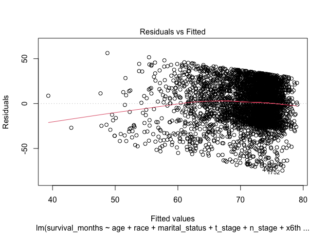
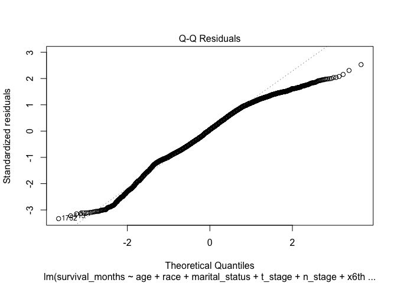
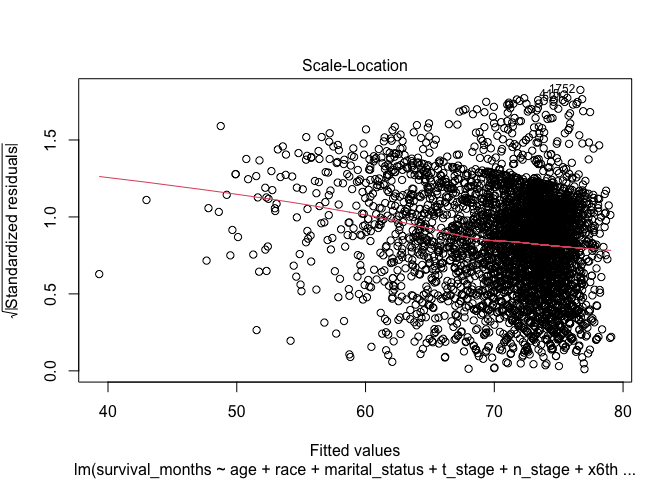
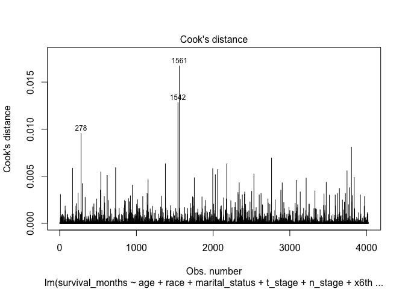
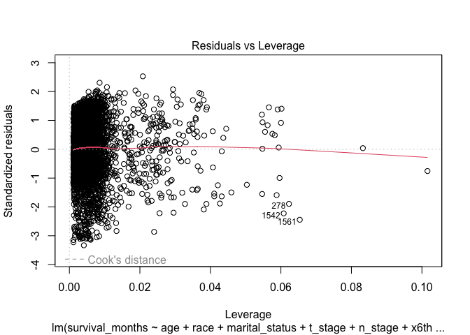
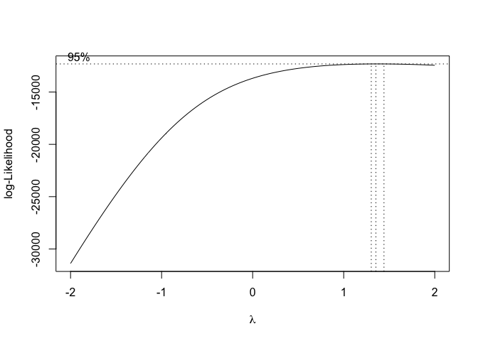

Data Cleaning
================
2023-11-29

# 

``` r
knitr::opts_chunk$set(echo = TRUE, message = FALSE, warning = FALSE)

library(tidyverse)
```

    ## ── Attaching core tidyverse packages ──────────────────────── tidyverse 2.0.0 ──
    ## ✔ dplyr     1.1.3     ✔ readr     2.1.4
    ## ✔ forcats   1.0.0     ✔ stringr   1.5.0
    ## ✔ ggplot2   3.4.3     ✔ tibble    3.2.1
    ## ✔ lubridate 1.9.2     ✔ tidyr     1.3.0
    ## ✔ purrr     1.0.2     
    ## ── Conflicts ────────────────────────────────────────── tidyverse_conflicts() ──
    ## ✖ dplyr::filter() masks stats::filter()
    ## ✖ dplyr::lag()    masks stats::lag()
    ## ℹ Use the conflicted package (<http://conflicted.r-lib.org/>) to force all conflicts to become errors

``` r
library(MASS) # boxcox
```

    ## 
    ## Attaching package: 'MASS'
    ## 
    ## The following object is masked from 'package:dplyr':
    ## 
    ##     select

``` r
library(performance) # vif
library(ggpubr)
```

``` r
# import data
breastcancer = read_csv("./data/Project_2_data.csv")

#Data Cleaning
breastcancer_1 = breastcancer|>
  janitor::clean_names()|>
   mutate(
    race = as_factor(race),
    marital_status = factor(marital_status, levels = c("Single", "Married", "Divorced", "Separated", "Widowed")),
    t_stage = factor(t_stage, levels = c("T1", "T2", "T3", "T4")),
    n_stage = factor(n_stage, levels = c("N1", "N2", "N3")),
    x6th_stage = factor(x6th_stage, levels = c("IIA", "IIB", "IIIA", "IIIB", "IIIC")),
    differentiate = factor(differentiate, levels = c("Moderately differentiated", "Poorly differentiated", "Undifferentiated", "Well differentiated")),
    grade = factor(grade, levels = c("1", "2", "3", "anaplastic; Grade IV")),
    a_stage = factor(a_stage, levels = c("Distant", "Regional")),
    estrogen_status = as_factor(estrogen_status),
    progesterone_status = as_factor(progesterone_status),
    status = ifelse(status == "Dead", 1, 0),
    status = as_factor(status))

breastcancer_clean = breastcancer_1|>
  mutate(node_positive_prop = reginol_node_positive/regional_node_examined,
         node_positive_prop = round(node_positive_prop, 4))
  
breastcancer_clean
```

    ## # A tibble: 4,024 × 17
    ##      age race  marital_status t_stage n_stage x6th_stage differentiate     grade
    ##    <dbl> <fct> <fct>          <fct>   <fct>   <fct>      <fct>             <fct>
    ##  1    68 White Married        T1      N1      IIA        Poorly different… 3    
    ##  2    50 White Married        T2      N2      IIIA       Moderately diffe… 2    
    ##  3    58 White Divorced       T3      N3      IIIC       Moderately diffe… 2    
    ##  4    58 White Married        T1      N1      IIA        Poorly different… 3    
    ##  5    47 White Married        T2      N1      IIB        Poorly different… 3    
    ##  6    51 White Single         T1      N1      IIA        Moderately diffe… 2    
    ##  7    51 White Married        T1      N1      IIA        Well differentia… 1    
    ##  8    40 White Married        T2      N1      IIB        Moderately diffe… 2    
    ##  9    40 White Divorced       T4      N3      IIIC       Poorly different… 3    
    ## 10    69 White Married        T4      N3      IIIC       Well differentia… 1    
    ## # ℹ 4,014 more rows
    ## # ℹ 9 more variables: a_stage <fct>, tumor_size <dbl>, estrogen_status <fct>,
    ## #   progesterone_status <fct>, regional_node_examined <dbl>,
    ## #   reginol_node_positive <dbl>, survival_months <dbl>, status <fct>,
    ## #   node_positive_prop <dbl>

# Fit a MLR Model With All Potential Predictors

``` r
# fit a model with all the predictors
fit1 = lm(survival_months ~ age + race + marital_status + t_stage + n_stage + x6th_stage + differentiate + grade + a_stage + tumor_size + estrogen_status + progesterone_status + regional_node_examined + reginol_node_positive, data = breastcancer_clean)

summary(fit1)
```

    ## 
    ## Call:
    ## lm(formula = survival_months ~ age + race + marital_status + 
    ##     t_stage + n_stage + x6th_stage + differentiate + grade + 
    ##     a_stage + tumor_size + estrogen_status + progesterone_status + 
    ##     regional_node_examined + reginol_node_positive, data = breastcancer_clean)
    ## 
    ## Residuals:
    ##     Min      1Q  Median      3Q     Max 
    ## -74.685 -15.591   1.087  18.126  56.245 
    ## 
    ## Coefficients: (4 not defined because of singularities)
    ##                                    Estimate Std. Error t value Pr(>|t|)    
    ## (Intercept)                        72.83328    3.67741  19.806  < 2e-16 ***
    ## age                                -0.04220    0.04138  -1.020  0.30787    
    ## raceBlack                          -3.67154    1.40193  -2.619  0.00885 ** 
    ## raceOther                           1.91040    1.32287   1.444  0.14878    
    ## marital_statusMarried               0.74868    1.02626   0.730  0.46572    
    ## marital_statusDivorced              0.03560    1.37859   0.026  0.97940    
    ## marital_statusSeparated            -6.21046    3.48494  -1.782  0.07481 .  
    ## marital_statusWidowed              -0.75373    1.77315  -0.425  0.67080    
    ## t_stageT2                          -1.61447    1.69125  -0.955  0.33984    
    ## t_stageT3                           0.73762    2.76338   0.267  0.78954    
    ## t_stageT4                          -2.25092    4.48353  -0.502  0.61567    
    ## n_stageN2                          -0.58607    1.98650  -0.295  0.76799    
    ## n_stageN3                          -3.37649    2.67197  -1.264  0.20642    
    ## x6th_stageIIB                       0.53765    1.82506   0.295  0.76832    
    ## x6th_stageIIIA                     -0.65701    2.36107  -0.278  0.78082    
    ## x6th_stageIIIB                      3.32794    5.15941   0.645  0.51895    
    ## x6th_stageIIIC                           NA         NA      NA       NA    
    ## differentiatePoorly differentiated -0.98945    0.85155  -1.162  0.24533    
    ## differentiateUndifferentiated      -2.95238    5.21782  -0.566  0.57154    
    ## differentiateWell differentiated   -0.02110    1.07890  -0.020  0.98440    
    ## grade2                                   NA         NA      NA       NA    
    ## grade3                                   NA         NA      NA       NA    
    ## gradeanaplastic; Grade IV                NA         NA      NA       NA    
    ## a_stageRegional                     4.36505    2.67211   1.634  0.10243    
    ## tumor_size                         -0.05649    0.03434  -1.645  0.10002    
    ## estrogen_statusNegative            -8.61299    1.68605  -5.108  3.4e-07 ***
    ## progesterone_statusNegative        -1.60271    1.10116  -1.455  0.14562    
    ## regional_node_examined              0.10692    0.04828   2.214  0.02686 *  
    ## reginol_node_positive              -0.31396    0.14259  -2.202  0.02774 *  
    ## ---
    ## Signif. codes:  0 '***' 0.001 '**' 0.01 '*' 0.05 '.' 0.1 ' ' 1
    ## 
    ## Residual standard error: 22.47 on 3999 degrees of freedom
    ## Multiple R-squared:  0.04476,    Adjusted R-squared:  0.03903 
    ## F-statistic: 7.808 on 24 and 3999 DF,  p-value: < 2.2e-16

# Check the Assumption of Equal Variance and Influential Points

``` r
# residual vs fitted plot: 
plot(fit1, which = 1) #funning of the data points
```

<!-- -->

``` r
# QQ plot: detect normality of residuals and outliers
plot(fit1, which = 2) #deviations at the tails 
```

<!-- -->

``` r
# Scale-Location: check the assumption of equal variance
plot(fit1, which = 3)
```

<!-- -->

``` r
# Residual v.s. Leverage: identify influential cases
plot(fit1, which = 4)
```

<!-- -->

``` r
#Box-Cox result indicates that we might not need transformation on y 
plot(fit1)
```

<!-- --><!-- --><!-- --><!-- -->

``` r
boxcox(fit1)
```

<!-- -->
\# Check for Multicollinearity

``` r
# Calculate the variance inflation factor (VIF)
check_collinearity(fit1) # based on the results, we have to stratify for different stage levels if we include them in our model
```

    ## # Check for Multicollinearity
    ## 
    ## Low Correlation
    ## 
    ##                    Term  VIF     VIF 95% CI Increased SE Tolerance
    ##                     age 1.10 [ 1.07,  1.14]         1.05      0.91
    ##                    race 1.06 [ 1.03,  1.11]         1.03      0.94
    ##          marital_status 1.12 [ 1.09,  1.17]         1.06      0.89
    ##           differentiate 1.14 [ 1.10,  1.18]         1.07      0.88
    ##                 a_stage 1.27 [ 1.23,  1.32]         1.13      0.79
    ##              tumor_size 4.19 [ 3.97,  4.43]         2.05      0.24
    ##         estrogen_status 1.41 [ 1.36,  1.47]         1.19      0.71
    ##     progesterone_status 1.39 [ 1.33,  1.44]         1.18      0.72
    ##  regional_node_examined 1.22 [ 1.18,  1.27]         1.10      0.82
    ##   reginol_node_positive 4.23 [ 4.01,  4.47]         2.06      0.24
    ##  Tolerance 95% CI
    ##      [0.88, 0.94]
    ##      [0.90, 0.97]
    ##      [0.86, 0.92]
    ##      [0.85, 0.91]
    ##      [0.76, 0.81]
    ##      [0.23, 0.25]
    ##      [0.68, 0.73]
    ##      [0.69, 0.75]
    ##      [0.79, 0.85]
    ##      [0.22, 0.25]
    ## 
    ## High Correlation
    ## 
    ##        Term   VIF     VIF 95% CI Increased SE Tolerance Tolerance 95% CI
    ##     t_stage 64.44 [60.64, 68.49]         8.03      0.02     [0.01, 0.02]
    ##     n_stage 28.84 [27.15, 30.63]         5.37      0.03     [0.03, 0.04]
    ##  x6th_stage 90.22 [84.88, 95.89]         9.50      0.01     [0.01, 0.01]
